## **Input**

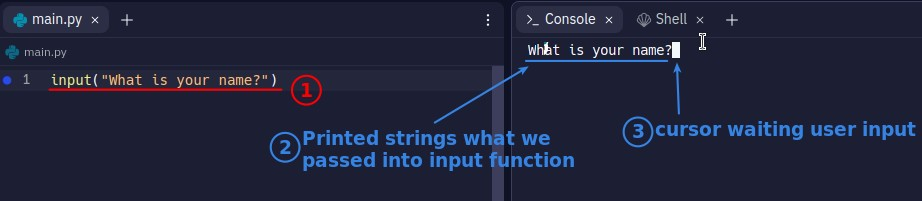

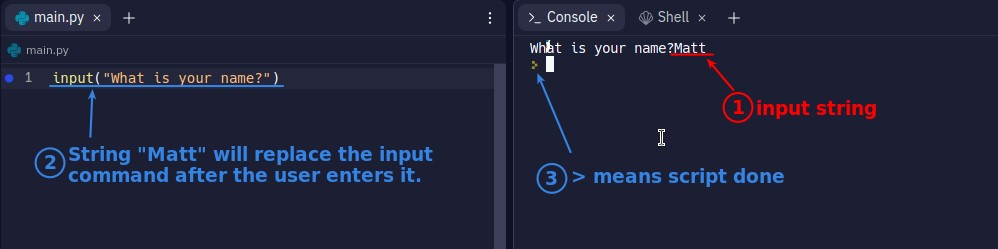

## **.replit layout**

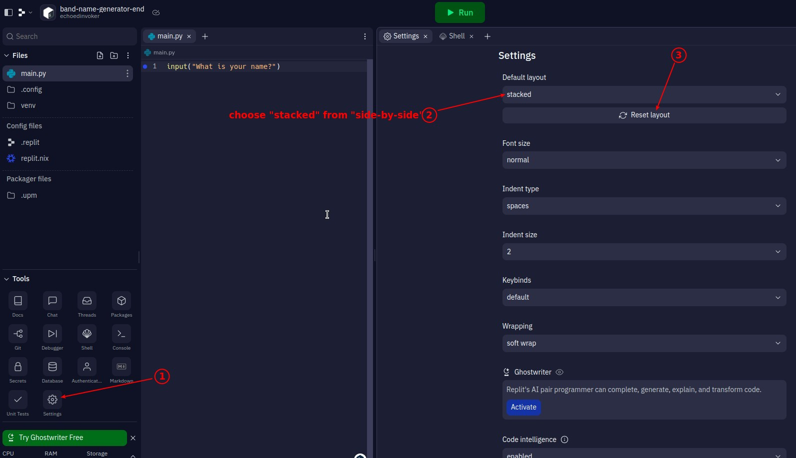

## **Thonny**

> Thonny is an app that allows us to observe the script execution process step by step.

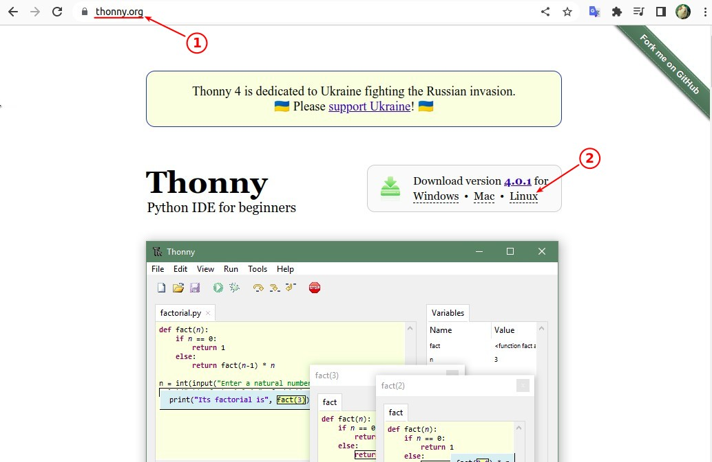

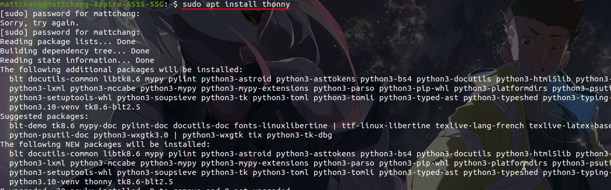

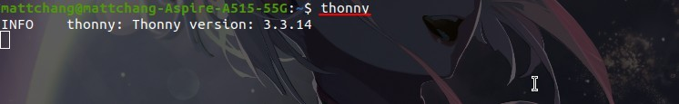

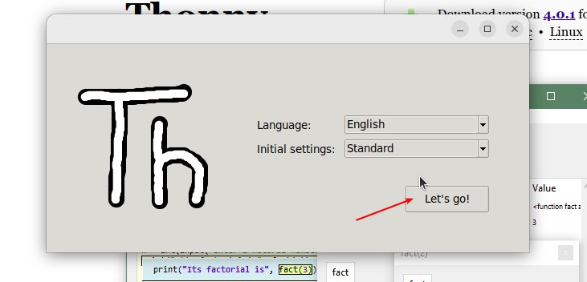

## **Analyze Input & Print Step by Step**

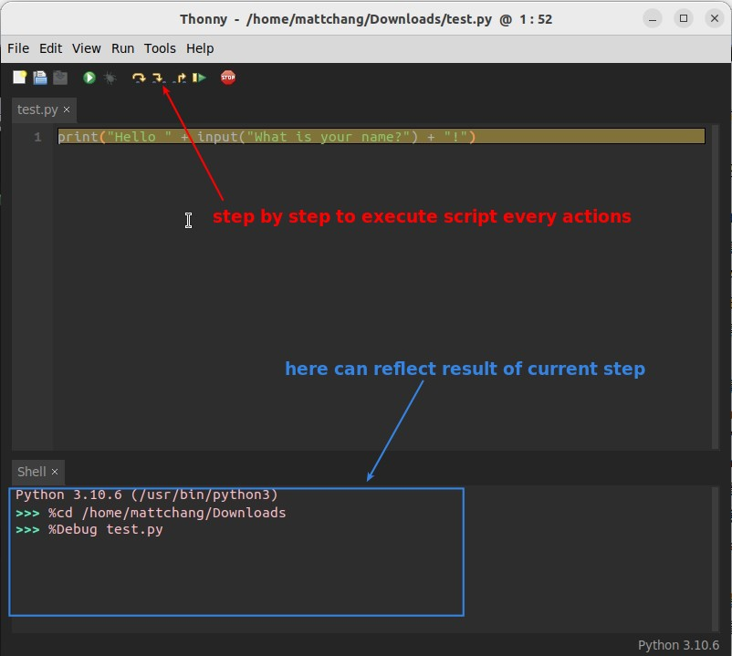

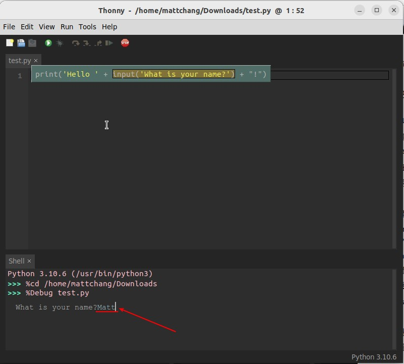

### _replace input()_

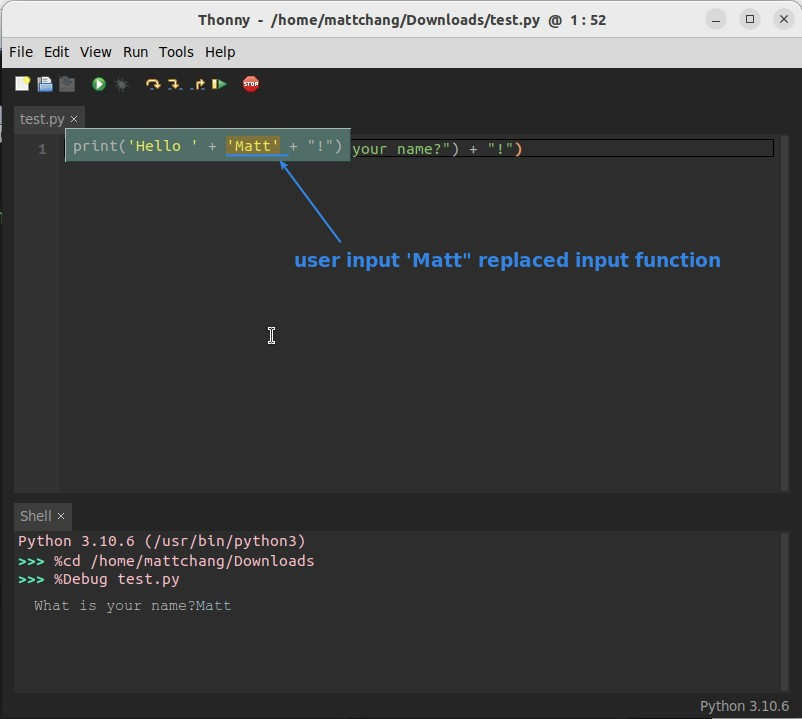

### _strings concatenation_

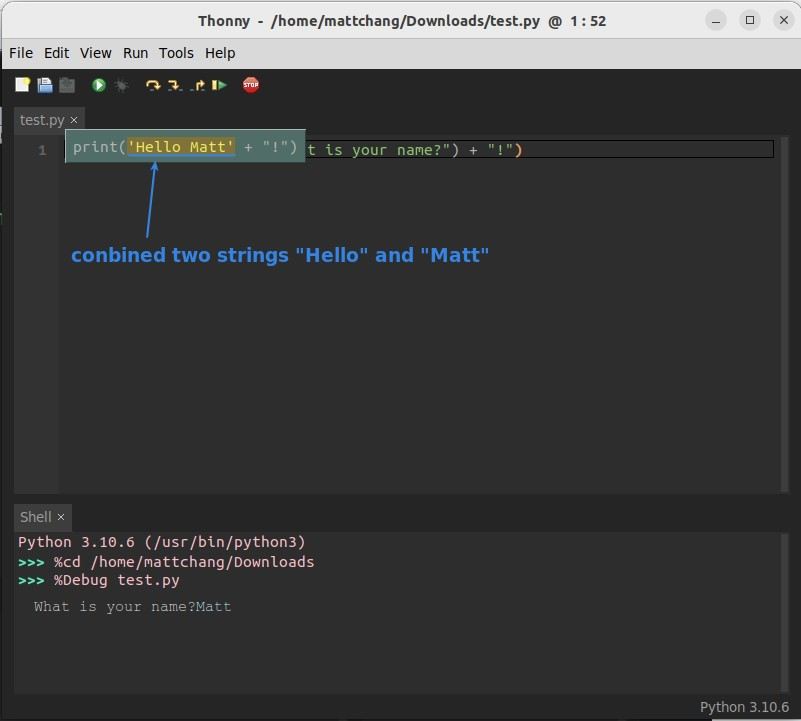

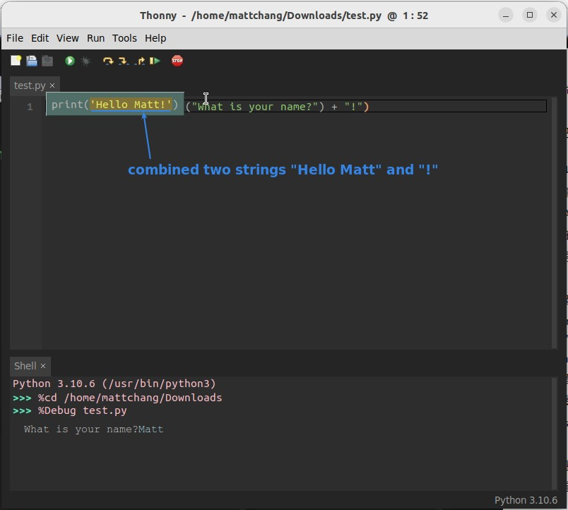

### _replace print()_

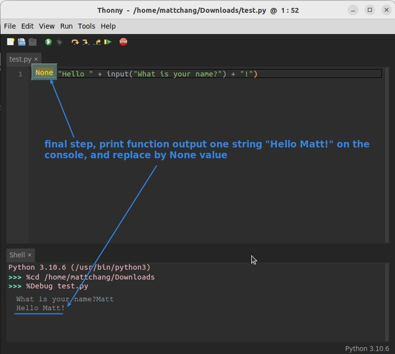

- With Thonny we can observe the details of each step of the script execution process, but usually only a few lines of code are copied from the .replit as needed for analysis.
- Because .replit share code functionality is too good to use, so we mainly coding on it, instead of Thonny.
