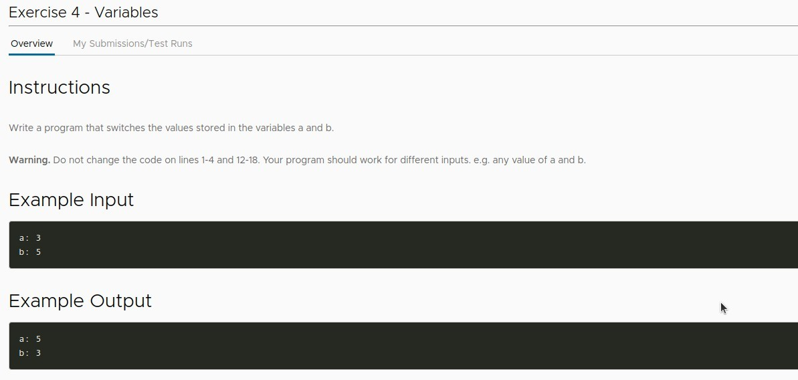
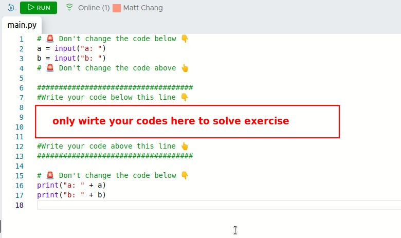
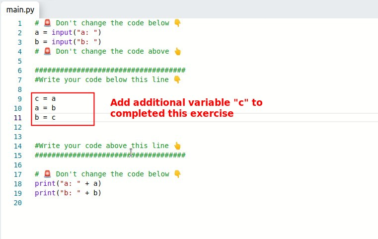

## **Exercise**

## **Solution**

- Because when a variable is reassigned a new value, the old value will disappear, which is a problem in this switch values of variables problem, so an additional variable should be added to preserve the value temporally.
