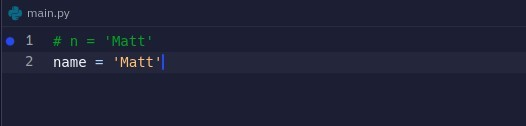
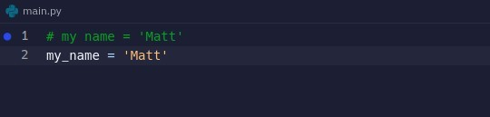
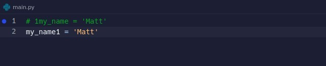
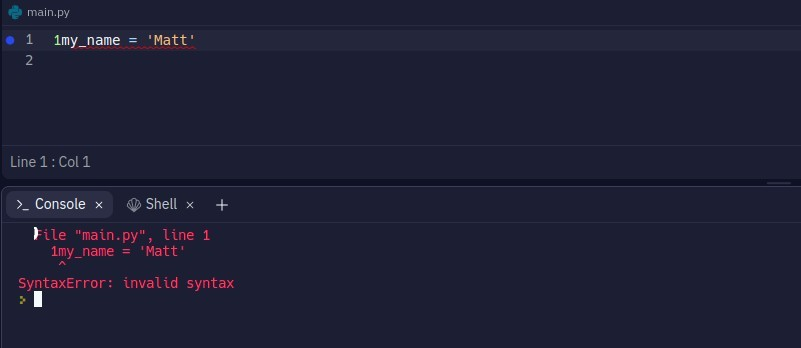
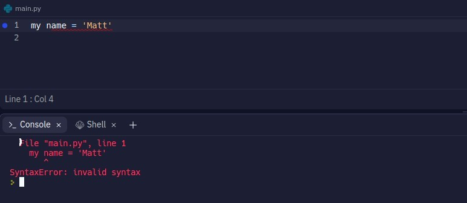
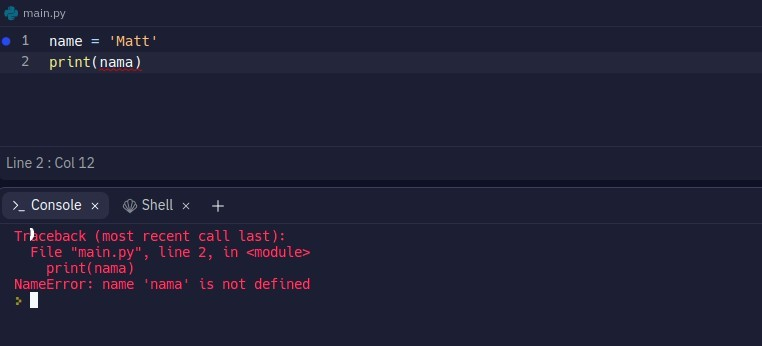
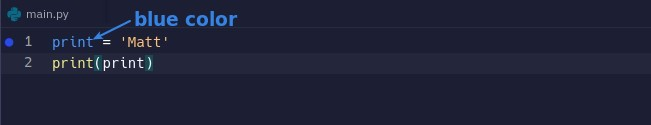

## **Better Meaningfull Naming**

- It is better to give meaning to the name of the variable to make it readable.

## **Naming rules**

### _may not contain space_

### _may not start with number_

## **SyntaxError**

> If the naming rules are not followed, you will get SyntaxError.

## **NameError**

- When you get NameError, there may be a typo error.

## **Do not use existed function names to naming**

- This will directly cause this function to not work properly in the future.
- Usually the IDE uses color to tell us if we've made this mistake.
