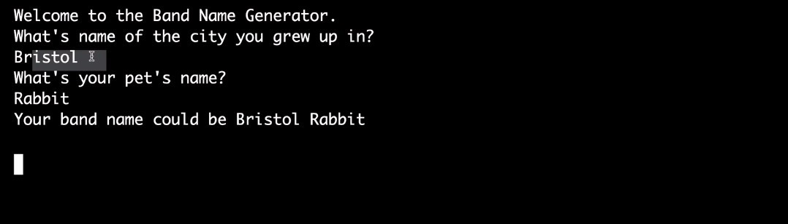
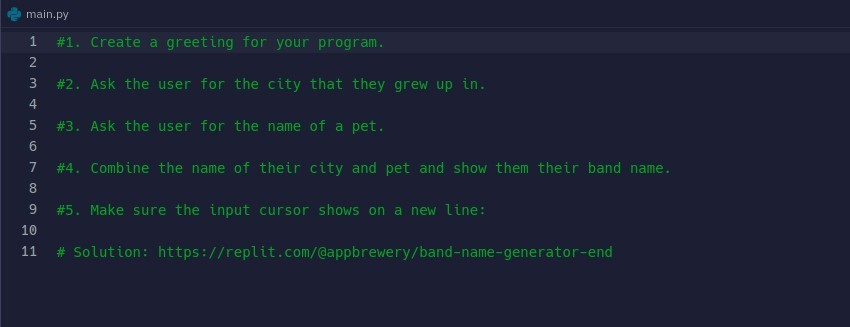
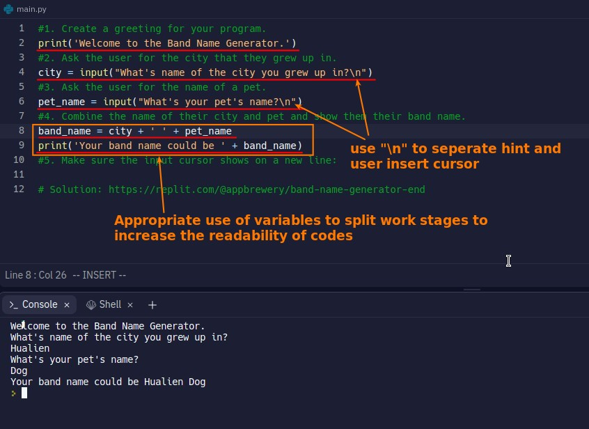

## **Project Final Result**

- We want to create a band name generator as above, which automatically generates the band name based on the city of birth and pet name user input.
- Note that after the input hint string is printed, the cursor for user to input will appear on the next line.

## **Open .replit start code and fork it**

## **My Solution**

