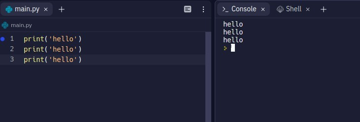
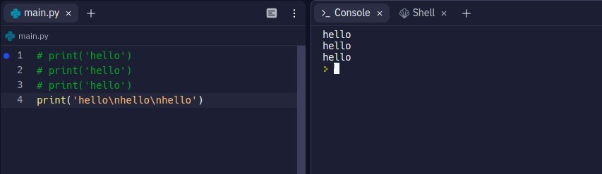
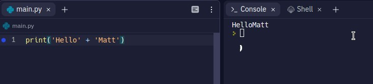
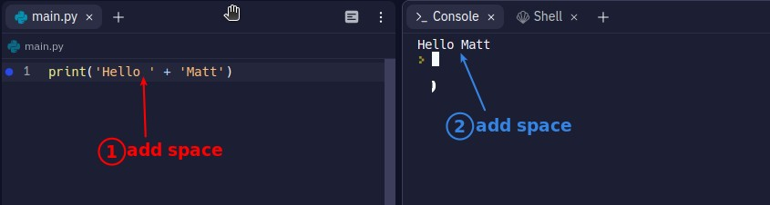
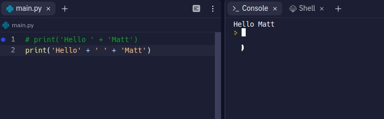
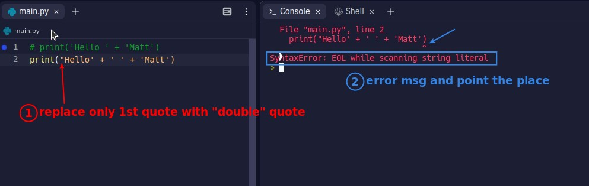
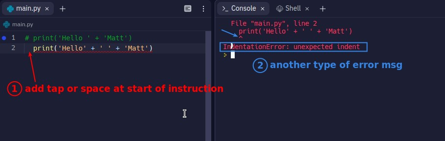
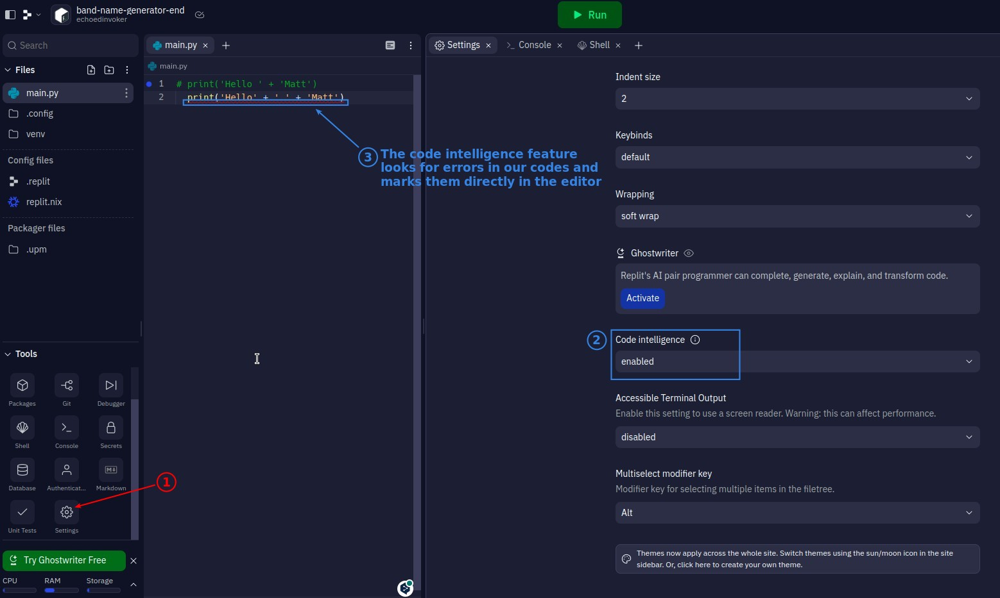
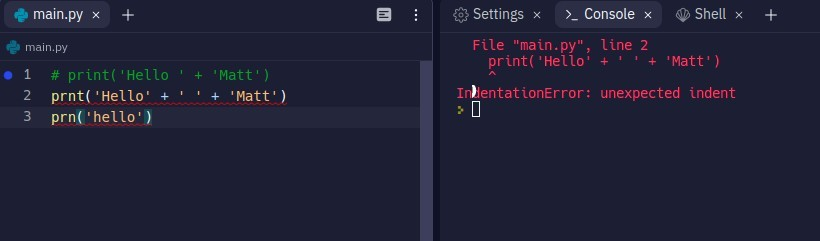

## **line break**

- We can use "\n" to represent a line break, so that we can print out three lines of String with just one "print".

## **concatenate strings**

- It means to combine multiple strings into one, usually using symbol "+".

## **add space**

## **Errors**

- When we encounter an error, we will directly throw the error message in the console into google and usually find the answer in stack overflow.
- It is best to be familiar with and even remember what each error message means.

## **Code Intellection**

- The console error will only show the first part of the script that has an error, and it must be run before it will be shown.
- In contrast, code int can display each error in multiple lines of instructions at the same time, and it can be displayed directly without running, which can reduce the debugger's time a lot.
