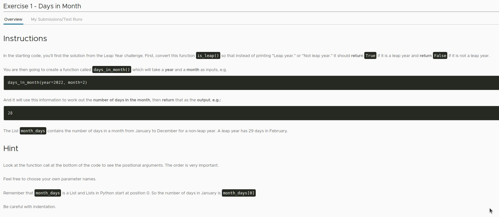
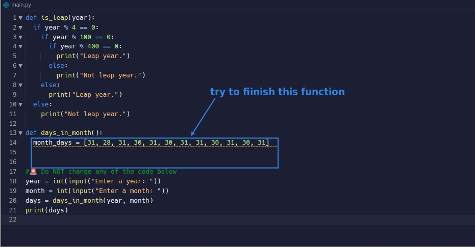
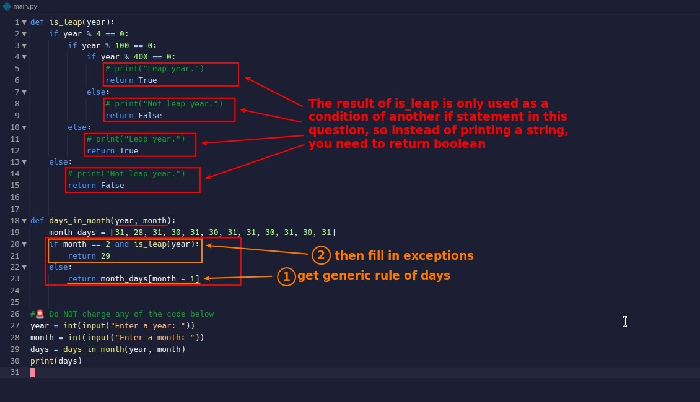
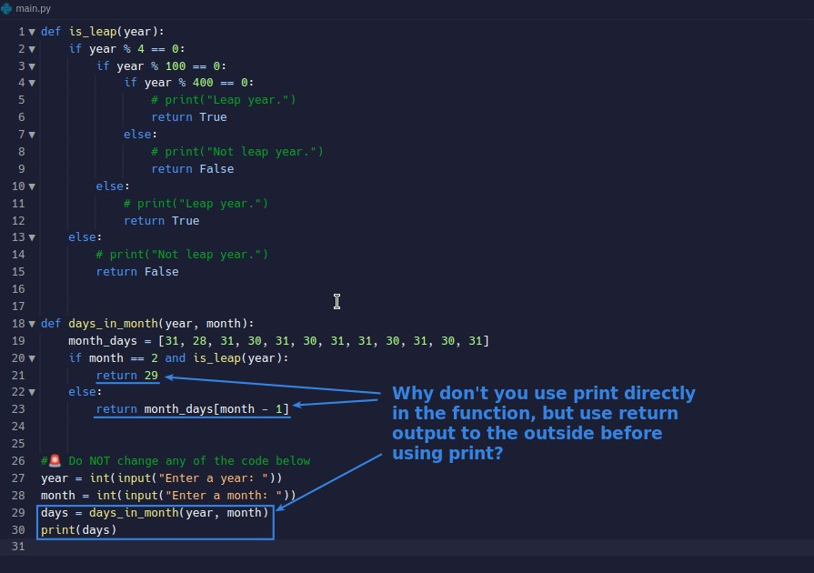

## **Exercise: Days of Month**

### _Instructions_

- We use the result of the previous is_leap() to create another function to get the number of days in the month based on the year and month input.

### _Existed codes by lector_

## **My solution**

## **Why not just print in the function?**

