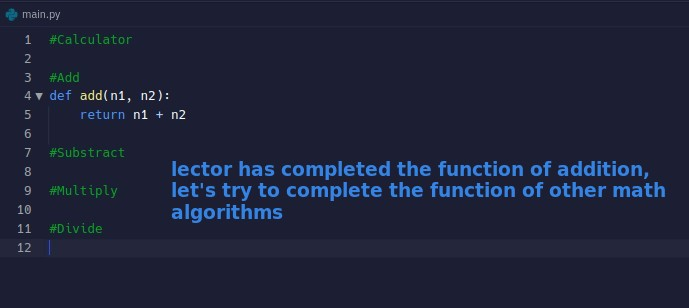
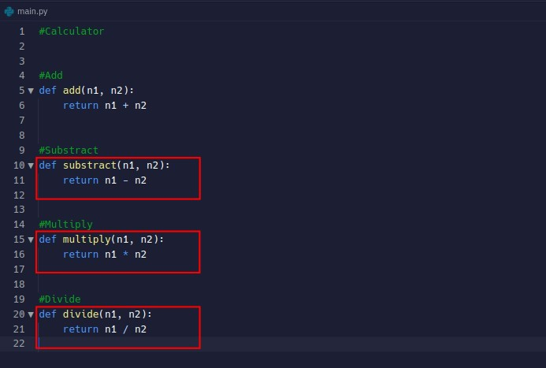
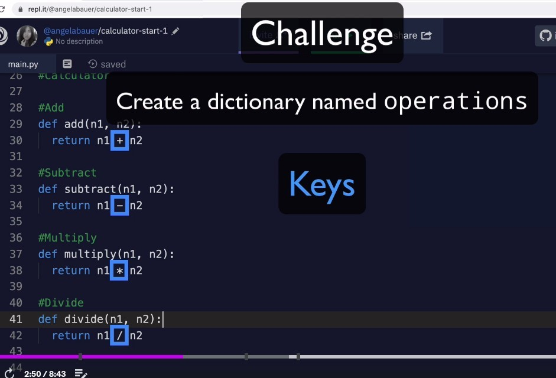
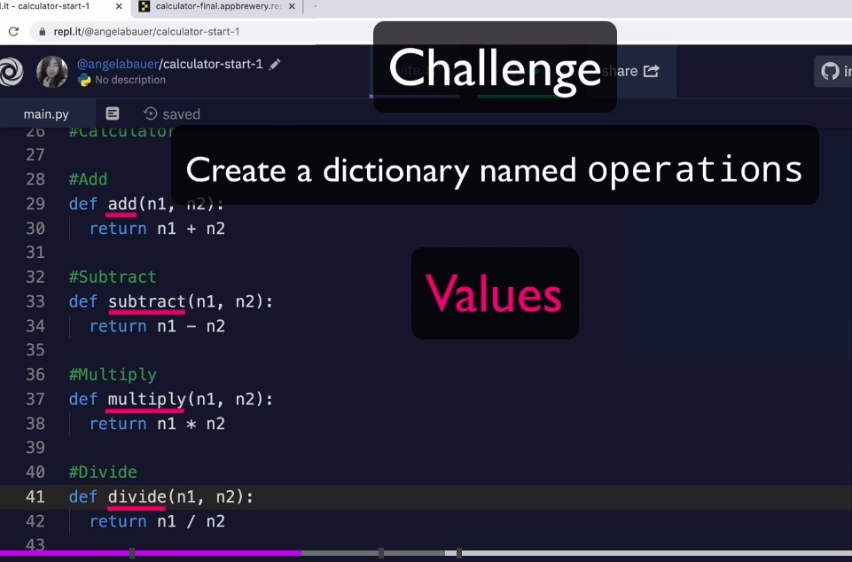
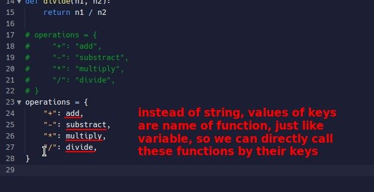
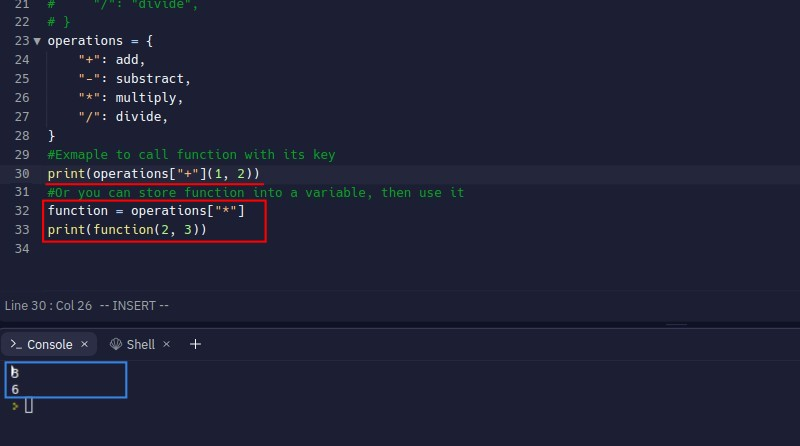
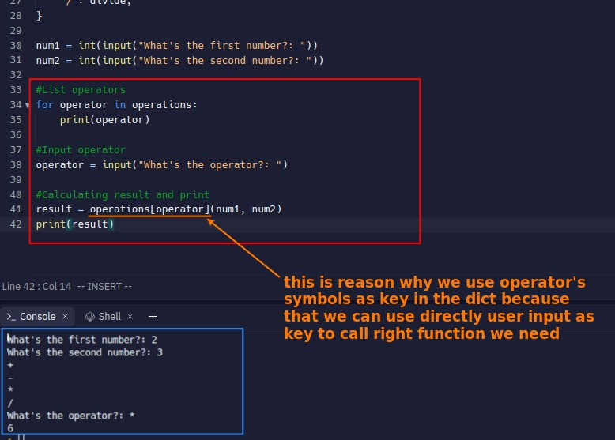
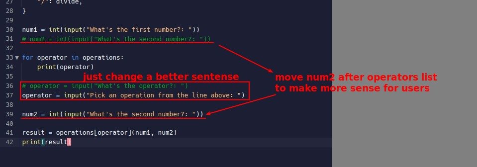
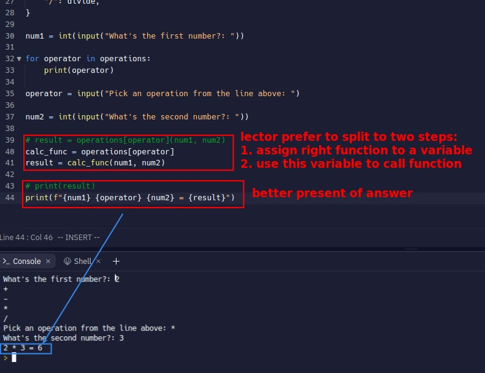

## **Challenge: Finish all math algo funtions**

### _Q_

### _A_

## **Challenge: Create a dict contain all math functions**

### _Q_

### _My answer_

### _Compare to lector's_

### _Use key to get wanted func in dict and call it_

## **Challenge: List all operators to let user choose, then calculate final answer and print**

### _Q_

### _My answer_

### _Compare to lector's_

