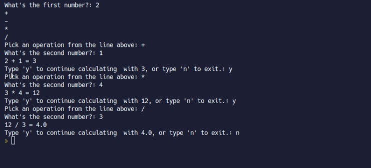

## **Challenge: Let user choose continue or not**

### _Wanted result_

### _Original codes_

## **Solutions**

### _Mine_

### _Test_

### _Compare to Lector's_

## **Replace exit with restart calculator**

### _Solution_

### _Using recurisve fucntion must be very careful_

