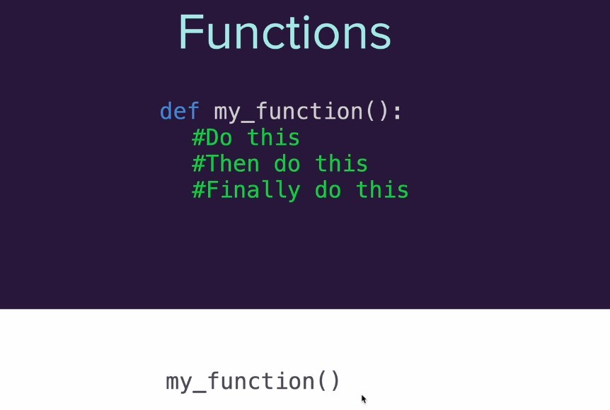
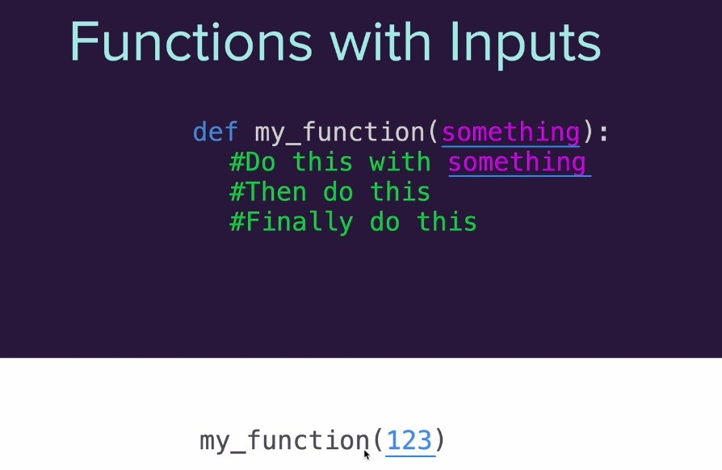
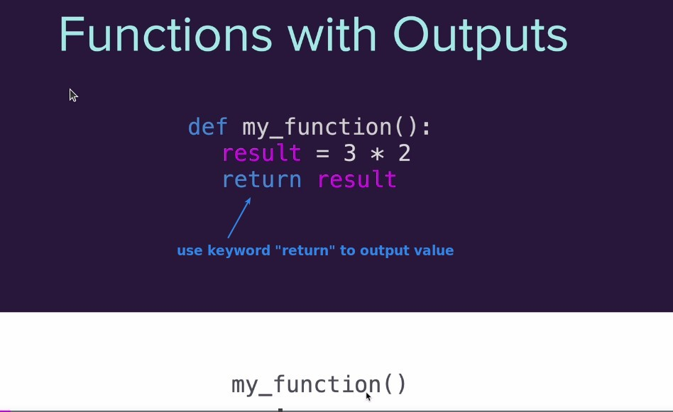
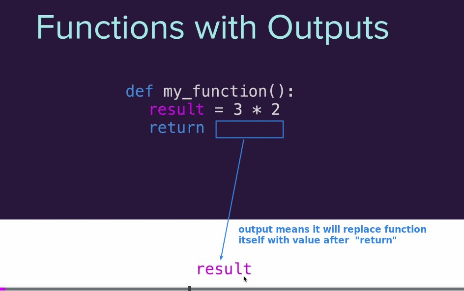
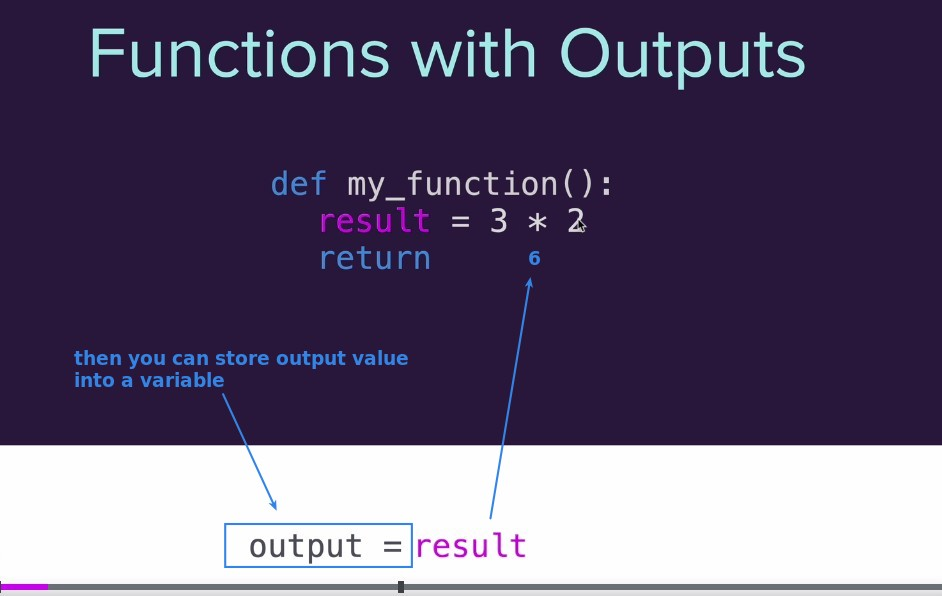
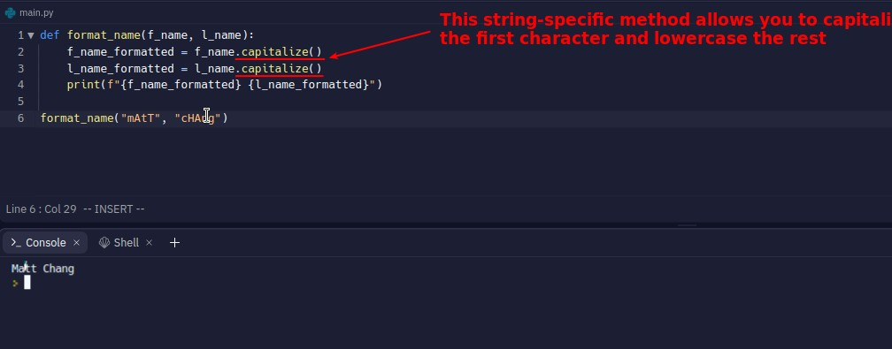
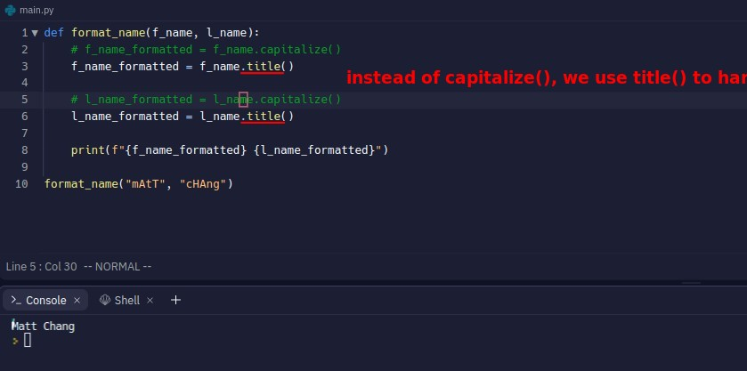

## **Reivew functions**

### _normal_

### _with inputs_

## **Function with output**

### _output step by step_

### _like a machine_

## **Exercise: Create a name format function**

### _My solution_

### _Compare to lector's_

