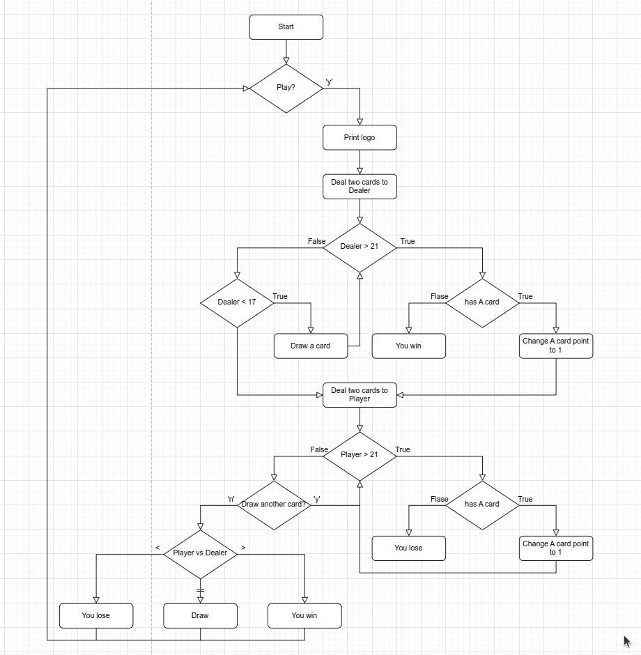
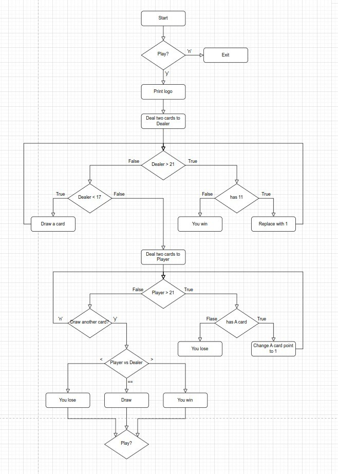

## **Flowchart by myself**

- Use multiple-if as much as possible, but I don't see any places can be optimized.
- Another thing that makes me hesitate is whether the details of the front-end presentation should also be drawn into the flowchart, for example, Dealer's card row only shows the first one.
  - My choice is not to draw in, as long as the data processing logic is correct first, the front-end presentation part is not included in order to avoid the flow chart becomes more complex.
  - On the other hand, I think that as long as the data is correct, it is easy to modify the front-end presentation at the end.

## **Adjust when coding**

- Sometimes the actual coding will gradually feel the flowchart, coding logic is wrong when you need to rely on flowchart to correct the error, the two complement each other is very normal.
