## **Codes compare with flowchart**

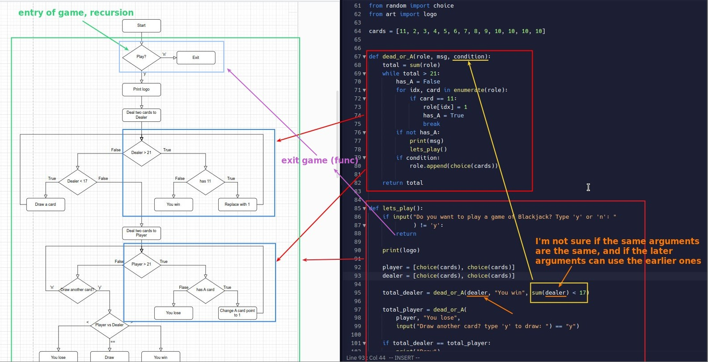

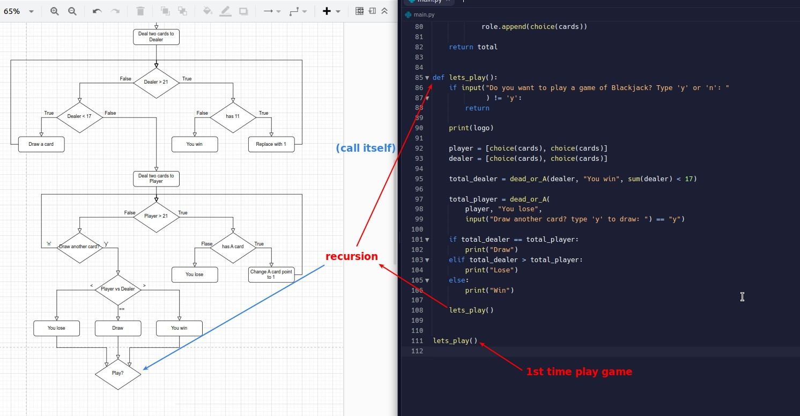

## **Thonny check**

### _Indent mistake_

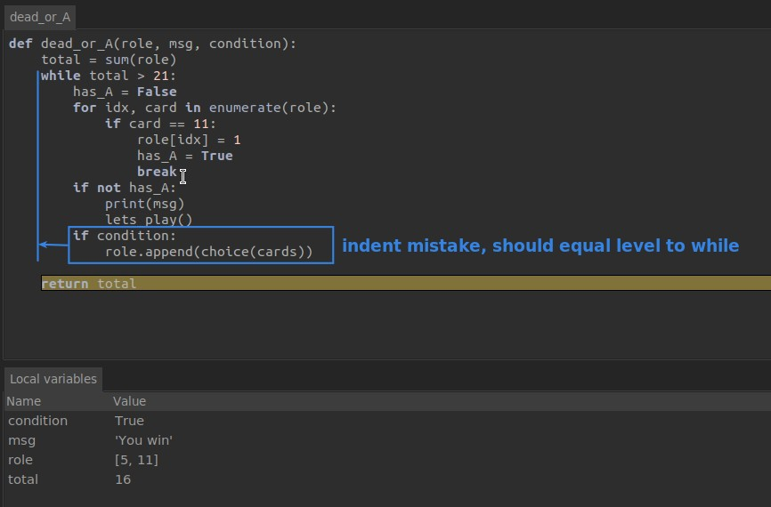

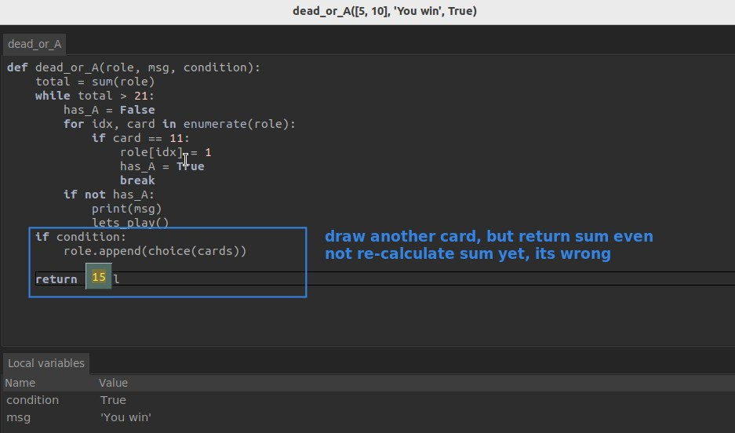

### _Lack of sum() after drawing_

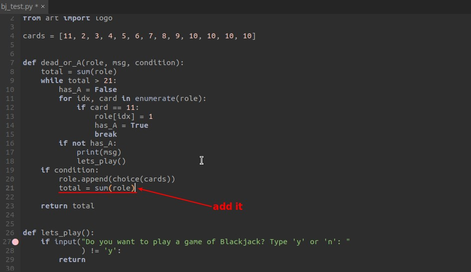

### _Multiple-if in the same while loop_

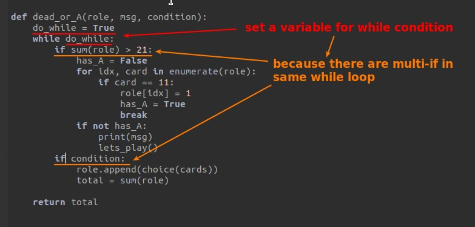

### _Pass function "value" into function_

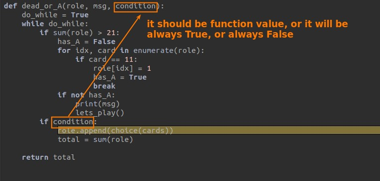

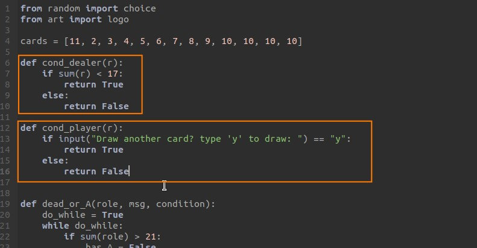

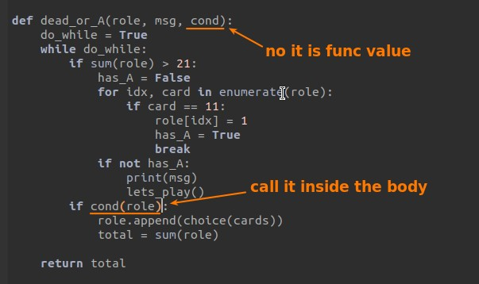

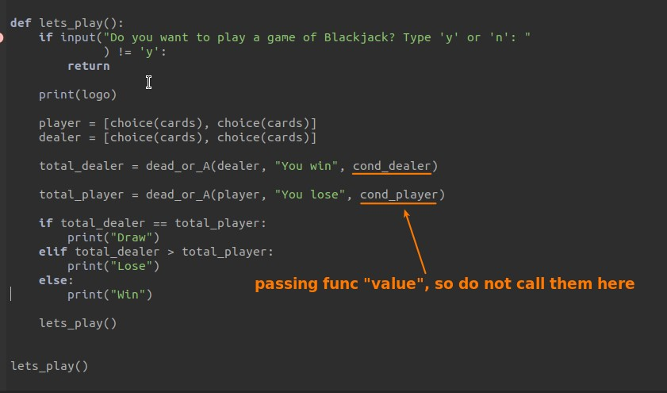

## **Back to flowchart level to solve the logic problem**

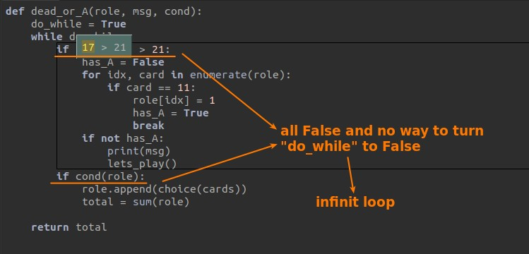

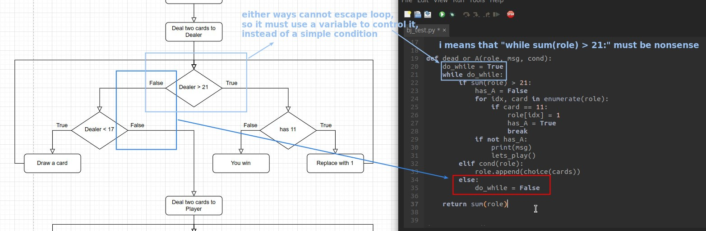
