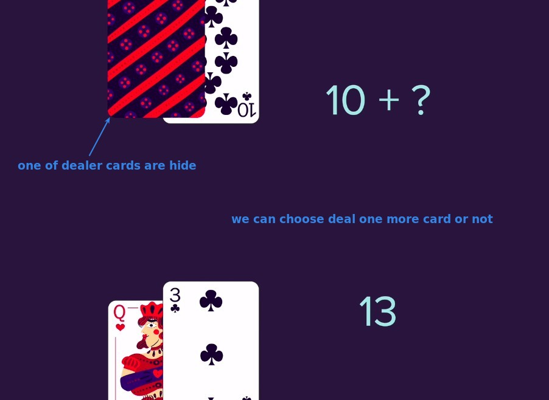

## **Rules of BlackJacks**

## **Simplify the game**

> Because the goal is to learn, we are not aiming for the real BlackJack, but will simplify some parts and focus on the coding practice.

## **Python game - walkthrough**

> Here is the final app we need to complete, and how it will actually work.

