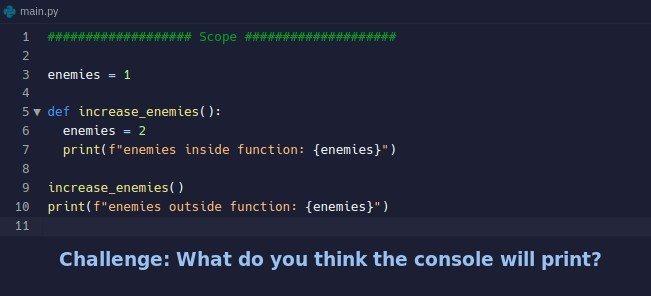
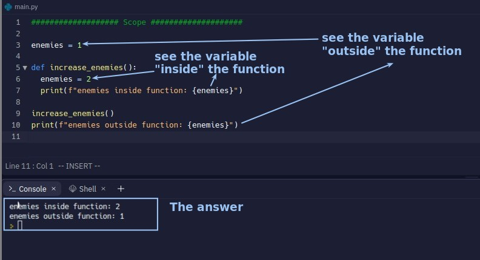
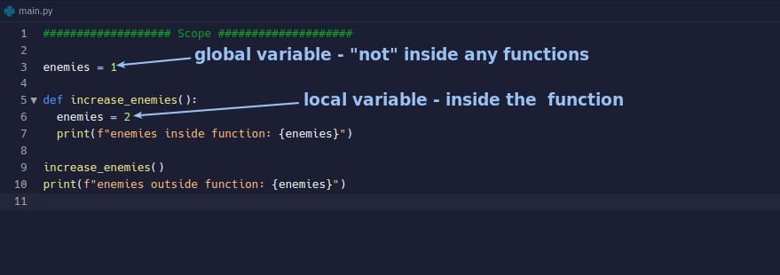
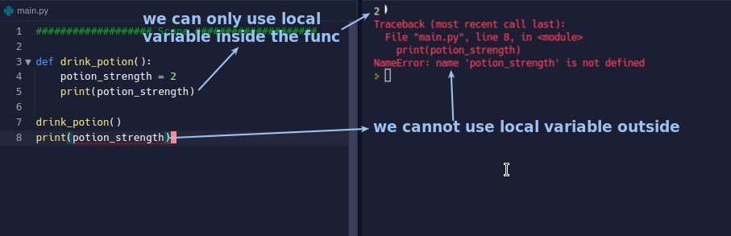
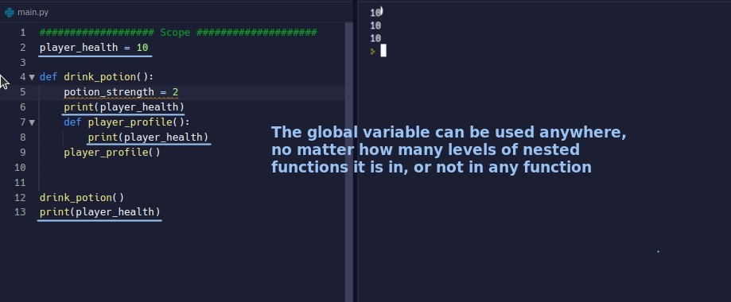
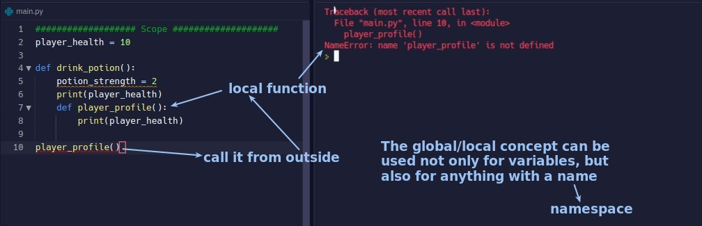

## **Challenge: What do you think the console will print?**

### _outside/inside_

- You can look out, but you can't look in.
- If the variable name set in the function is the same as the external one, it will be treated as a completely different variable.

## **Global/Local variable**

### _concept_

### _local variable_

- Note that the notes "inside" and "outside" in the above picture have a multi-layer meaning.

### _global variable_

## **Namespace**

- Applying the concepts of outside/inside and global/local to everything that has a name, we call it Namespace.
