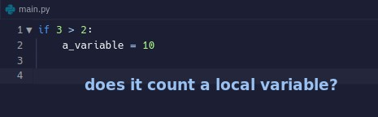
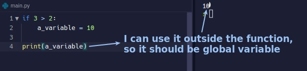
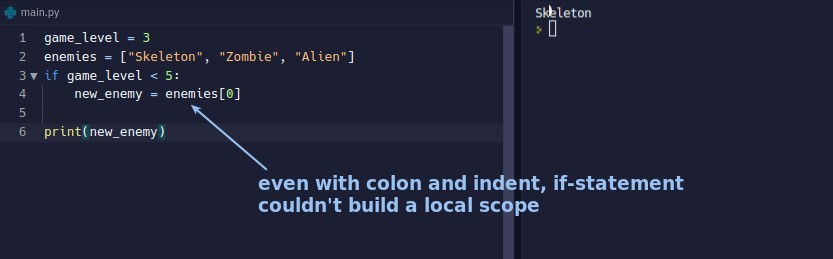
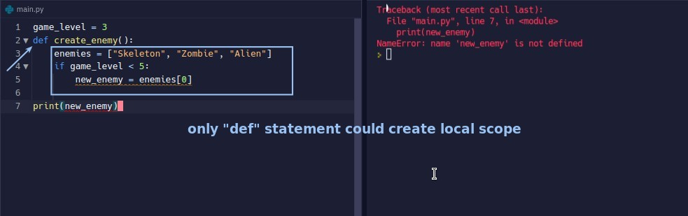

## **Challenge: is there any local scope?\***

### _Question_

### _Answer_

## **Build local scope or not**

### _if, while, for --> 'Not' build local scope_

### _def --> build local scope_

- In short, only the indent under the def has the ability to generate local scope.
