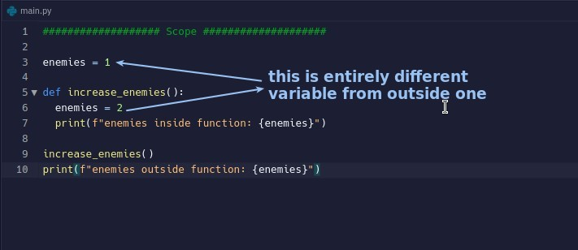
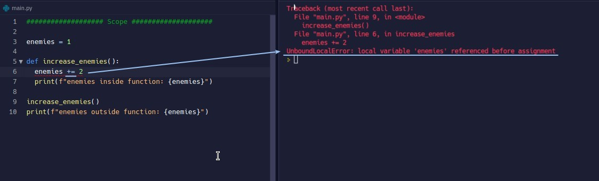
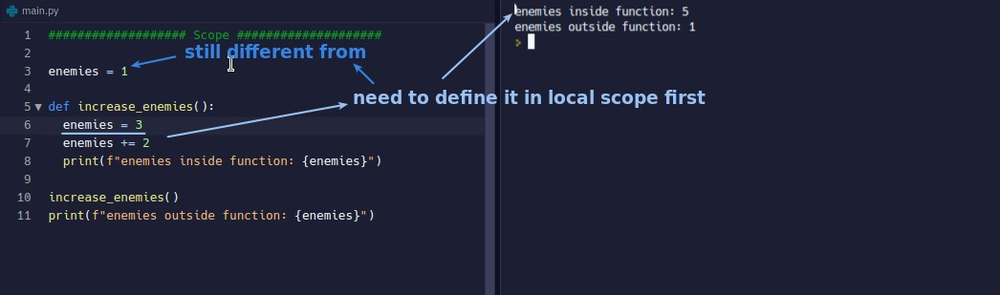
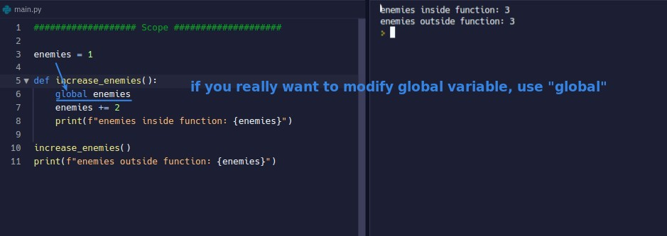
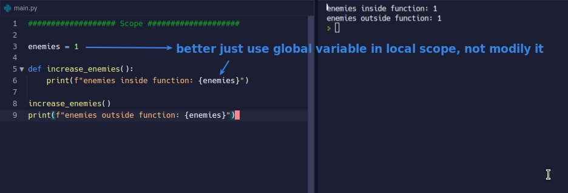
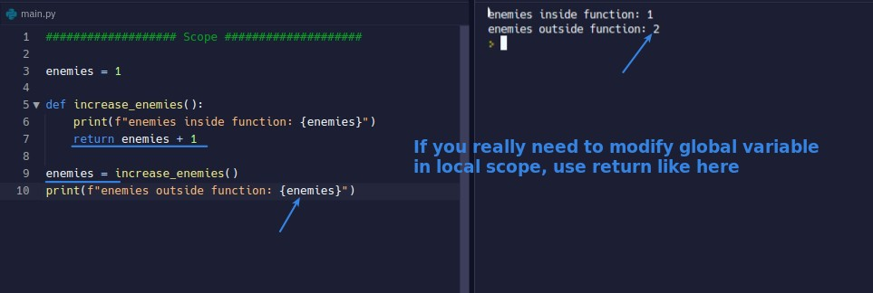

## **Try to assign new value to global variable in local scope**

- Although the same name, but two completely different variables.

## **+= in local scope**

### _Define local variable to do it(local)_

- An error will occur and will indicate that the variable is not yet defined, meaning that the global variable is not seen.

### _keyword "global"_

- If you want to see the global variable in the local scope and use it, you must use the keyword "global" in the local scope.

## **Sugguestion: Do not modify global variable in local scope**

- Try not to modify global variables in the local scope, as this can easily cause confusion and errors.

## **Better way to modify global variable by function**

- Because "assign =" happens after the function ends, it is not considered to modify global variable in the local scope.
