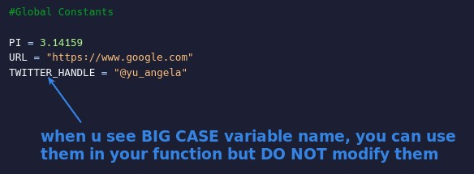

- Be very careful with global variables, but don't believe people who tell you never to use global variables.
- The global variable can be used directly in any function (without the keyword "global"), which is very convenient.
- The convention is to use all-caps for global variables. When we see an all-caps variable, remember not to change its value.
