## **Split whole app works**

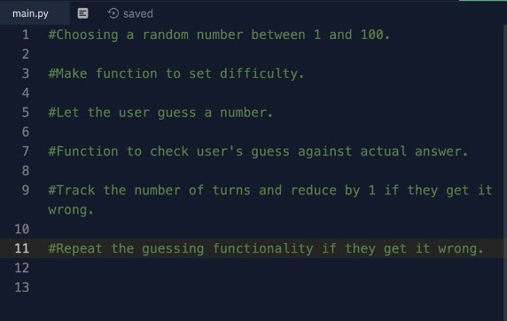

## **Get random number & Guess**

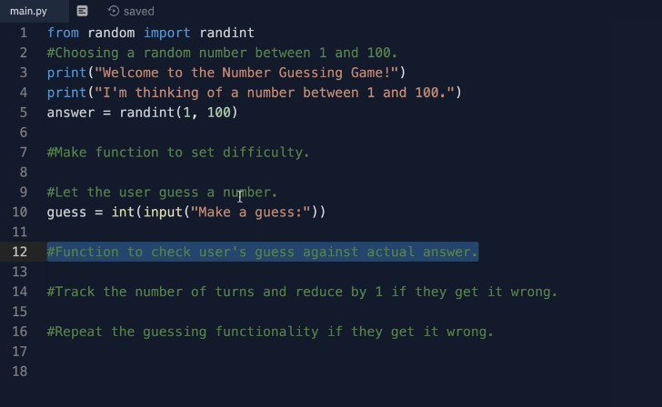

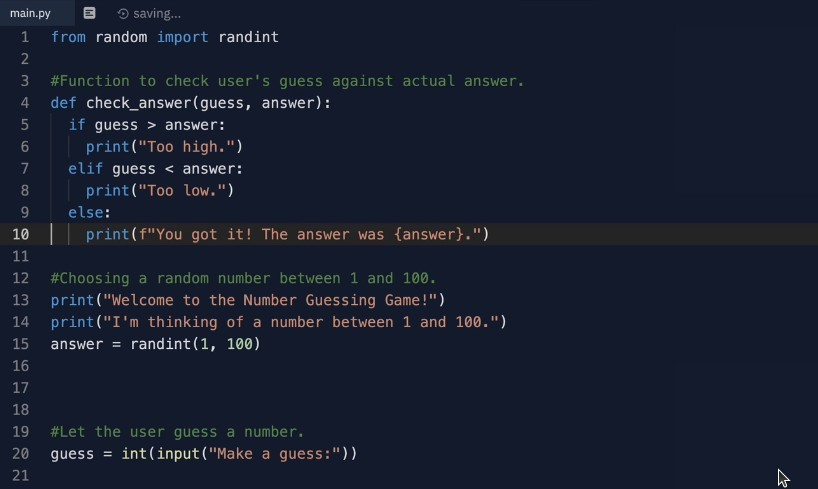

## **Glogbal variable & Set difficulty**

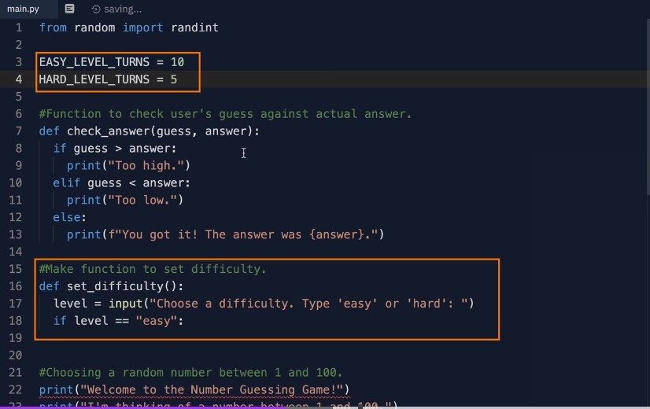

## **Initial turns**

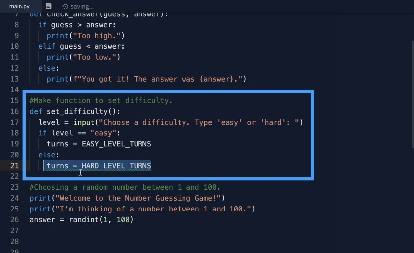

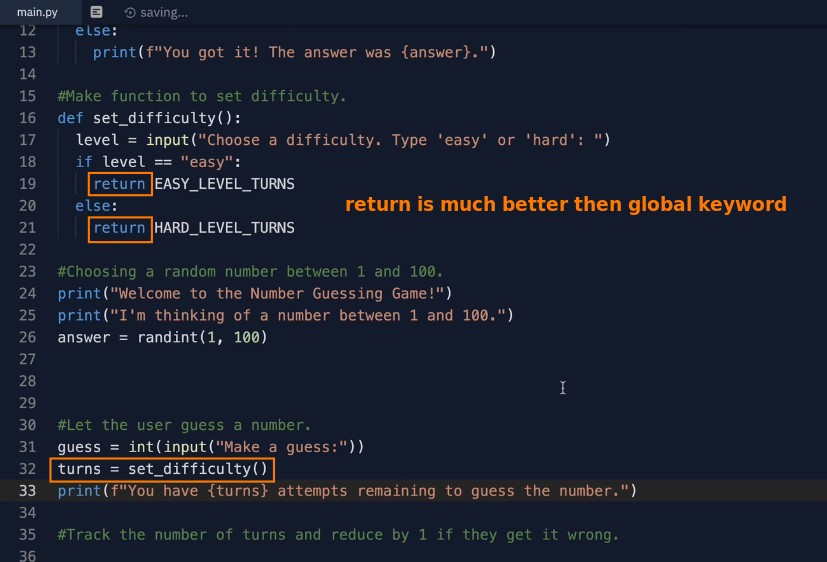

## **Middle test**

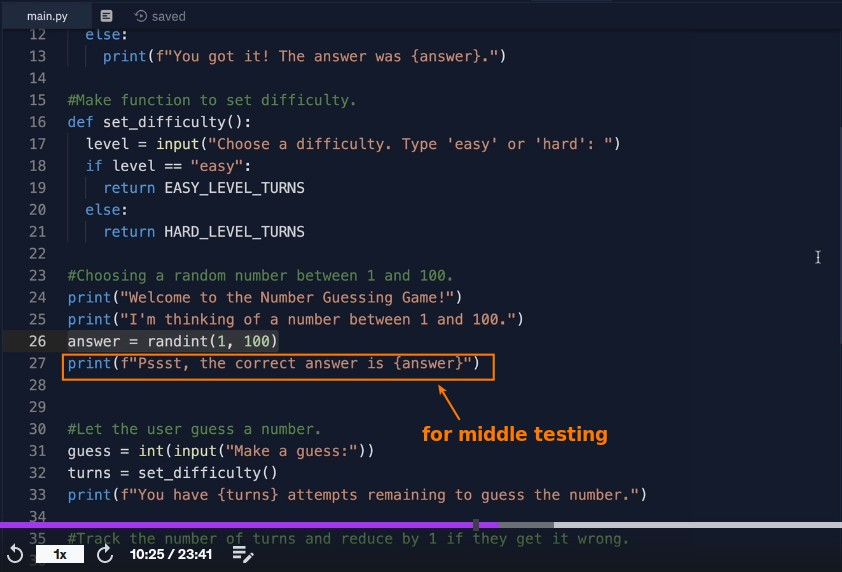

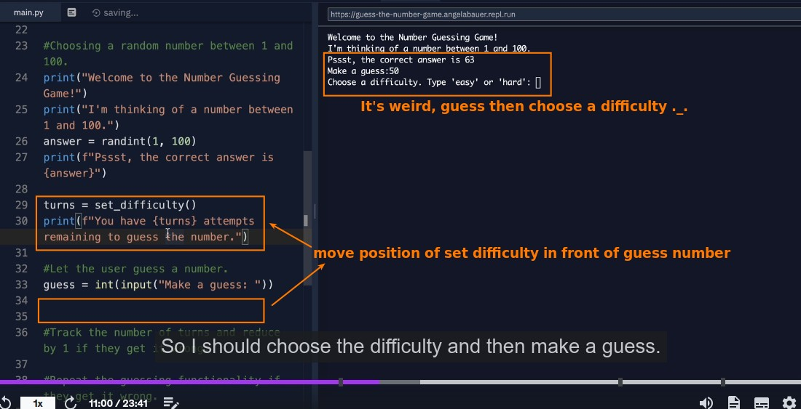

## **While loop to guess and check answer**

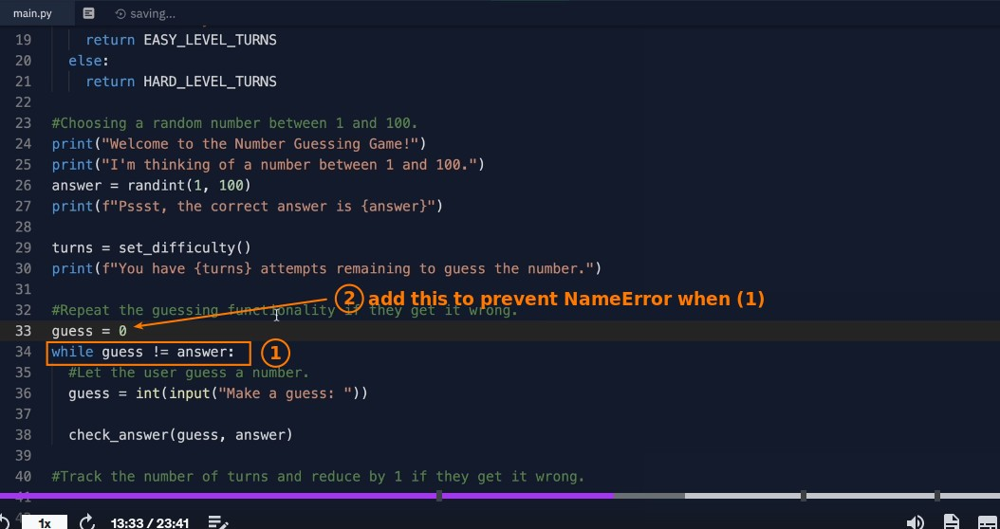

## **Why to wrap codes as a function**

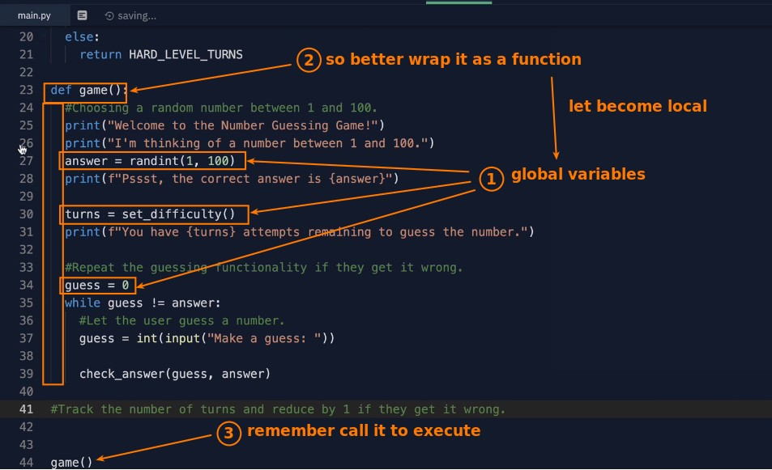

## **Reduce turns**

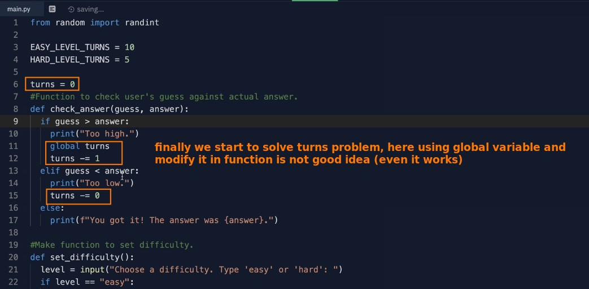

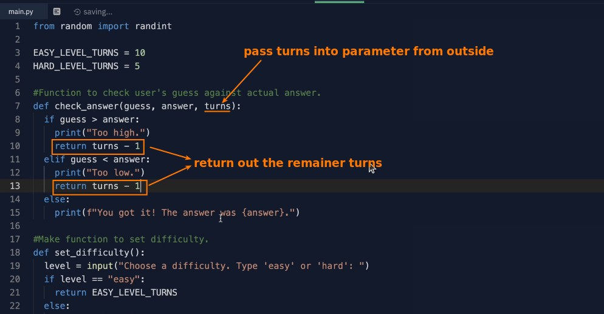

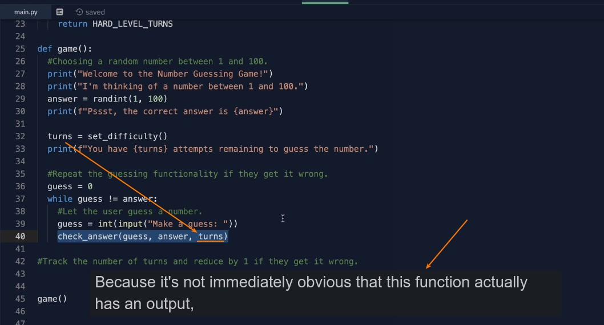

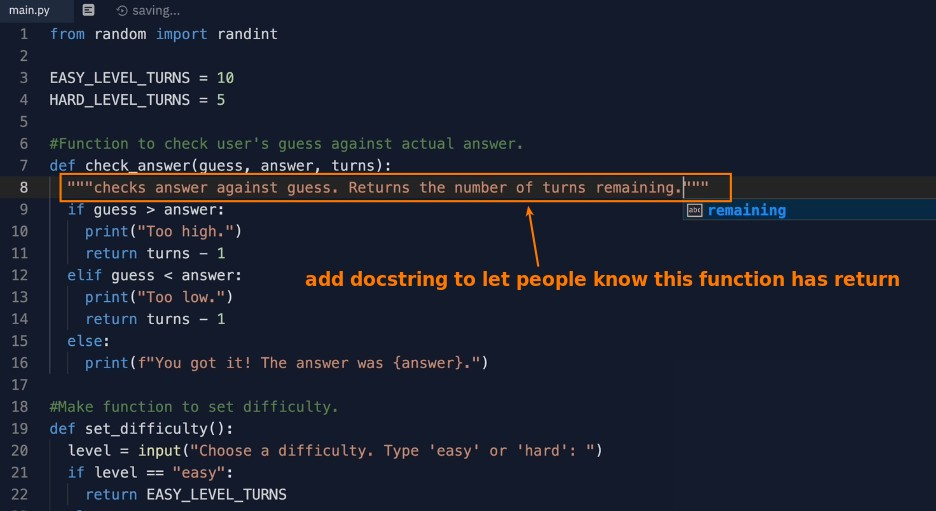

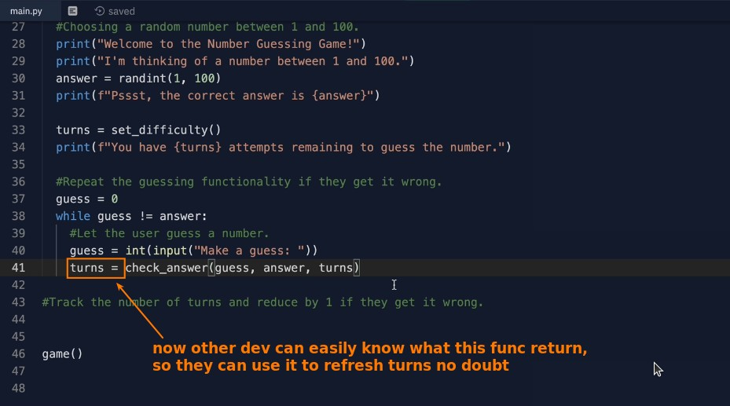

## **Final test**

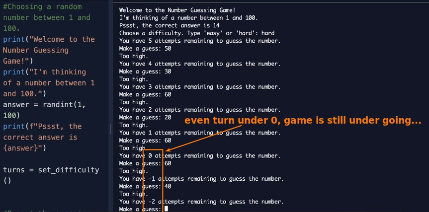

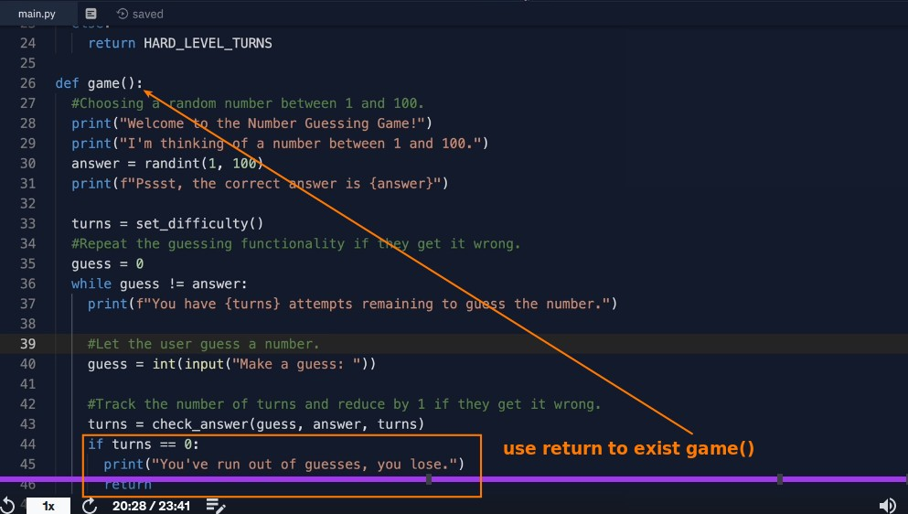
