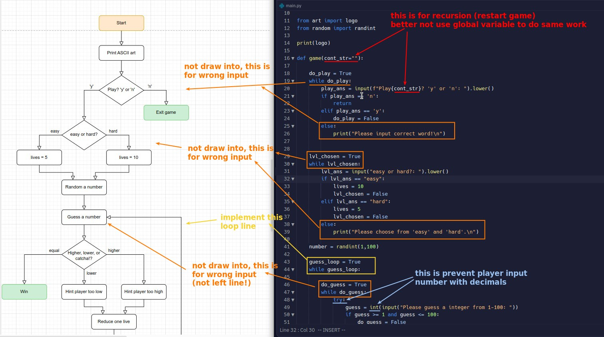

## **Flowchart**

- Just simply add functionality.

## **Create art.py**

- http://patorjk.com/software/taag/#p=display&f=Graffiti&t=Type%20Something%20
- use above web app to generate ASCII string art.

## **Codes**

- Call itself to restart the game, sometimes the game content will need to be changed a bit from the first time you play, use parameter to control them, instead of using global variable, the global variable itself should try to avoid being changed in the function as possible.
- When you use a recursive function, there are actually multiple nested functions, so the original return may not be able to jump out of all the functions completely, so pay attention to this.
- When you want to package a part of the code into a function, it is best to look at the flowchart to see which parts are packaged without problems, the input and output should be clear, especially in which the use of return to jump out, the behavior in the flowchart may look very different from the imaginary results.
