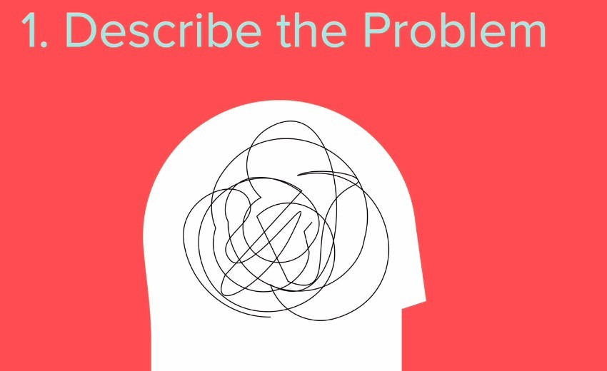
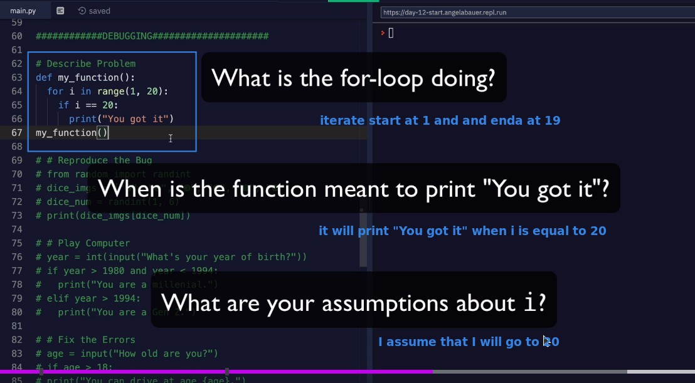
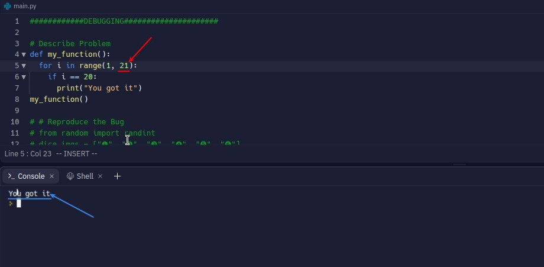

## **How to solve the bugged program?**

## **Practice**

### _Questions & Assumptions_

- Try to describe the flow of the program and find out your own assumptions.

### _Test assumptions_

- Test each assumption one by one for yourself to see if it works.
