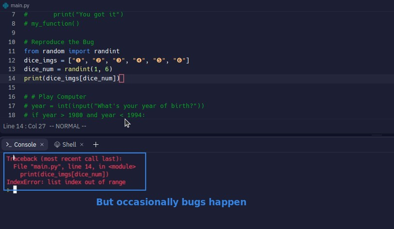
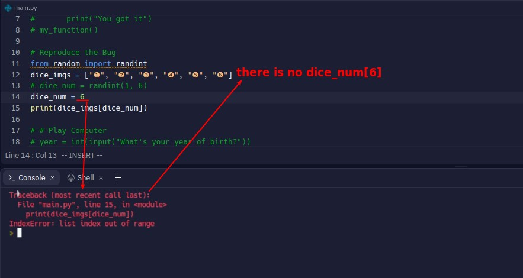

## **Occasionally Bugged**

- This type of bug is sometimes difficult to handle, and the key point is how to reproduce it.

## **Try to reproduce error(set value fixed)**

> This occasional bug usually means that each time you run the program there is a different scenario, so you have to fix each scenario and test it.

## **Fix the bug**

> If you can reproduce the problem, the bug itself is usually not too difficult.

