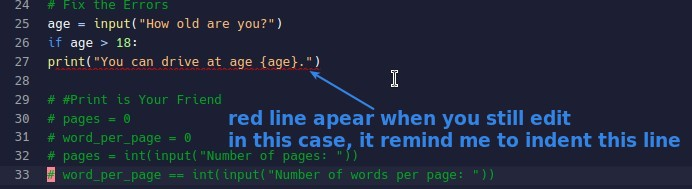
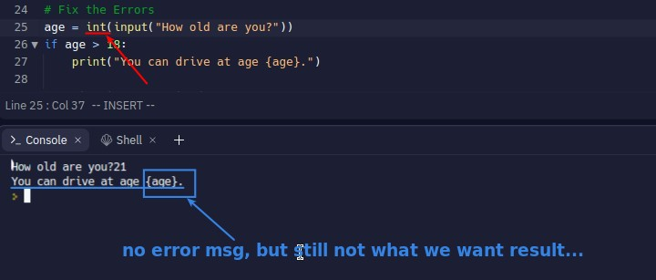

## **Red Line**

## **Error msg without red lines**

## **Search on internet**

> If looking at codes directly does not solve the problem, we will post the error message directly to google for searching.

## **Solve problem by experience and skill**

> Sometimes the problem may not search for answers on the Internet, we must rely on experience and professional knowledge to solve.

- It is recommended to always go to the Internet forums such as stack overflow to help people solve problems, which is a good way to accumulate experience.
- The professional knowledge component is recommended to rely on courses for systematic knowledge building.
