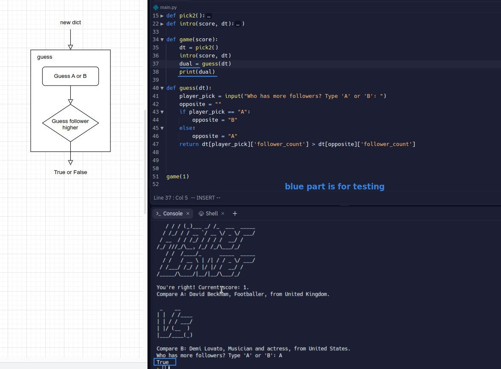

## **Game Walkthrough**

- The blue part does not appear for the first time (before any guesses).

- After each user input, the entire screen will be deleted and rendered again.

## **Files**

### _art.py_

- lector already provides the required ASCII art.

### _game_data.py_

- lector provides the required data, which we use to make the game.

### _main.py_

- empty, we must write the logic of the game itself from scratch.

## **Flowchart**

### _Initial_

### _Functionalized_

- It is important to clarify the input/output of each funtion.

## **Coding**

> Remember, try to avoid using global variables, unless they are constants

### _game_

### _pick2_

### _intro_

### _guess_

### _finish_

