# **_Features of pyCharm_**

> Not all, just list some features.

## **Why not keep use replit?**

- replit is very easy to fork and share, and can be used as long as it is online, no need to install any software.
- But as our program becomes more complex, we start to feel the limitations of replit.

## **More Space(Split window)**

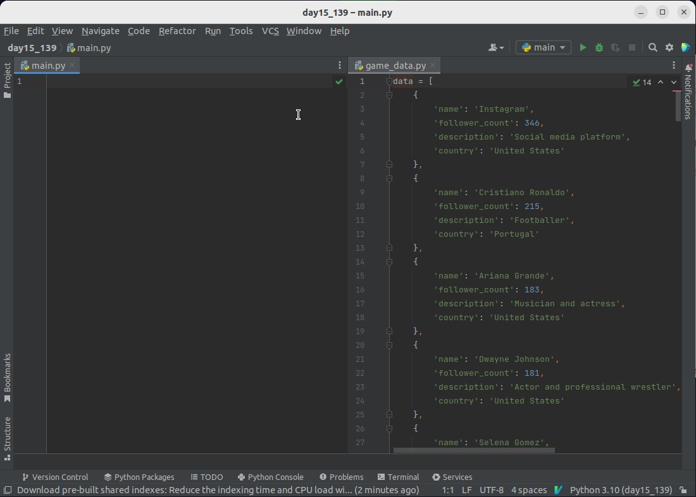

## **Spell Checking**

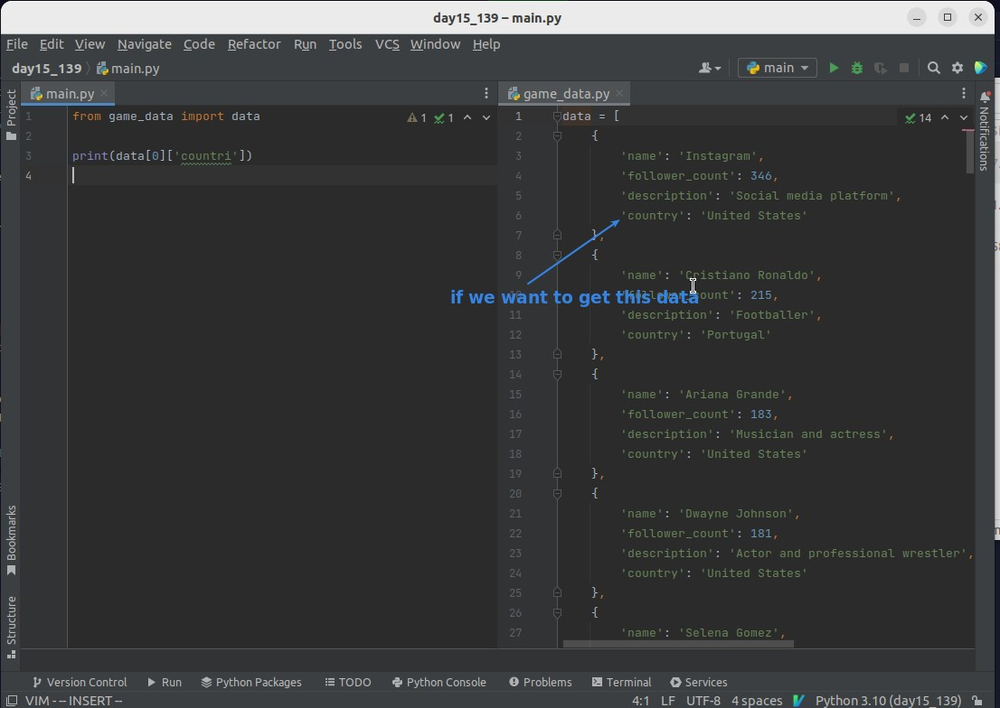

- If we all use the correct word for naming, any misspelling of a word will be found immediately, thus avoiding a bug

## **Linter & PEP 8**

### _Linter_

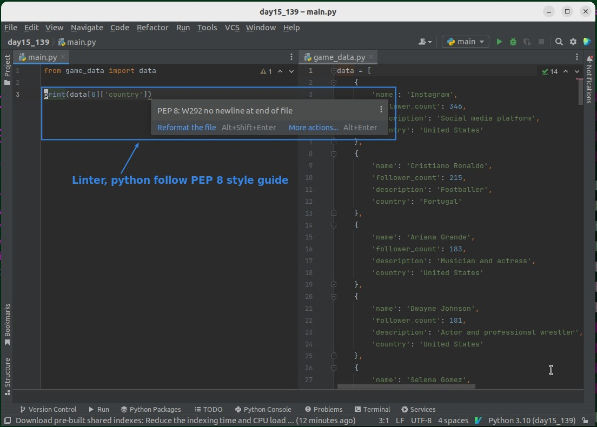

- linter is a mechanism that automatically checks whether our syntax conforms to the PEP 8 style guide.
- A style guide is a syntactic style and convention that does not affect the operation of the program even if it is not followed.

### _PEP 8_

> PEP 8 is a style guide that most developers of python follow.

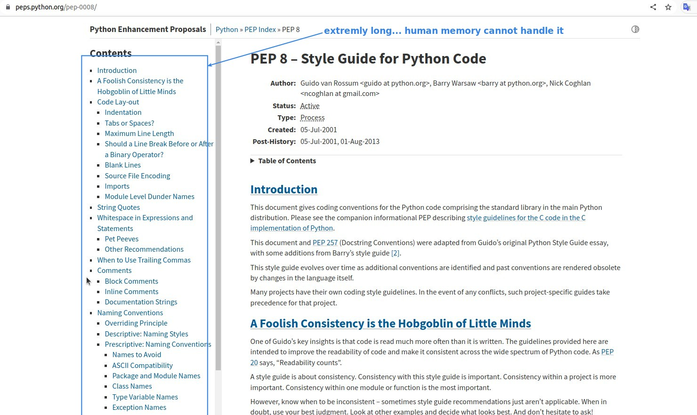

- There are too many rules, that's why we need to use linter to check.

## **Structure**

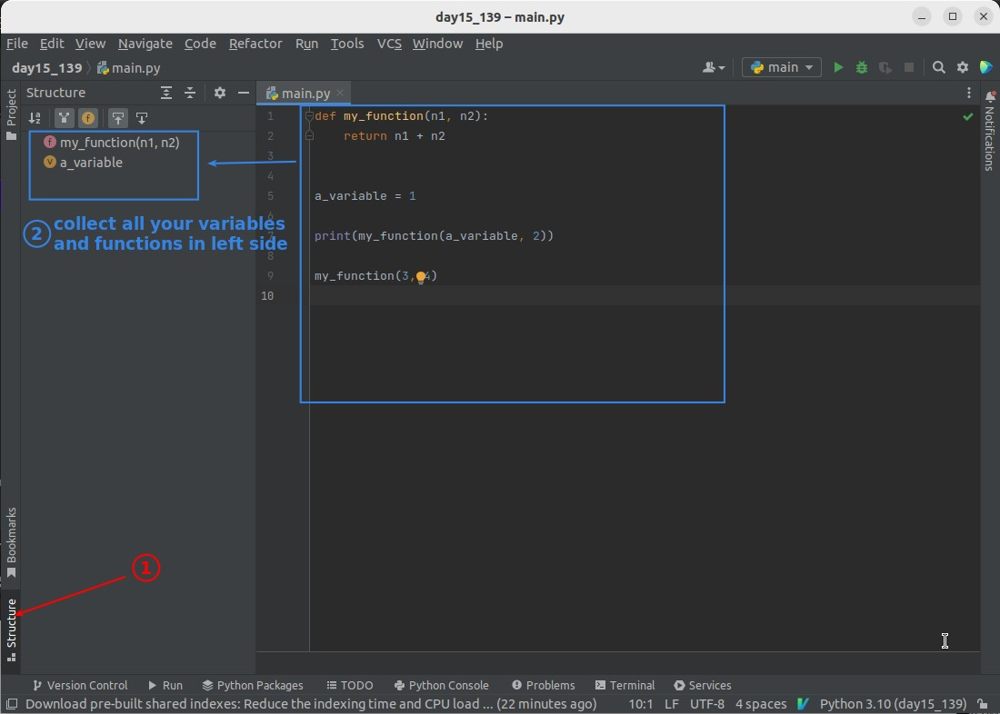

- The structure function comes in handy when we have a lot of variables or functions straggling around in different parts of the script.

## **Refactor name**

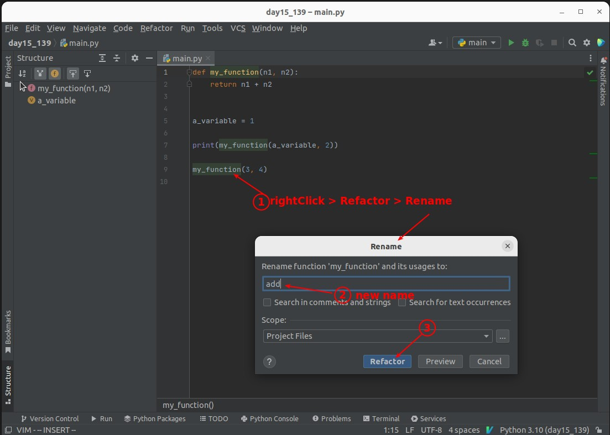

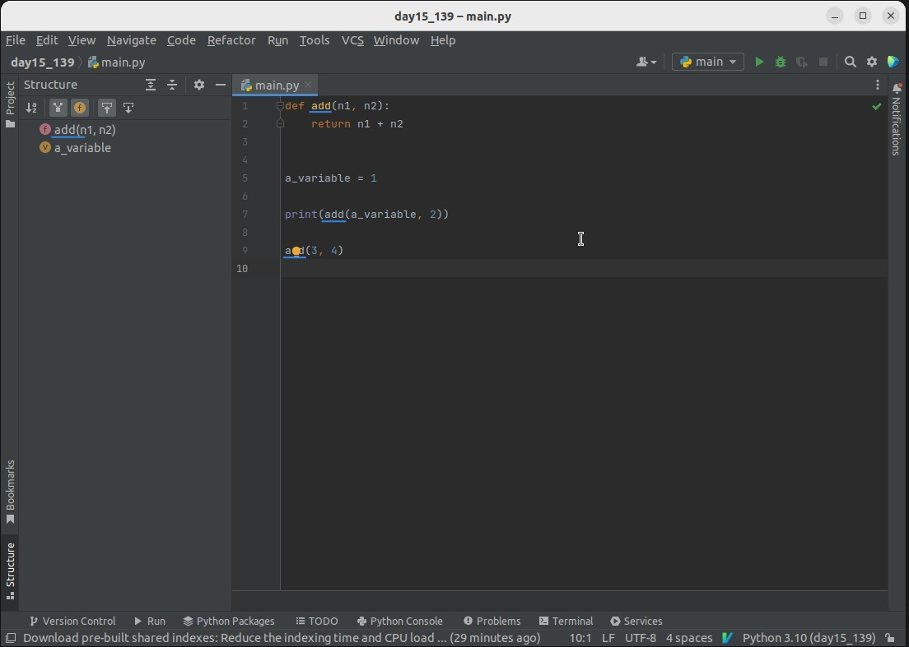

## **Local history & Recovery**

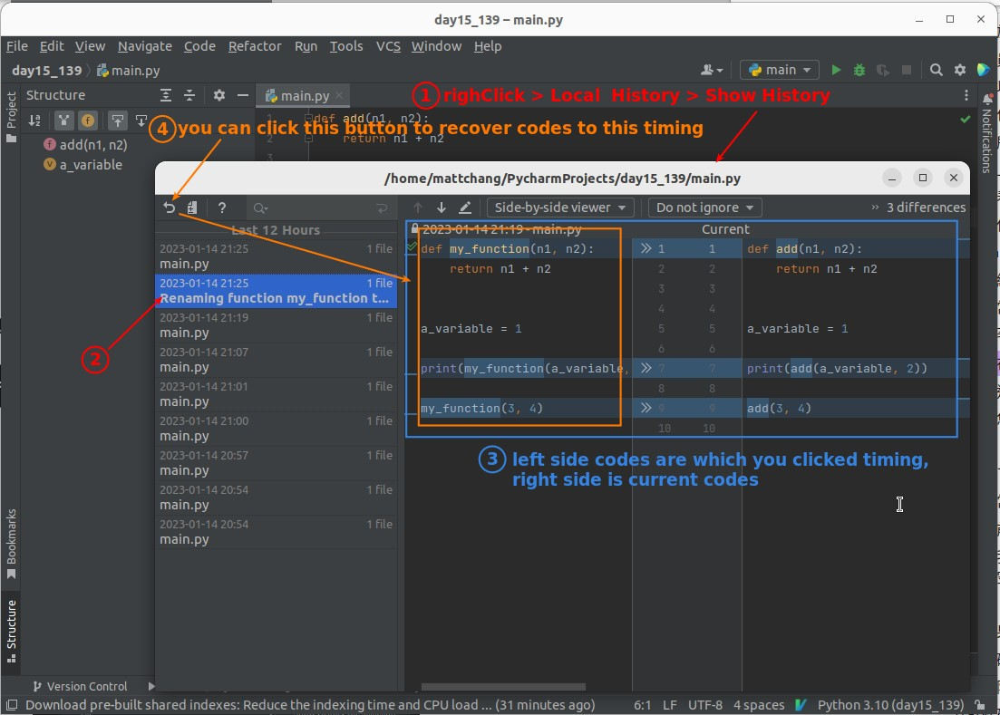

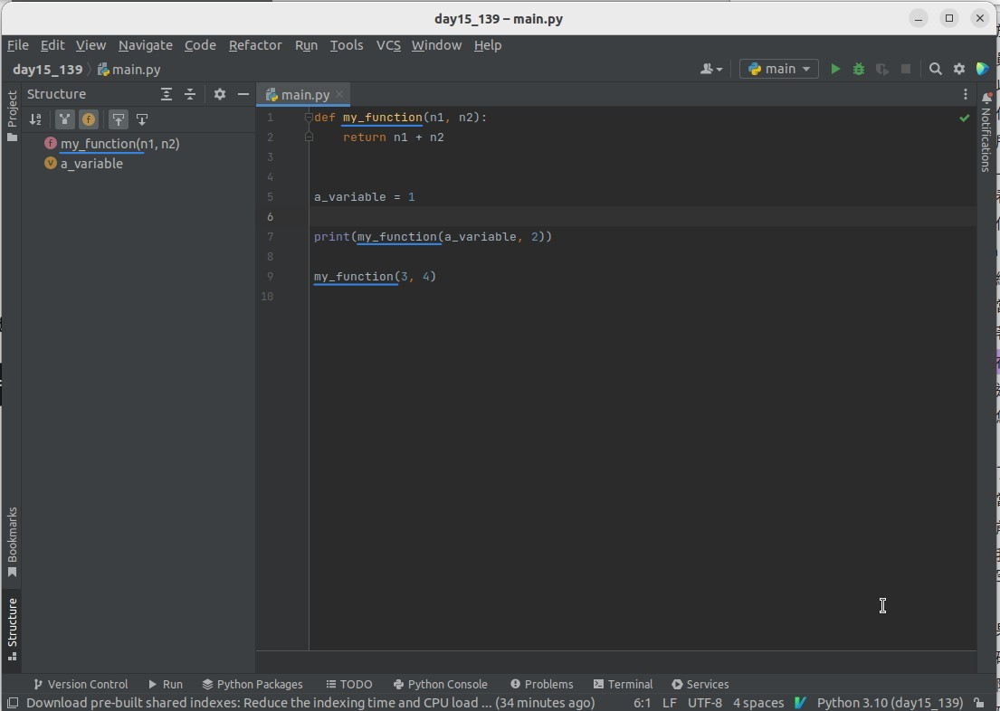

## **Recovery and Refactor name practice**

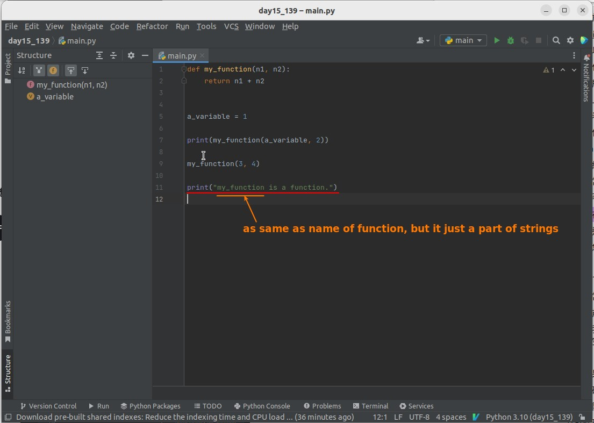

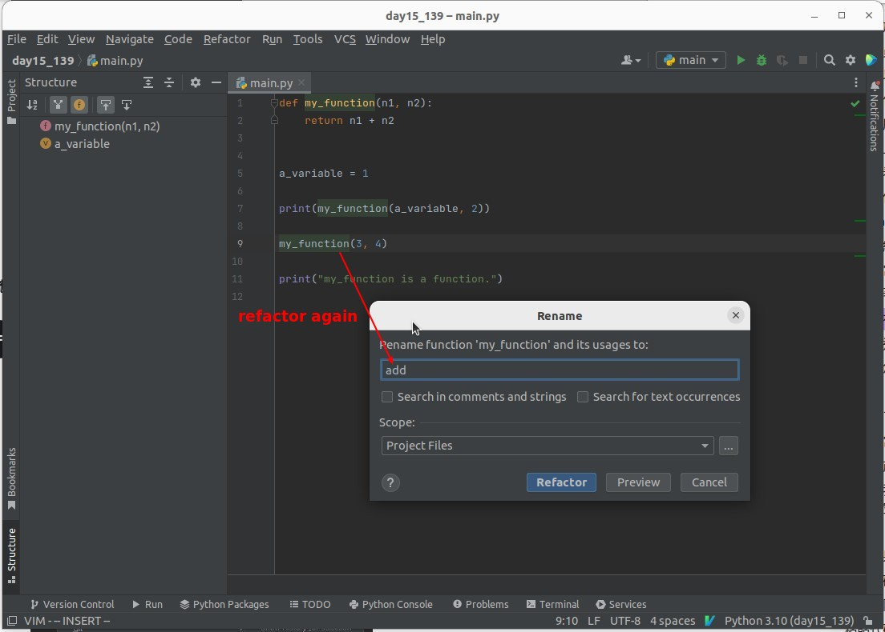

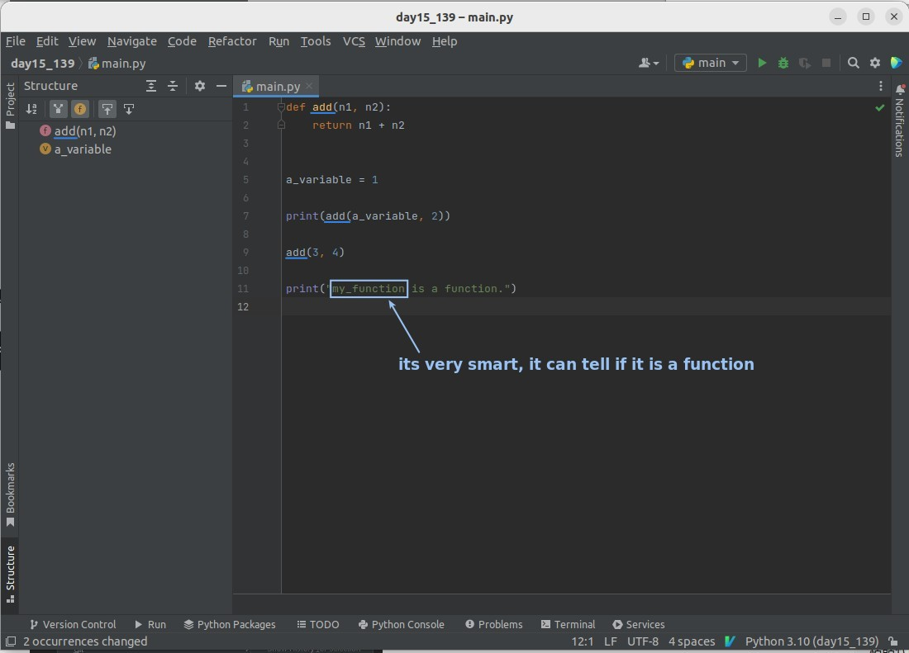

- A normal text editor will not distinguish between a function and a string, and will replace it as long as it matches the searched keyword, while pyCharm's refactor is much smarter.
