## **Coffee Machine Project!**

### _DM_

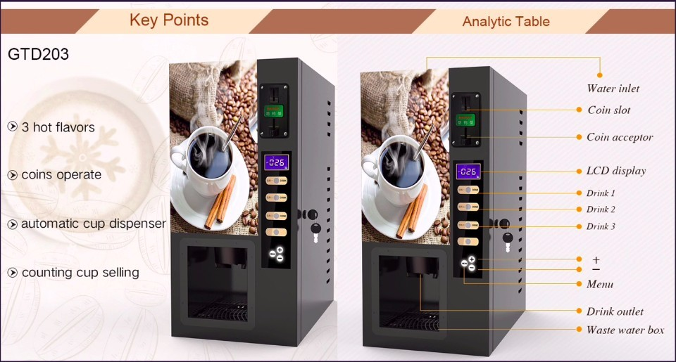

### _3 Flavours_

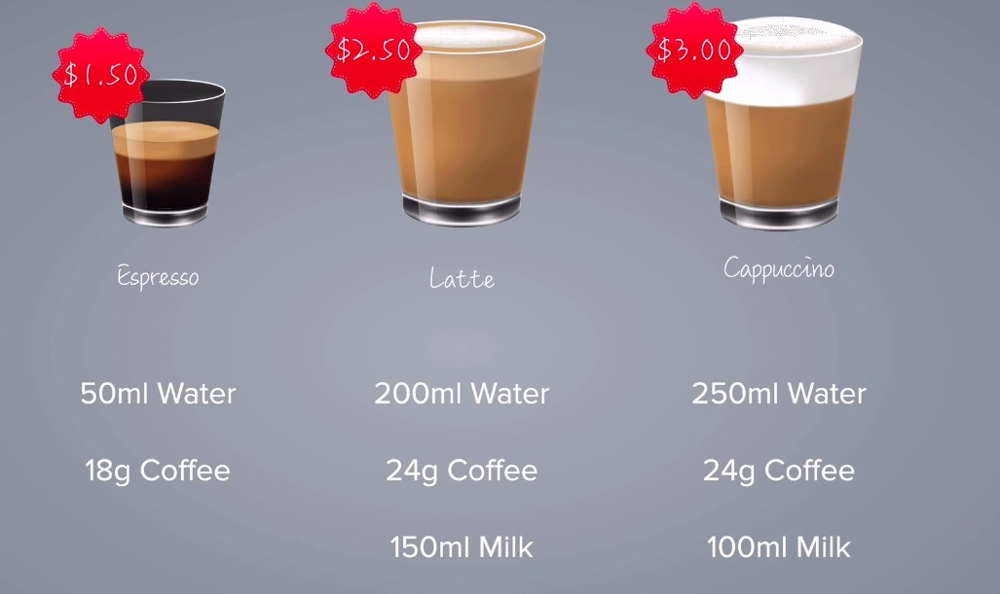

- This coffee machine offers three different coffee choices, each with different ingredients and prices.

### _Resources control_

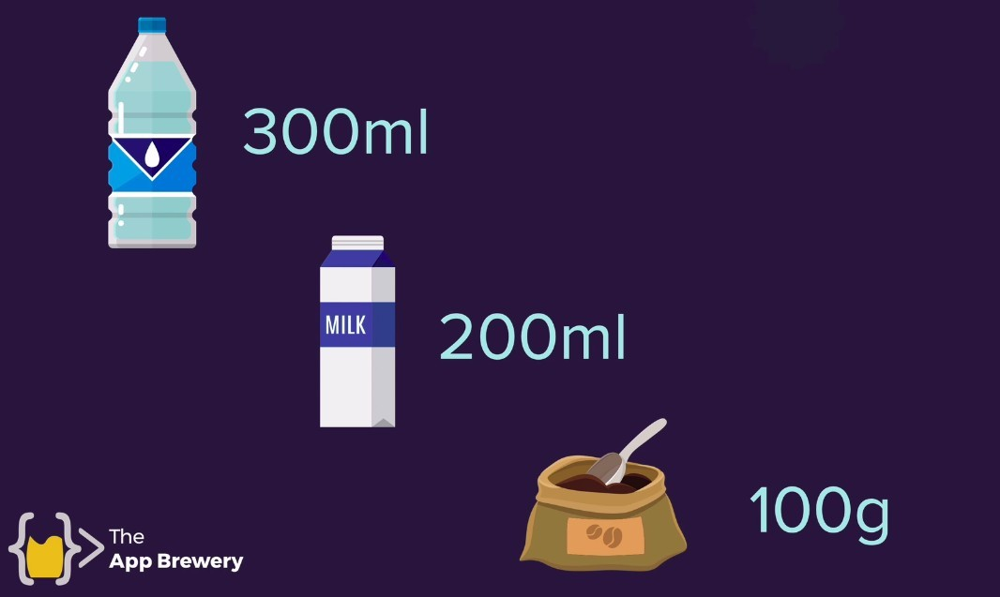

- The above diagram shows the three resources that will be available at the beginning of the coffee machine, which will be used when making coffee.

### _Coin operated_

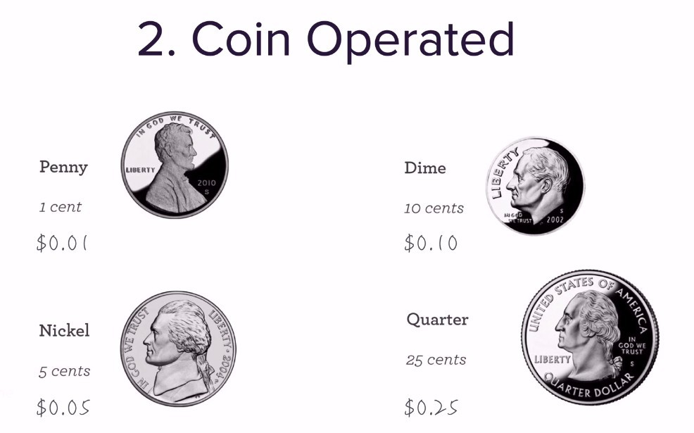

- This coffee machine only accepts these four types of coins, paper money or card or even electronic payment are not accepted.

## **Program requirements**

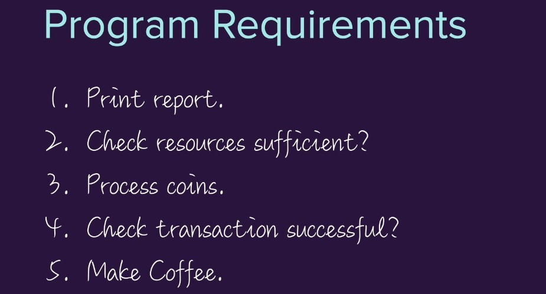

### _PDF_

> lector provides a PDF to describe in more detail the needs of the program, including what situation to print out what string, etc.

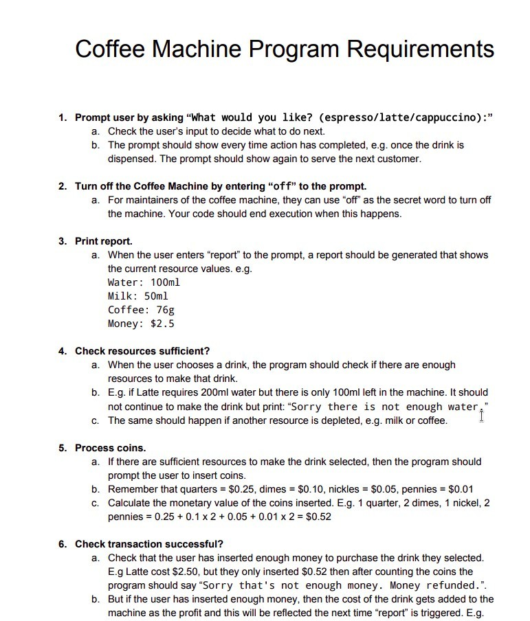

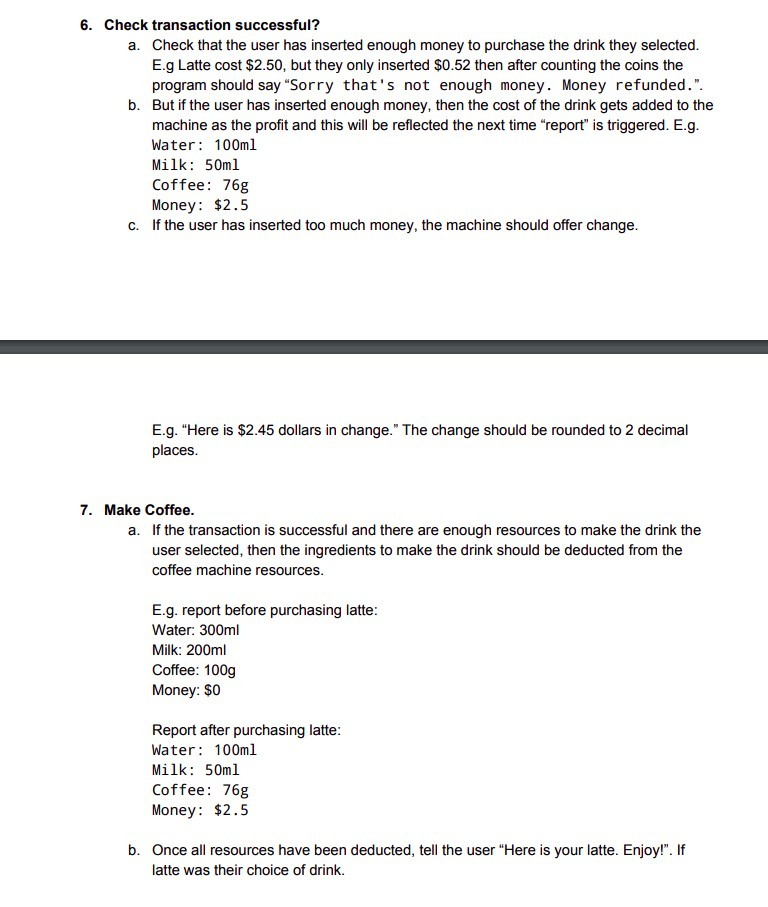

## **Play Walkthrough**

### _Report current resources_

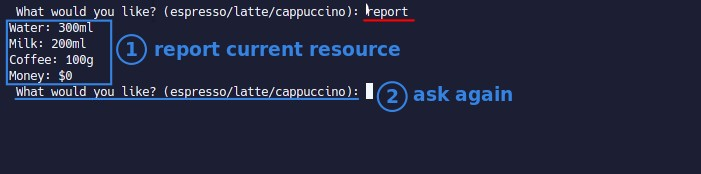

- We can check the current resources at any time by entering `report`.

### _Coin operated_

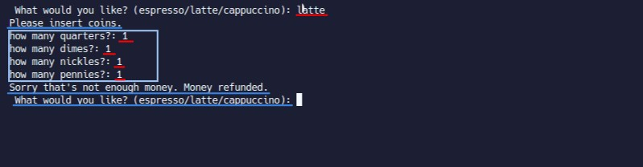

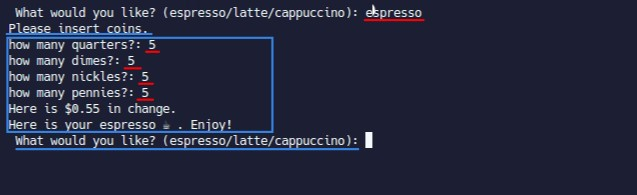

### _Resource control_

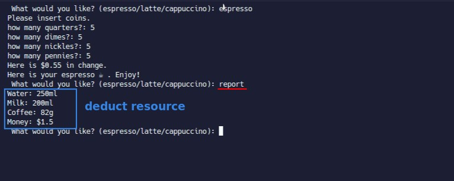

## **PyCharm prepare & TODO**

> We started using pyCharm to complete our project.

### _Create project_

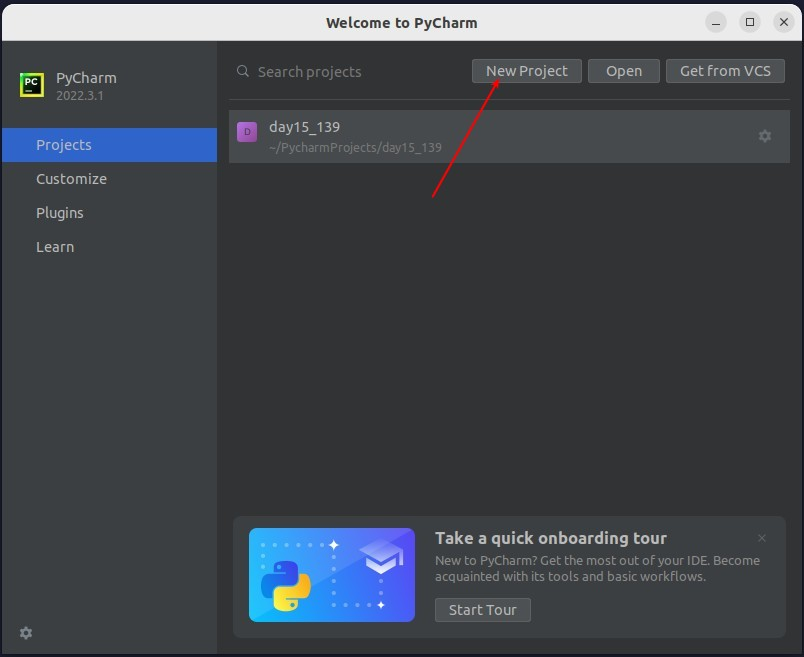

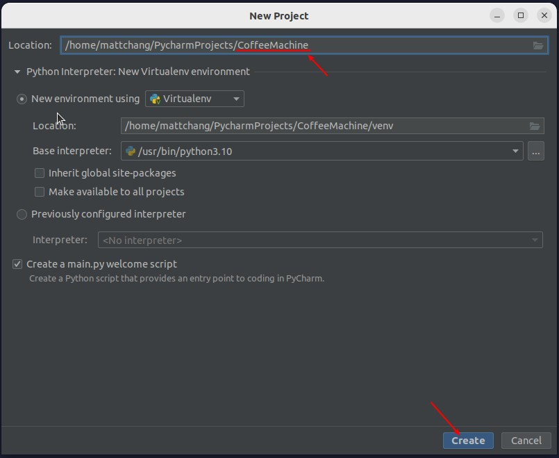

### _Get Data from replit_

> Because the sharing feature of replit is still very convenient, so the data written by lector for us is put on replit, and we have to copy it to the pyCharm file ourselves.

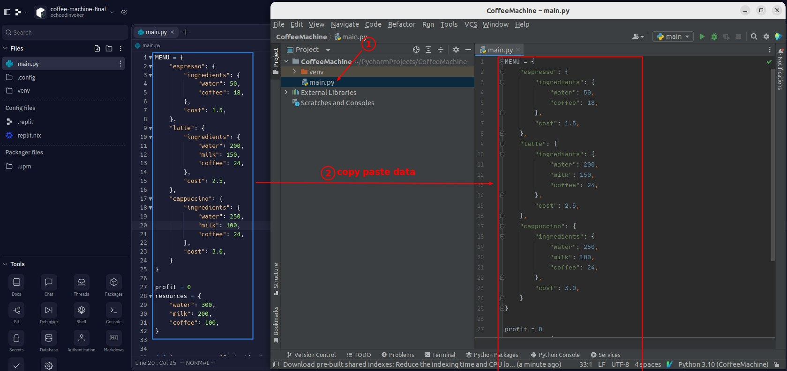

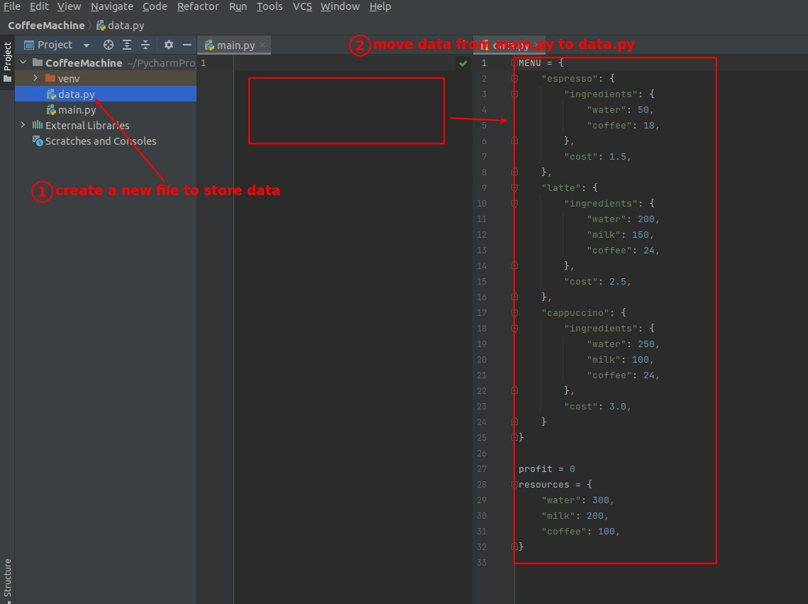

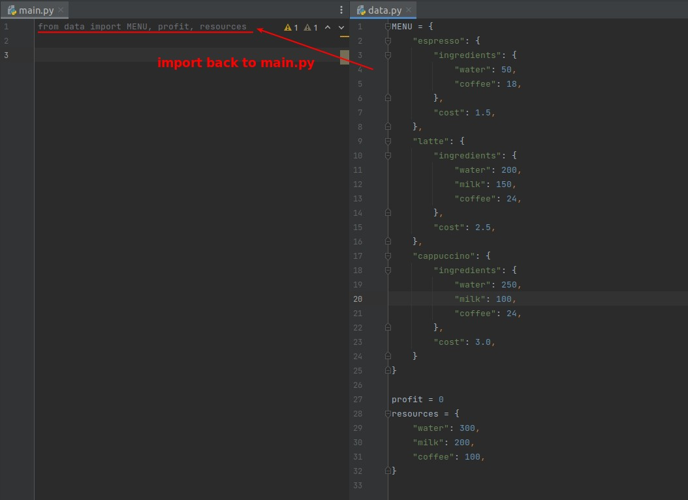

### _TODO_

> pyCharm has a TODO tracking feature, which makes it easier for us to break down our work into smaller chunks.

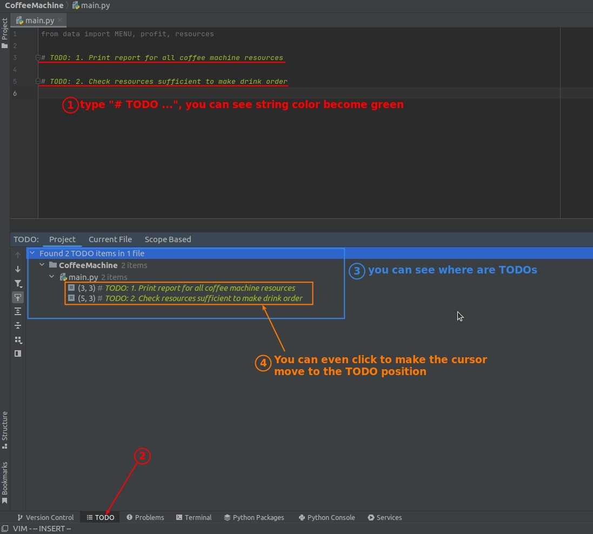
