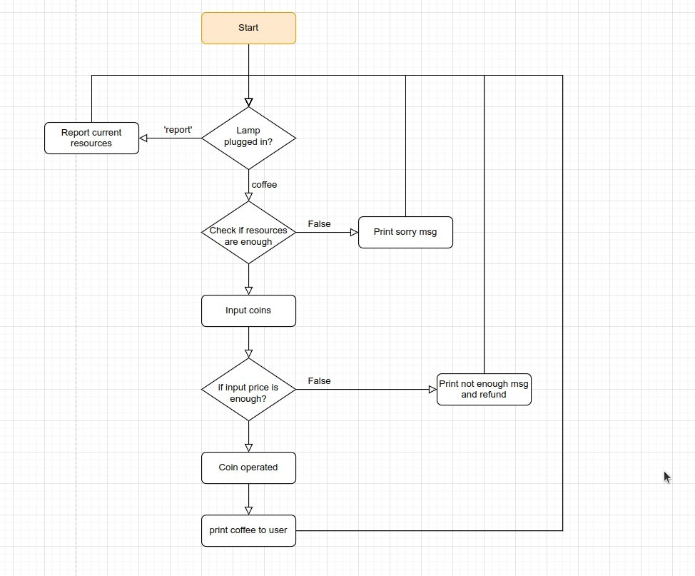

## **Flowchart**

### _init chart_

### _functionize chart_

## **Coding**

## **Compare to lector's**

## **Debugging**

## **Optimize**

### _ask flavour_

### _charge_

## **Conclusion**

- After the associated data has the correct data structure, the function often does not need to return any values, often return boolean is sufficient and can be directly as a condition.

- In addition to the return of the function, the parameter of the function should be set directly to the value that is really needed internally, because when we call the function, it is an assign operation, which can omit a lot of instructions for assignment.

- Try to use loops and avoid recursion, the latter is really prone to bugs.
  - This also means that sometimes it's better not to wrap codes in functions, but it's hard to know whether to wrap them in functions or not.
