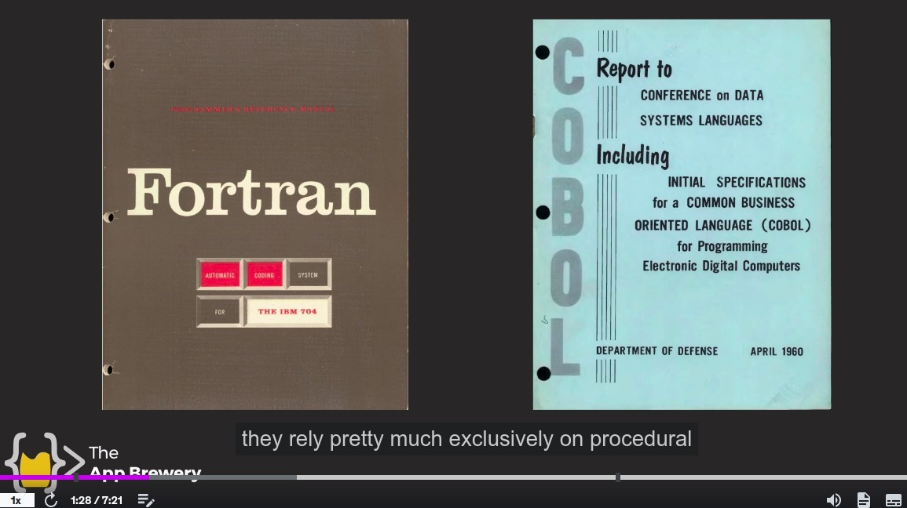
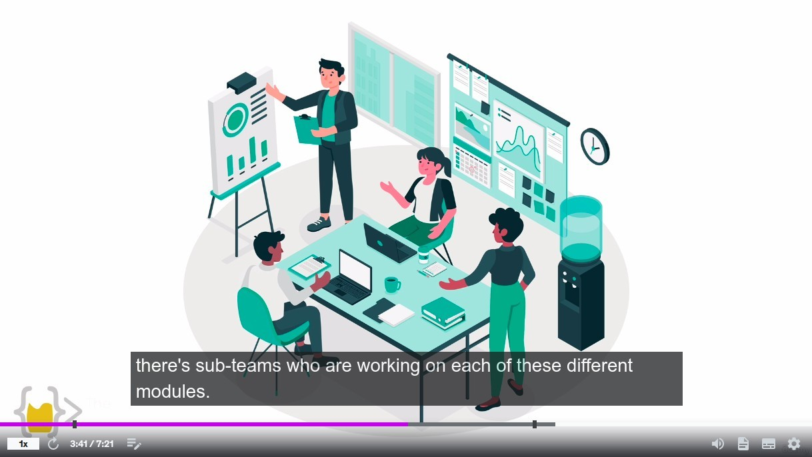

## **Procedural Programming**

### _How does it work?_

- Execute from the top to down, jump to the function when it is called.

### _Languages_

Some old languages like fortran and cobol is exclusively procedural programming.

### _Limitation_

- As the project grows larger, procedural programming becomes more difficult to use because of the need to remember how each part is related.

## **Example: automation car**

- To make a system for automation car is very complicated, but we can cut it into several pieces.

- In the case of multi-person collaboration, there are often several sub-teams of people responsible for one part of the project.
  - This allows for effective multi-person collaboration to complete projects.

### _Reusable_

- When automation care is finished, the next project may be drone, and we can take the parts we have done before and use them directly, unlike procedural programming where we have to rewrite them.

## **Example: restaurant**

### _one man_

- Although there are still restaurants run by one person, the number of customers they can serve is very limited.

### _Multi-Person Collaboration_

- Everyone doesn't have to know what the other person is working on, because everyone knows what they have to do and how to do.
