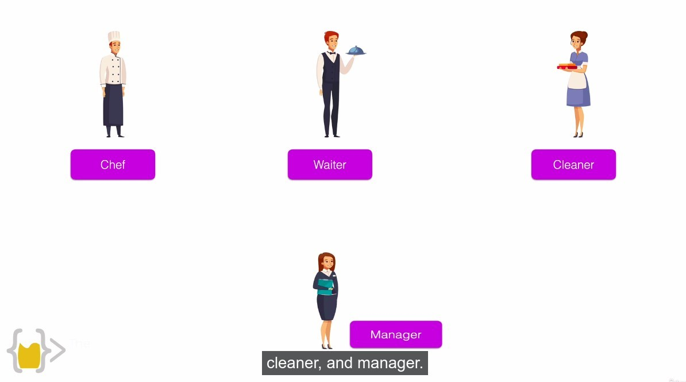
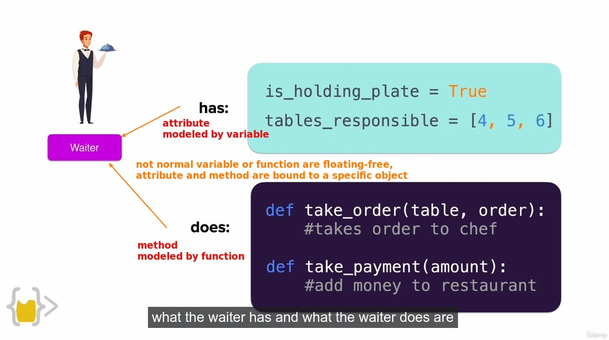
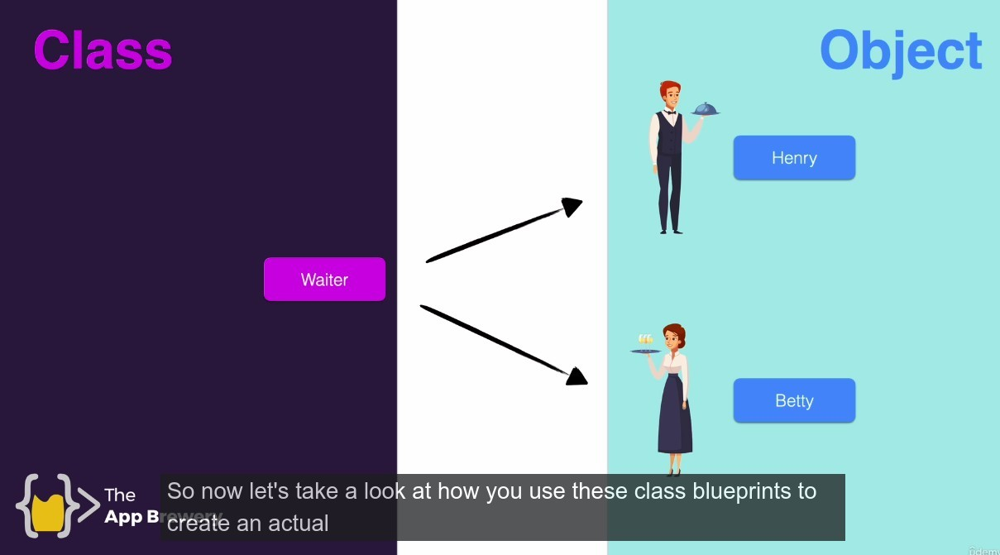

## **Virtual resturant**

- Suppose we want to build a restaurant, first we start by designing a virtual waiter.

## **Virtual waiter**

### _how to define a virtual waiter?_

- What he has?
- What he can do?

## **Real waiter**

- The preceding is only the definition of waiter, but the waiter in the restaurant may have many individuals, each of whom is an independent individual, just from a same blueprint.
