## **Formula: How to generate a object from a class**

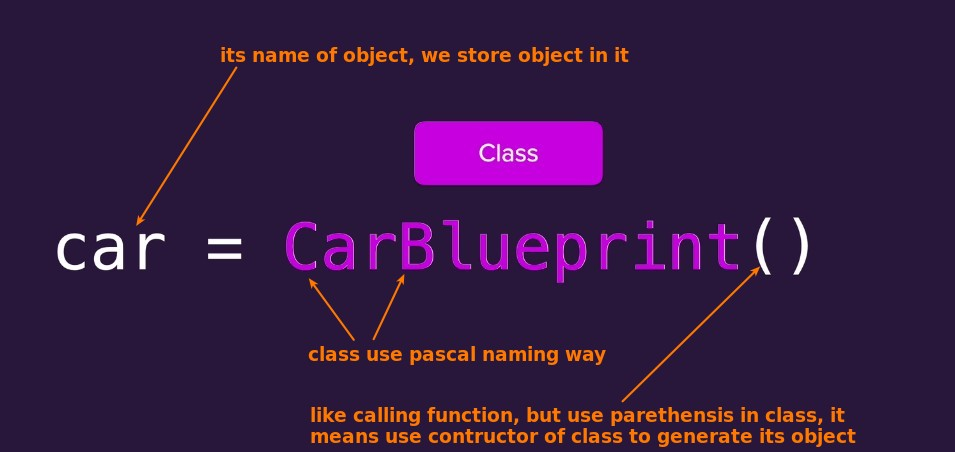

## **pyCharm symbol and practice**

### _class_

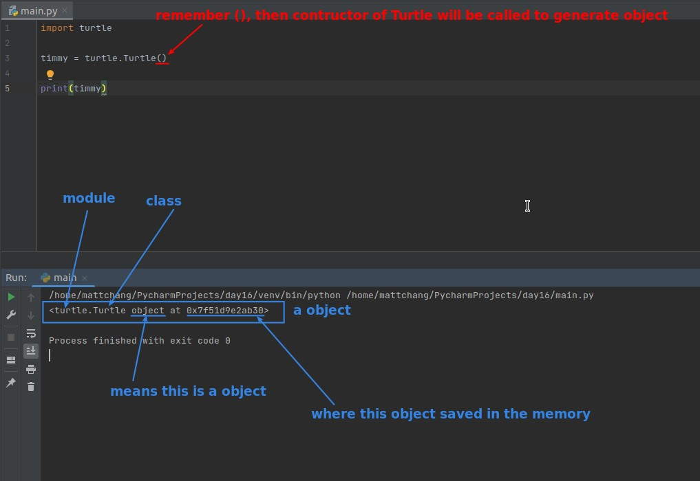

### _Funtion to create object_

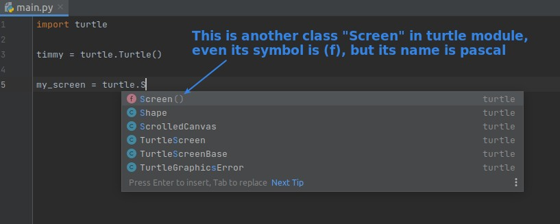

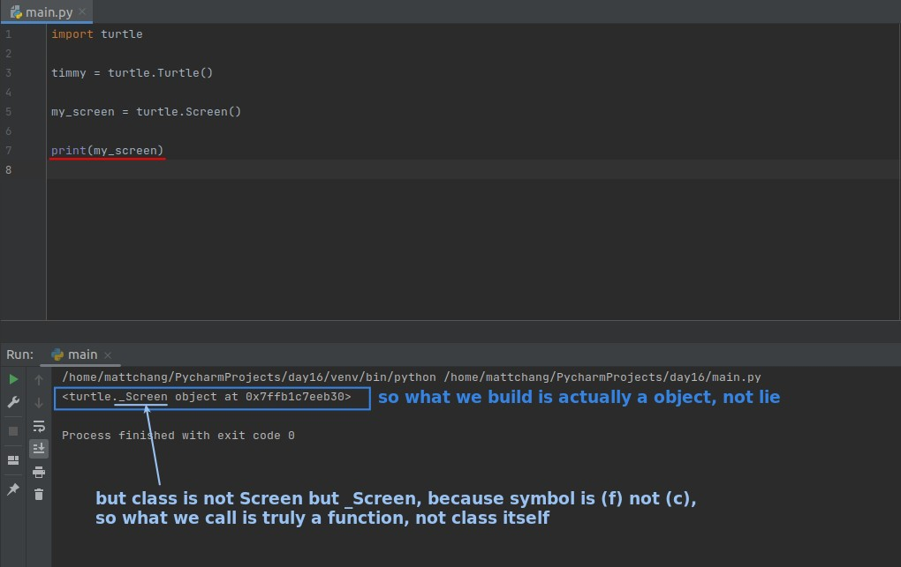

### _Attribute_

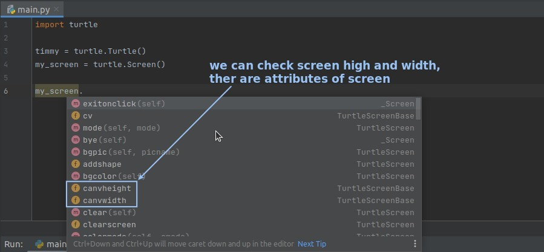

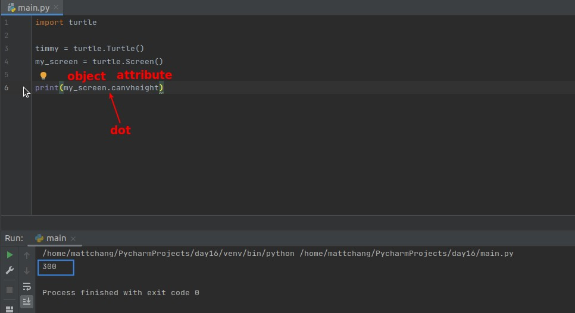

### _Method_

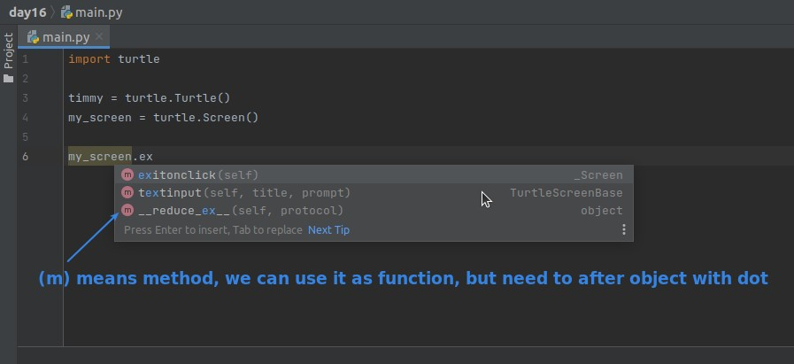

## **Play around Timmy on the screen**

j
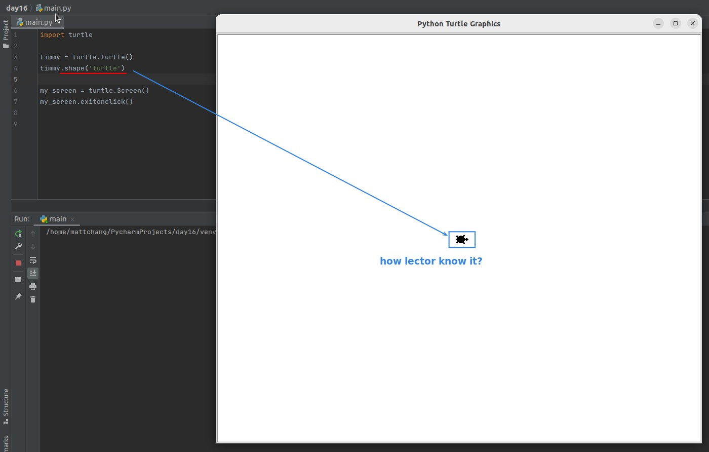

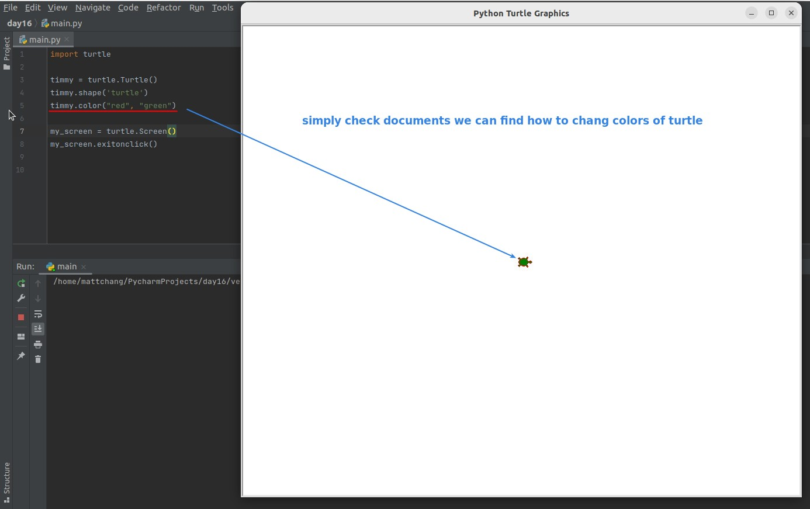

### _Why lector know so much knowledge about turtle..._

- Lector isn't magician... she just checks Turtle's documents.
  - https://docs.python.org/3/library/turtle.html
  - https://cs111.wellesley.edu/reference/colors

### _Try to let Timmy walk 100 steps by checking documents_

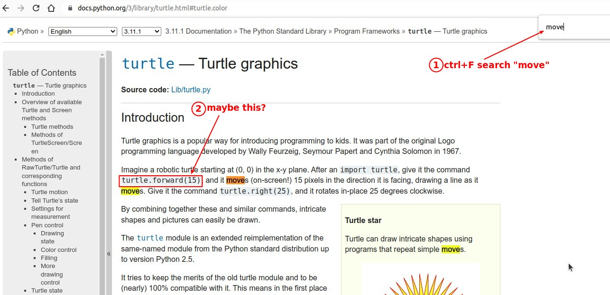

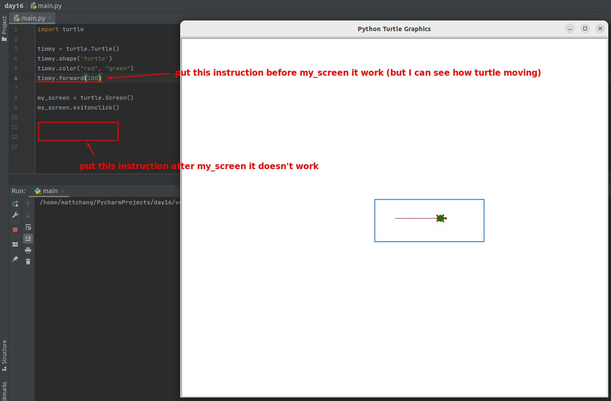
