## **Module vs. Package**

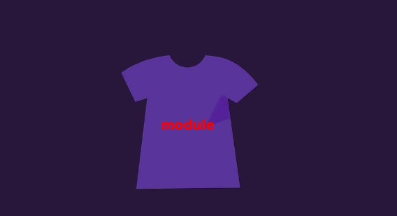

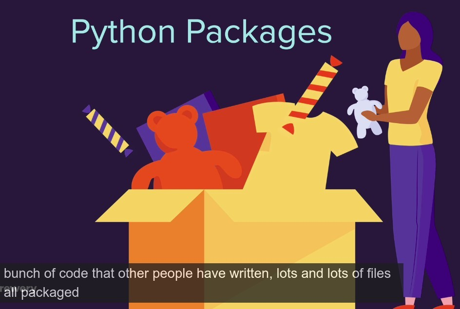

## **If I want to create a table about Pokimon and Their types**

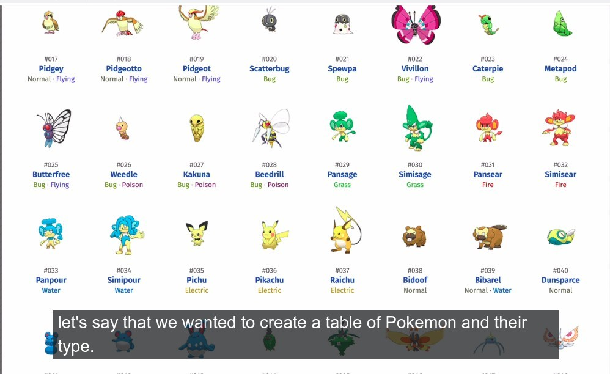

### _ASCII and print_

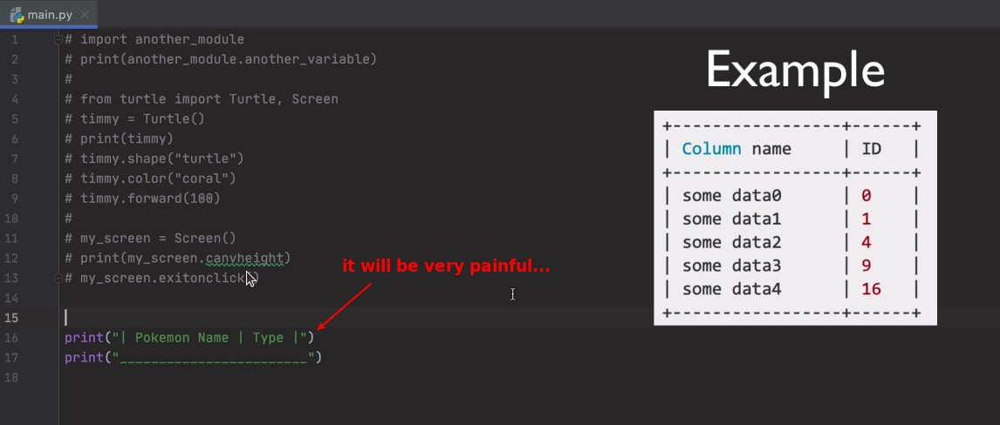

### _Use package written by others_

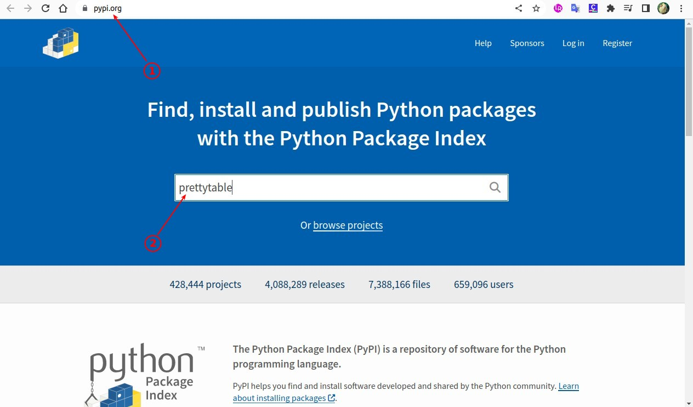

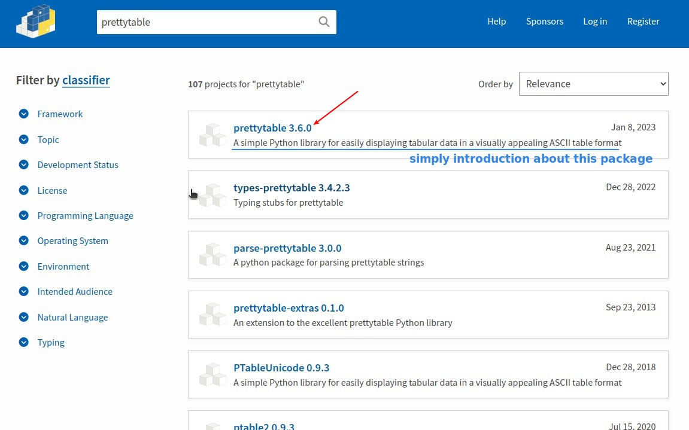

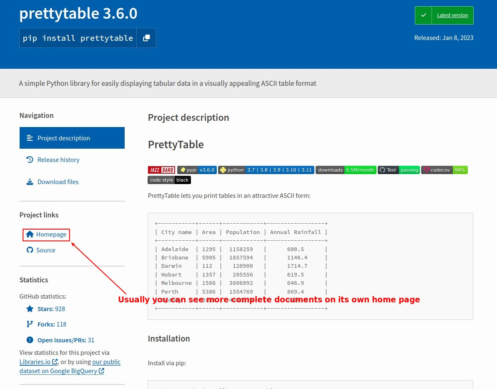

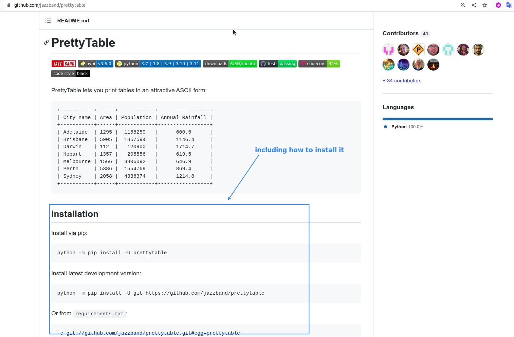

## **Install package**

### _pyCharm_

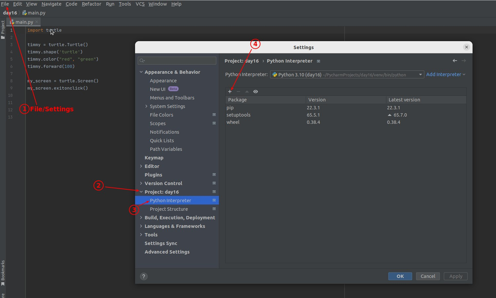

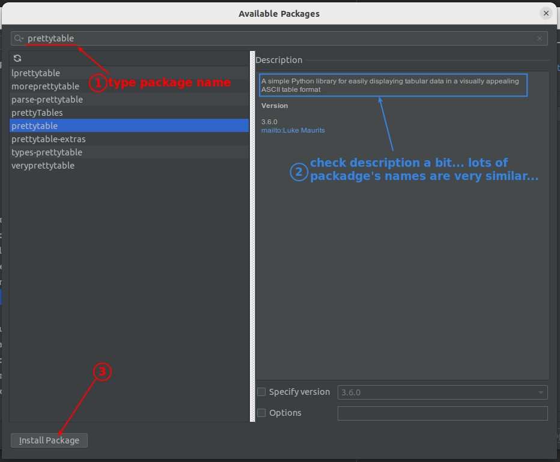

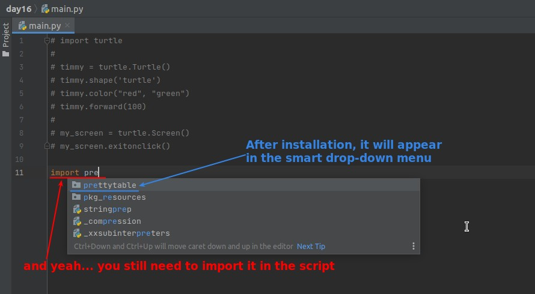

### _replit_

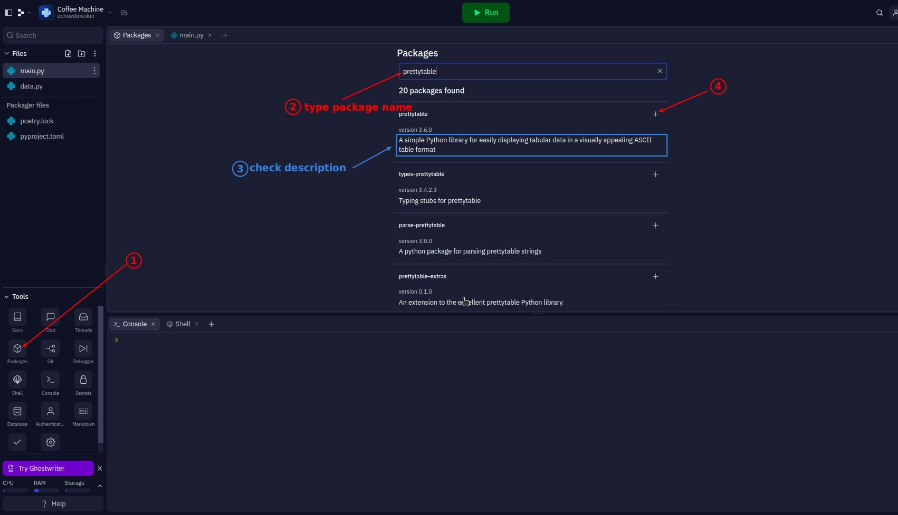
