## **Challenge: Create a PrettyTable Object and Name it "table"**

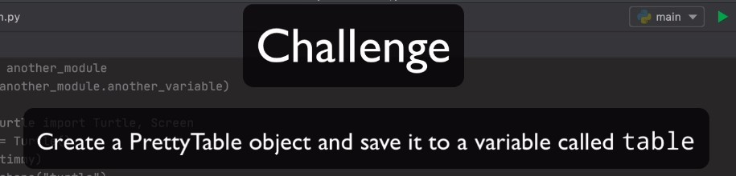

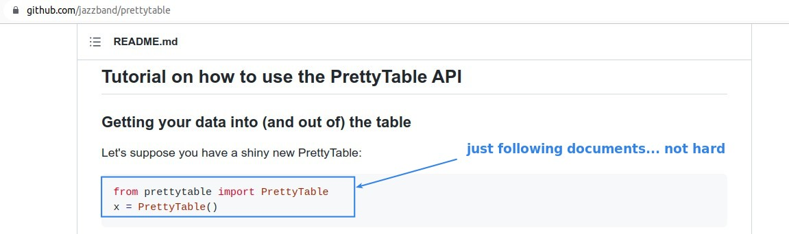

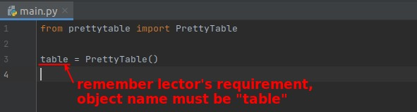

## **Challenge: Generate a Pokemon table by it (and documents...)**

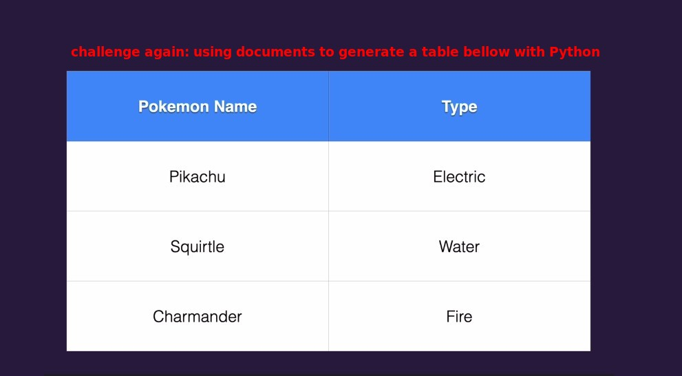

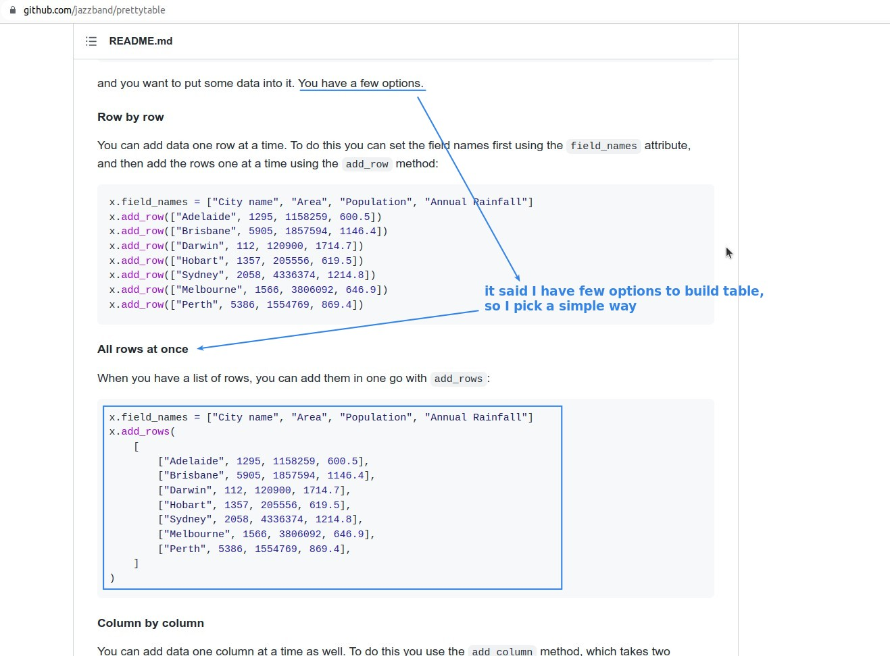

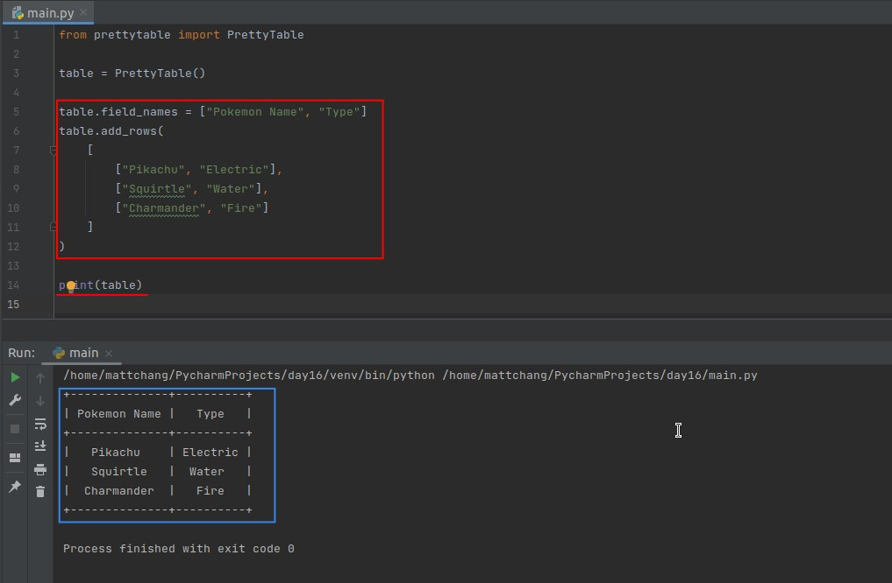

## **Set Style of Table**

> After an object is created, you can set its attributes to make it change, in PrettyTable it is mainly to change the style of the table.

### _Hard way: set value of attributes directly_

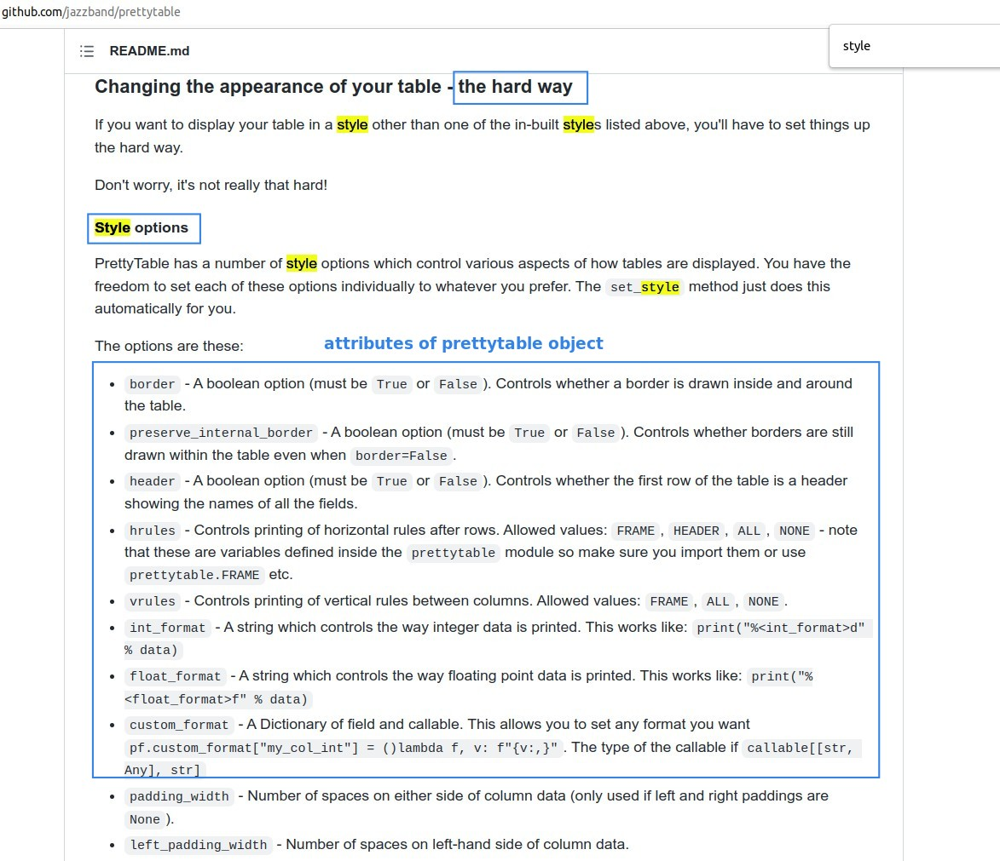

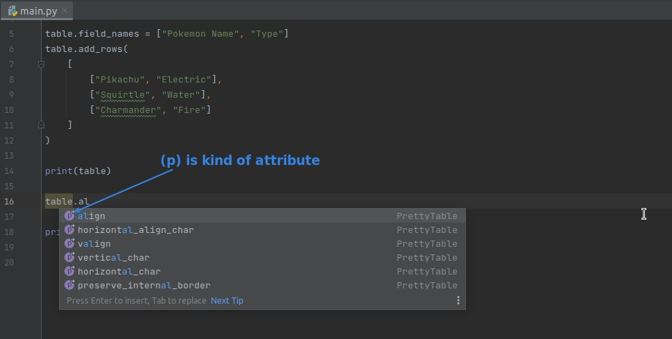

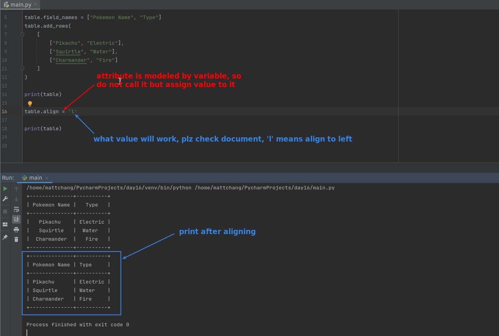

### _Easy way: set value of attributes by methods and constant variable_

> In fact, the core is still changing attributes, just become methods to do it for us.

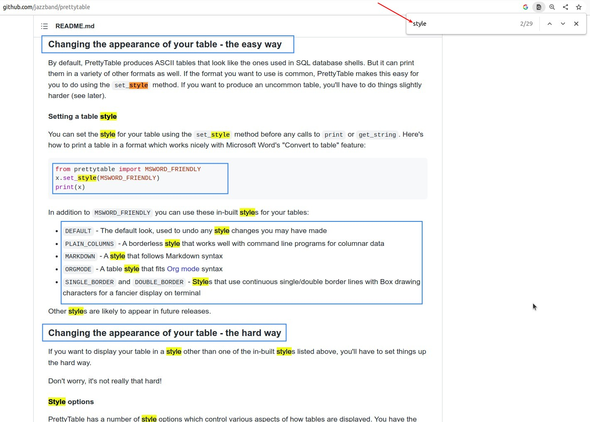

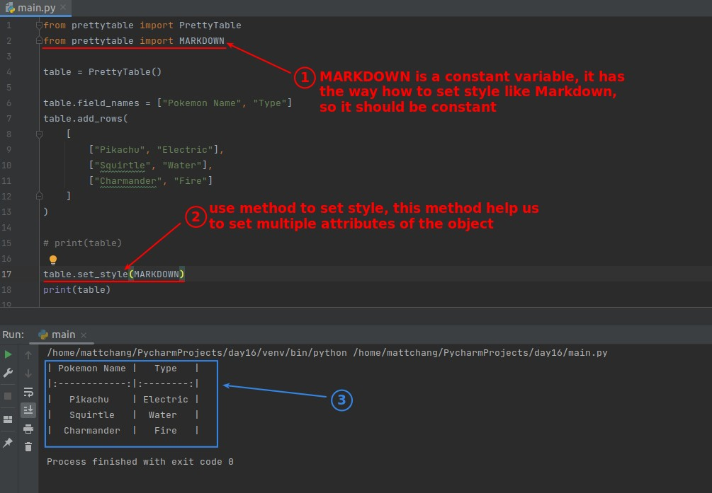
