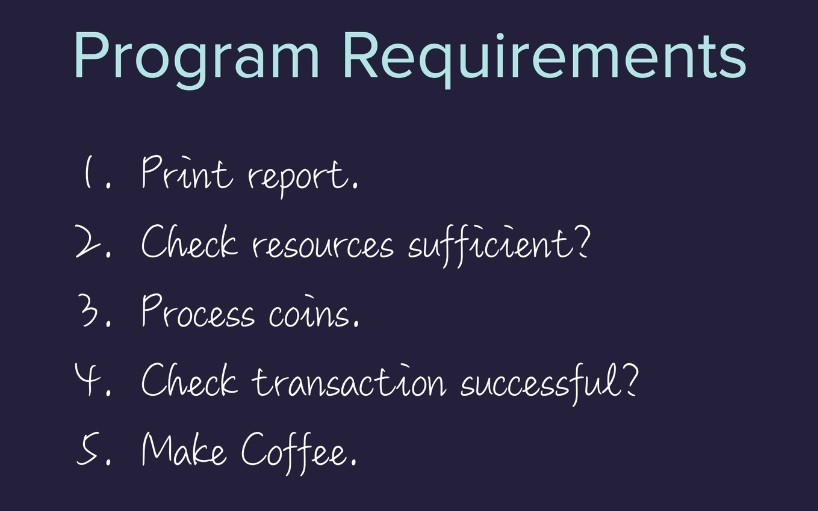
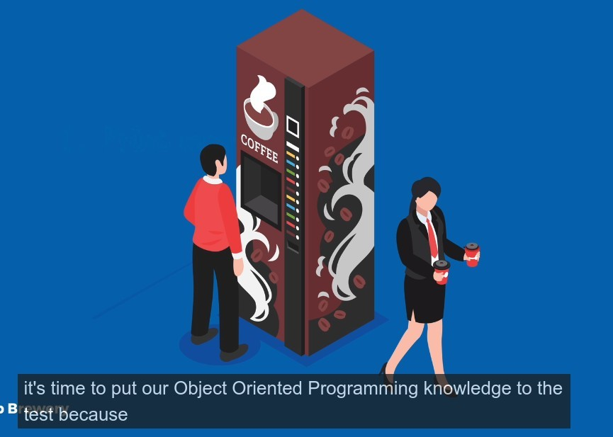
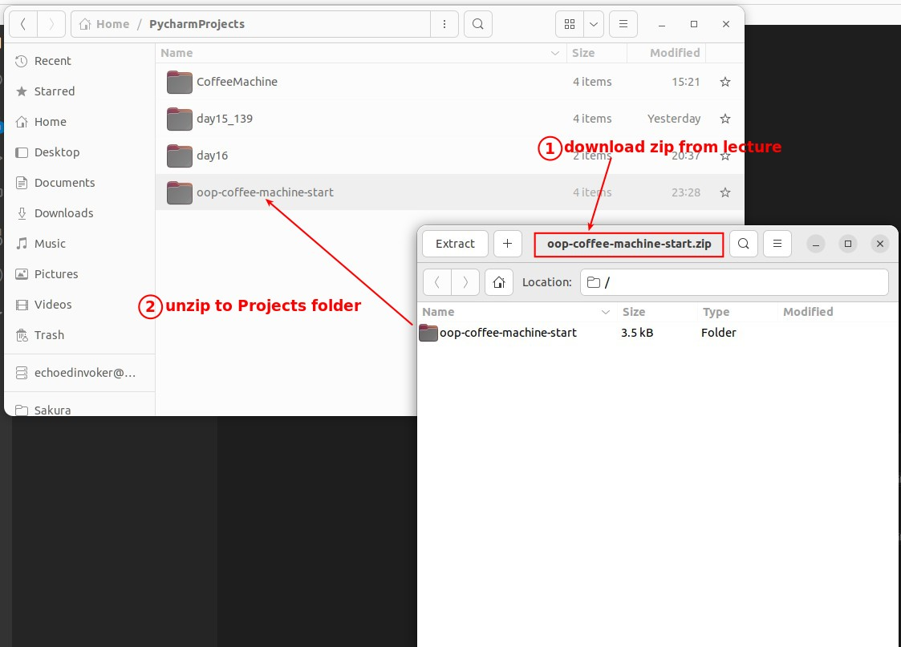
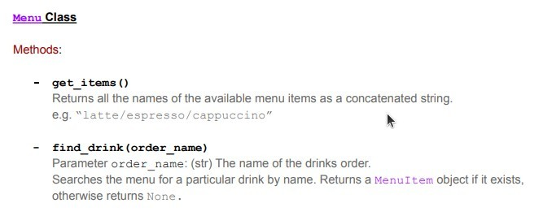
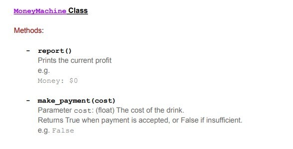
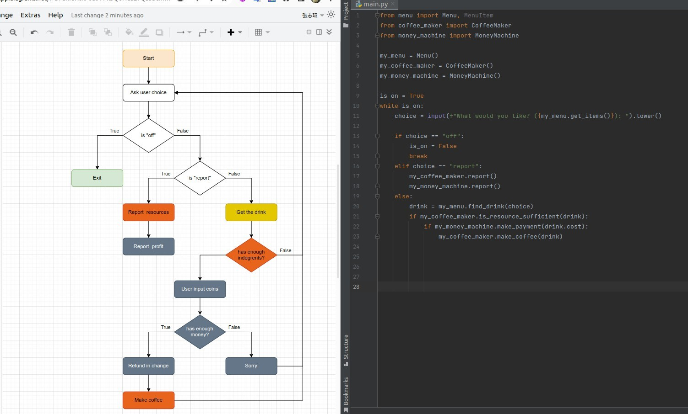
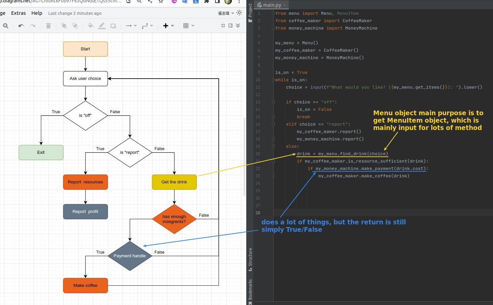

## **Review OOP by Hotel service**

## **Coffee Machine again in OOP**

- The requirements are exactly the same as before, but this time they are done using OOP.

## **Prepare file & codes**

## **Documents for Class by Lector**

> The first two Class concepts are not easy to understand, but you will often see this use case.

- The Objects generated by this Class are required as input for many other Class Object methods.
- You can find that for its constructor to be called, it must bring in five parameters, which is very troublesome if you want humans to do it, so it is used in the object of other classes to create the MenuItem object.

- We use the method of the Menu object to generate the MenuItem object.
- The basic information about all the drinks is here, but instead of calling the information directly from here, we bring it into the MenuItem object to generate the drink-specific MenuItem object, and these operations are done by the Menu object's own method. (very tricky I know...)

## **My Solution(Flowchart & Codes)**

- You can find that objects are classified by types of things, so many of the things handled by the same object are scattered, not necessarily centralized.

- We can do as much work in a method in the object as the data in the object allows, and then return a simple boolean, so that it looks like a condition block to the outside world, which is very simple and do a lot of work.
- Only one yellow block, but it is most tricky place in chart.
