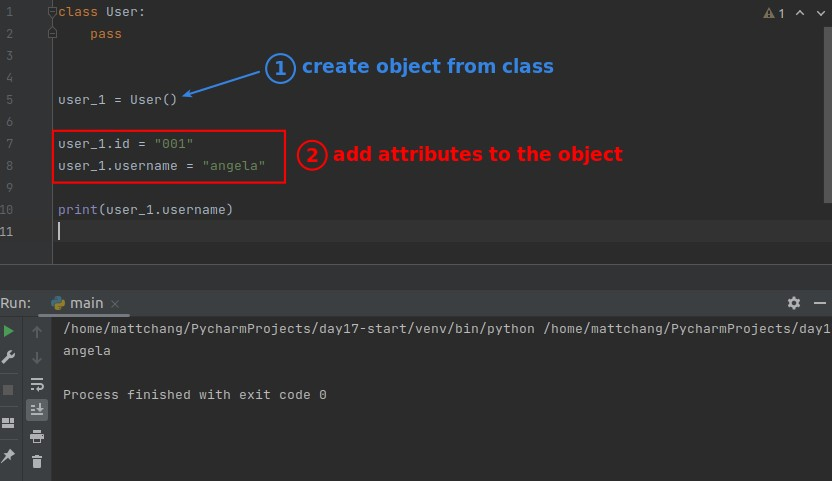
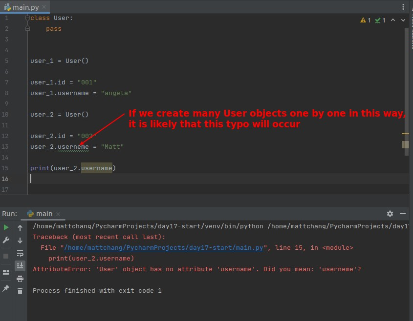
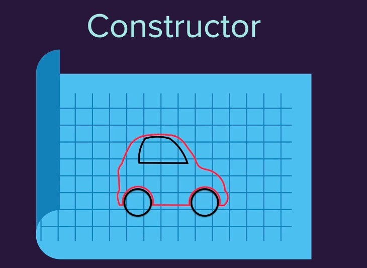
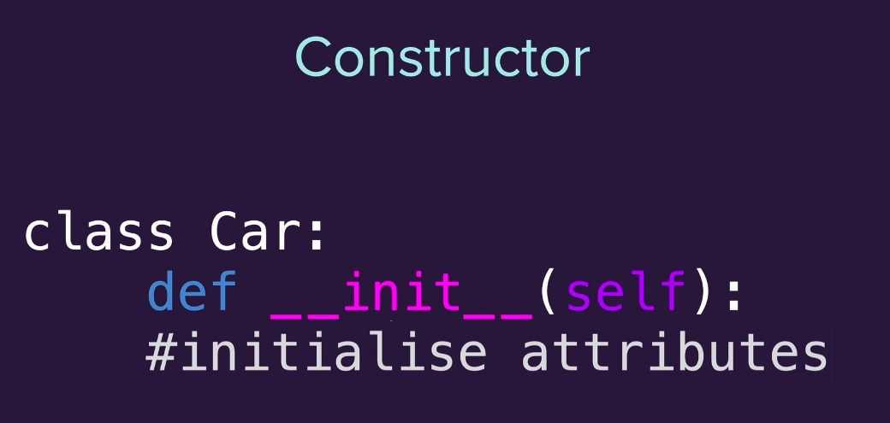
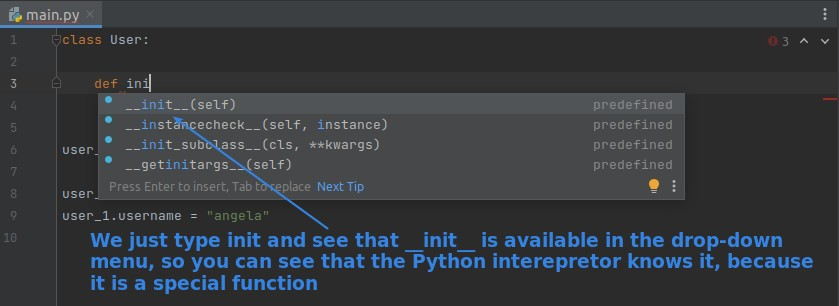
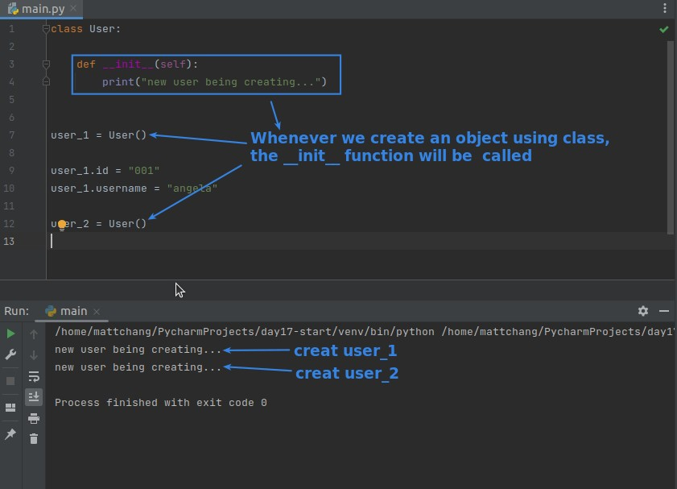
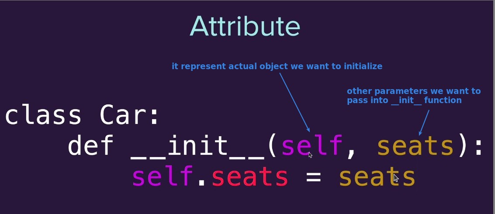
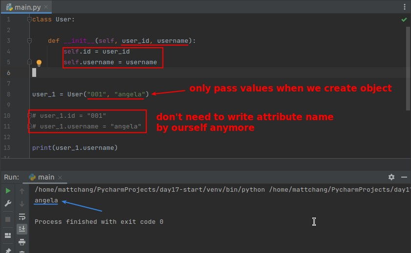
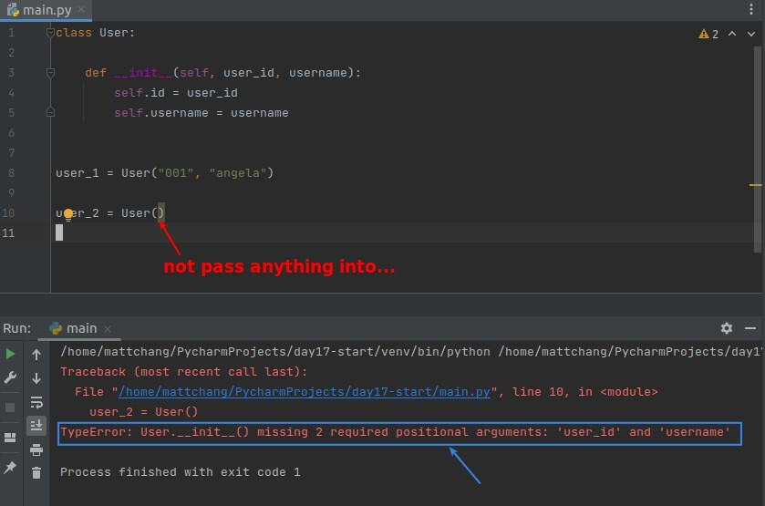
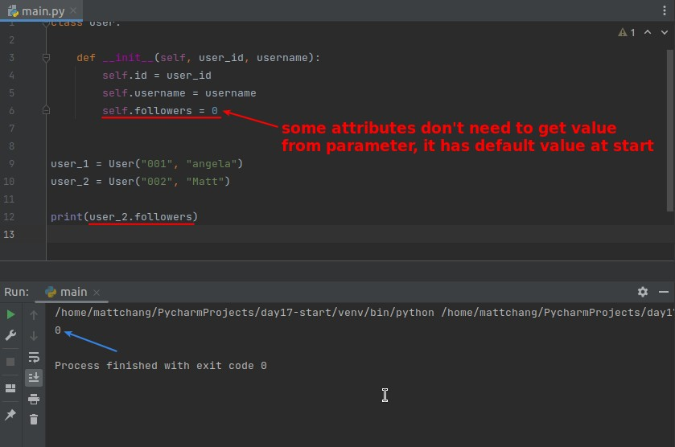

## **Create Attributes by Sticking to object**

### _practice_

### _prune to typo_

## **Constructor intro**

### _concept_

### _\_\_init\_\_ is special function_

## **Create Attributes by **init\*\*\*\*

### _\_\_init\_\_ parameters must have when creating object_

### _Attributes which have default values at start_

