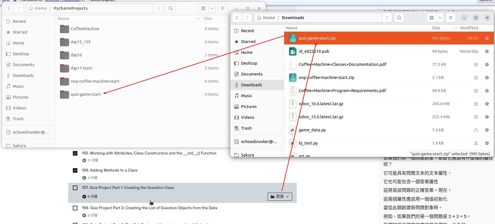
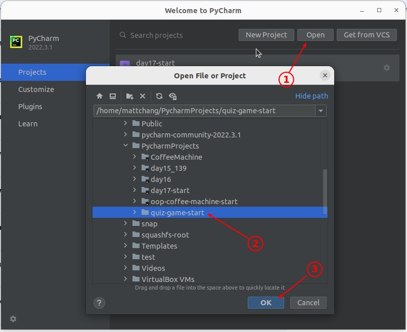
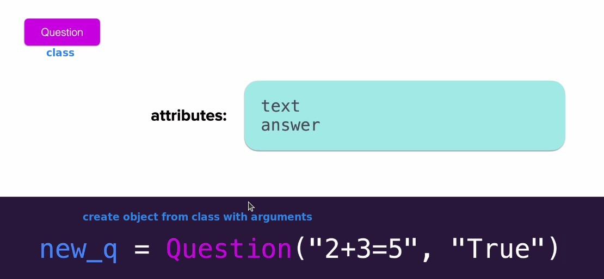
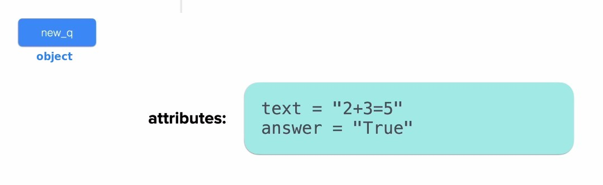
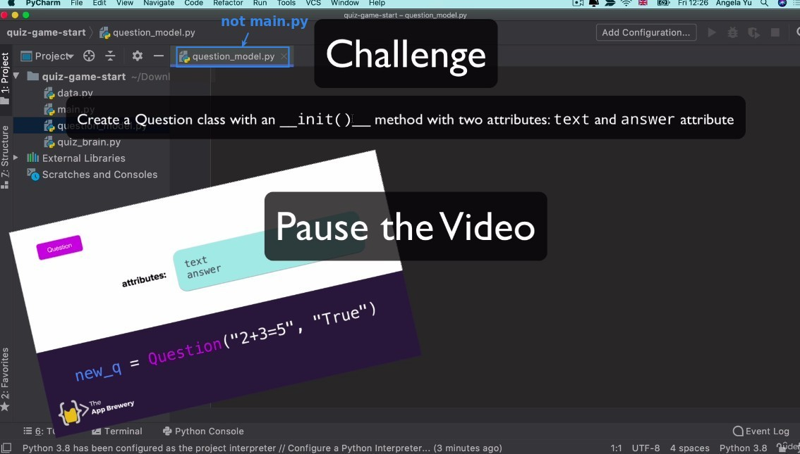
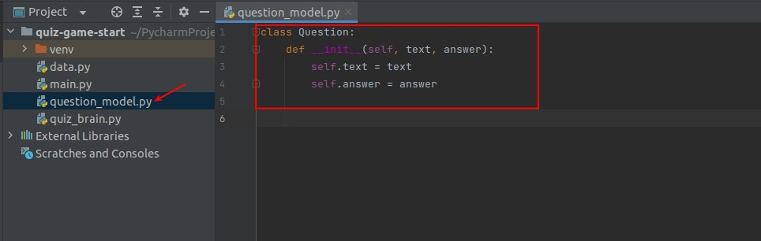
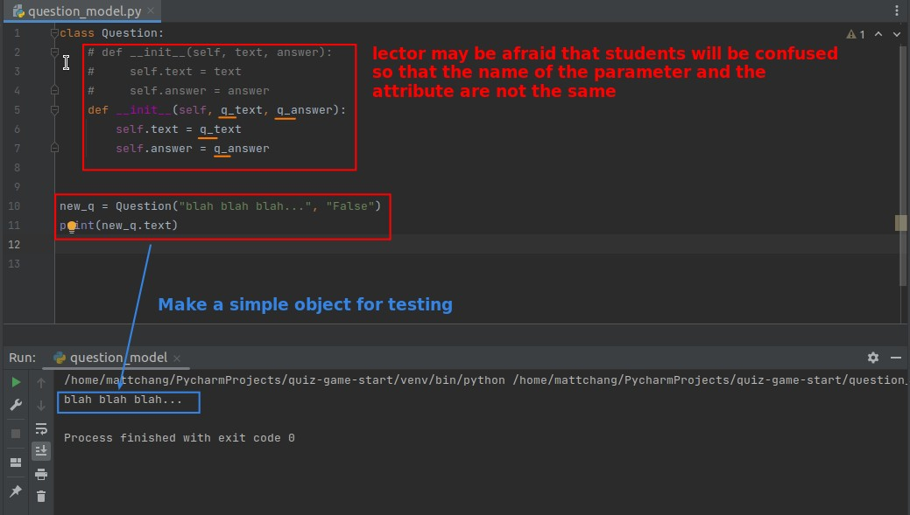

## **Prepare Quiz Project**

## **Concept fo Question class**

> In order to complete the quiz game, we need to have a blueprint to generate each question entity first.

## **Challenge: Create Question class**

### _My solution_

### _Compare to Lector's_

- But by convention, the parameter name of \_\_init\_\_ will be the same as that of attribute.
