## **Original data & remove alerts**

### _List of dicts_

> The data we often get from the internet API is in this format.

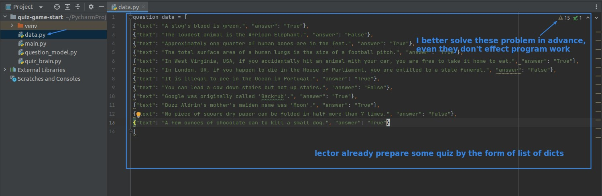

### _Remove alerts_

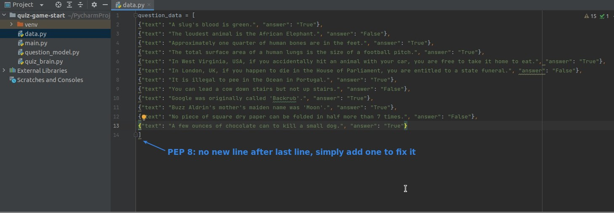

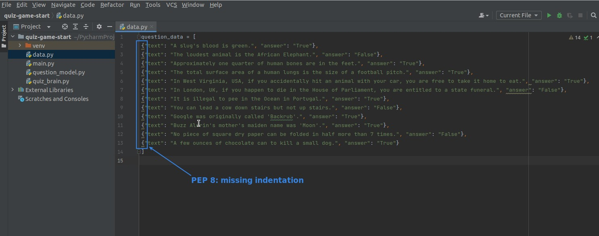

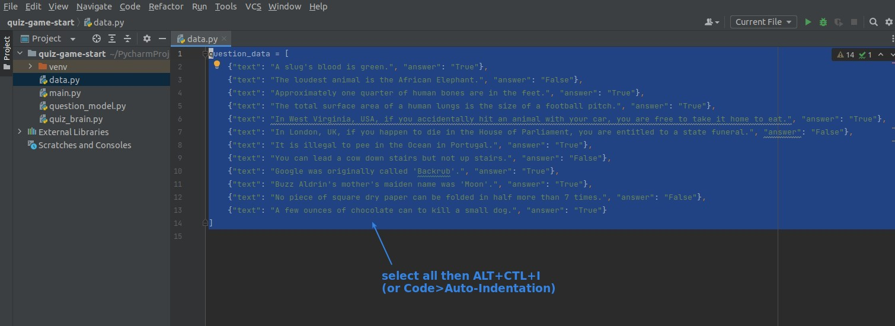

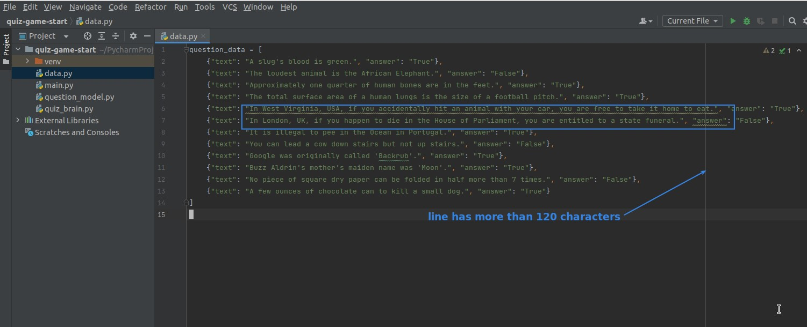

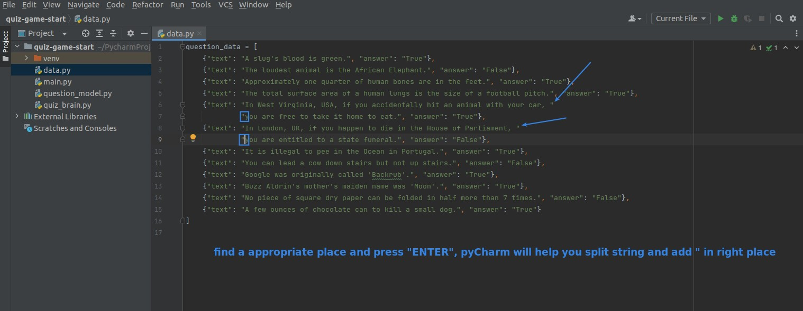

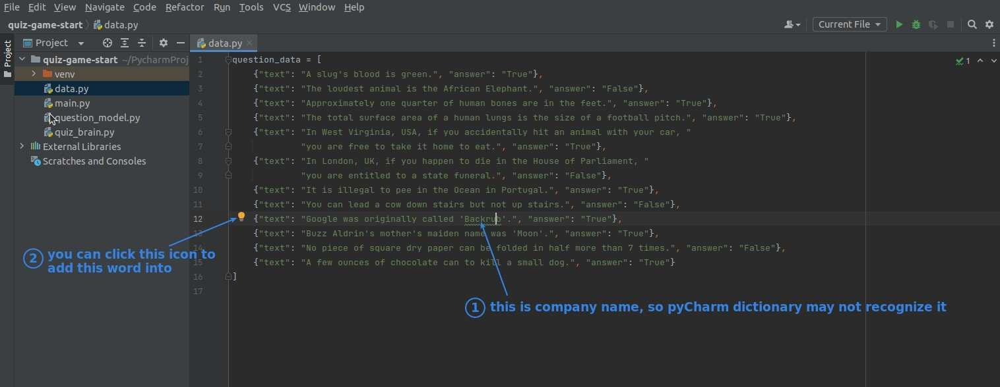

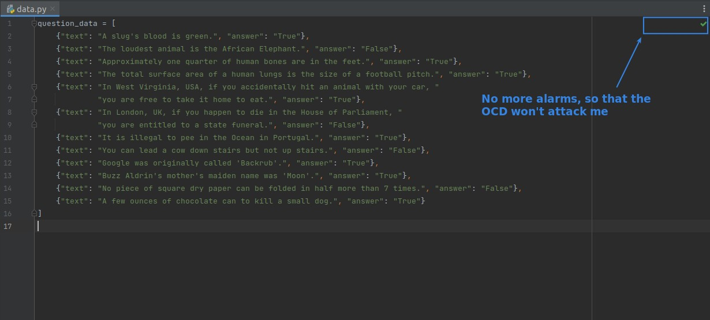

## **List of objects**

> Instead of using the raw data directly, we usually convert it to a list of objects format, which prevents typo and other errors from occurring.

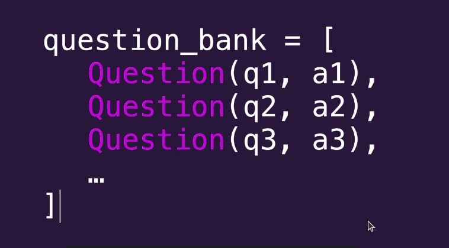

### _Challenge_

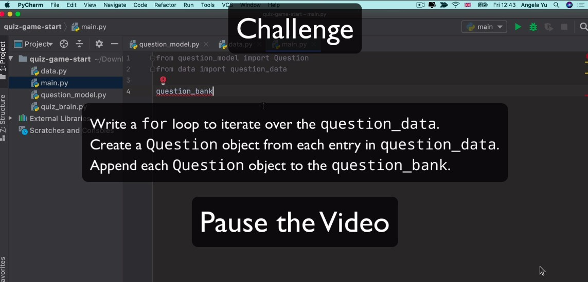

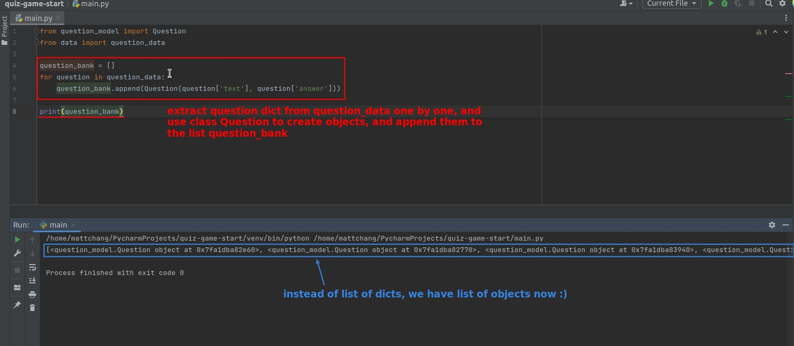

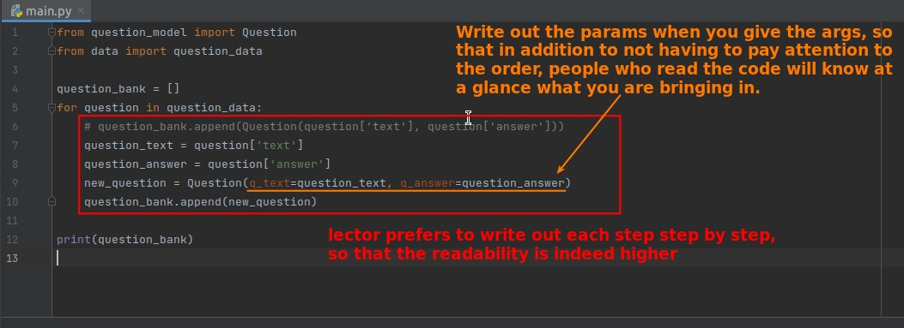

- I found that I always ignore readability when writing programs, just want to finish the script quickly, but in fact readability is very important.
