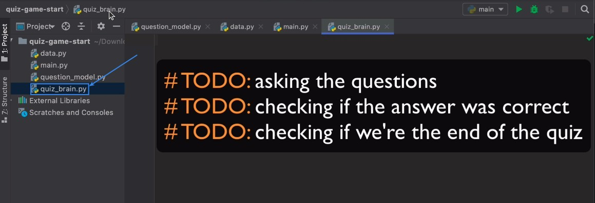
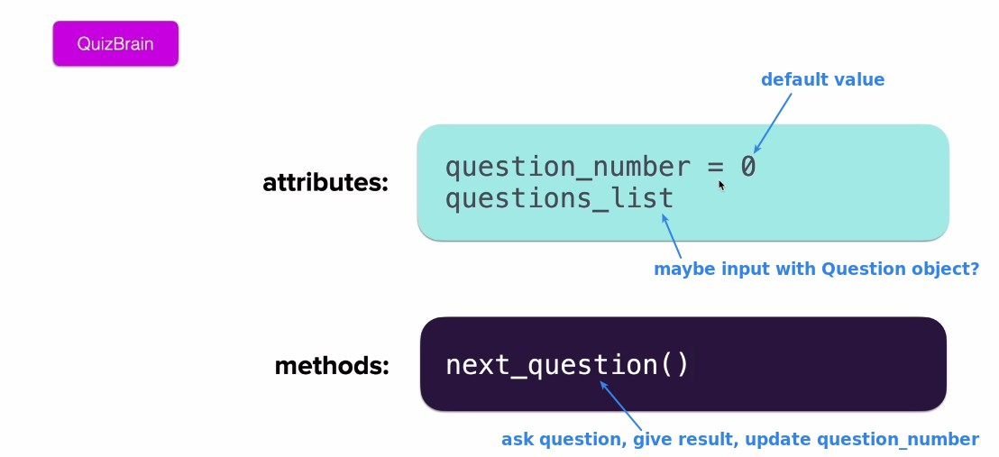
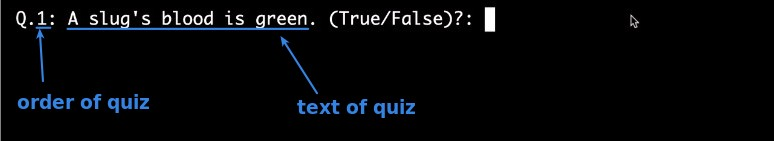
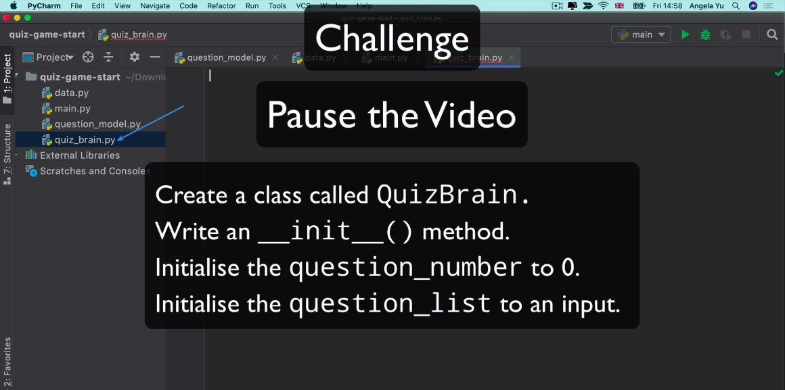
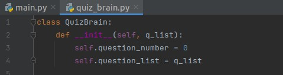
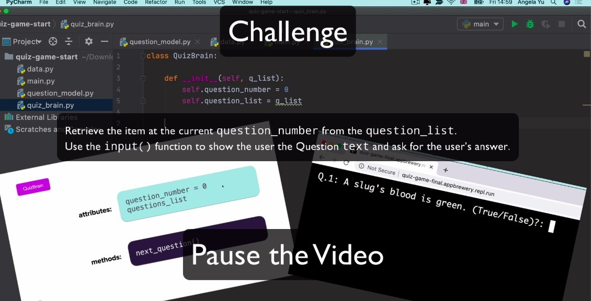
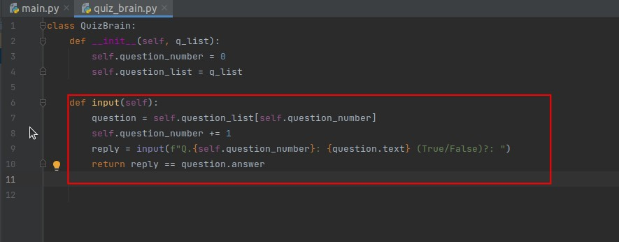
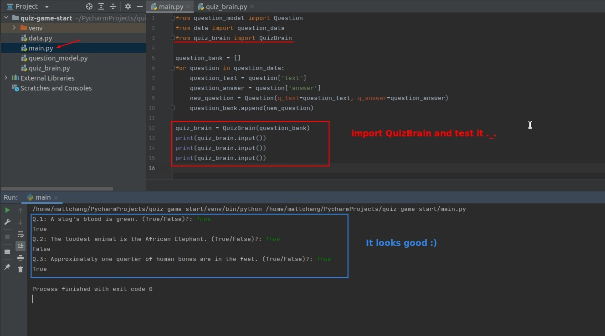
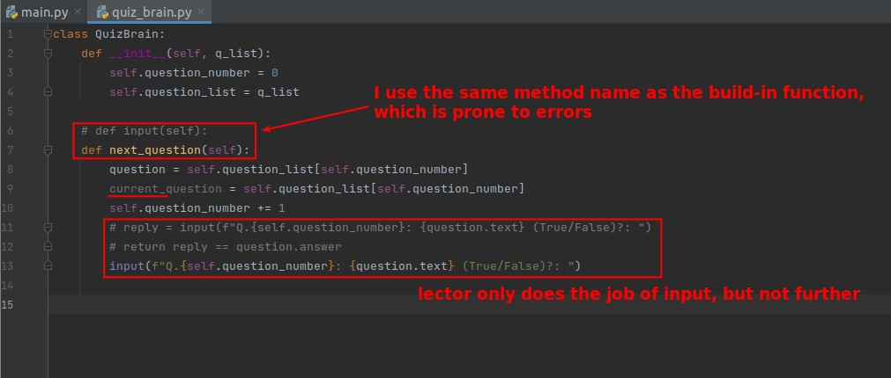

## **Design of new class: QuizBrain**

### _TODOs_

### _Attributes and method_

- questions_list is indeed just to store list of objects.
- Later I found out that in fact the only demand of lector for method is to print the correct string using input.

### _Goal_

## **Challenge 1: constructor of QuizBrain**

### _My solution_

- The attribute "question_list" is only used to store the question_bank, i.e. the list of objects for questions.

## **Challenge 2: method of QuizBrain**

### _My solution_

- My approach is not only to use input to print out the questions, but also to compare the answers and return the boolean, so that it will be easy to do other features later.

### _Compare to lector's_

- The lector really only does the method to print out the correct question using the input and that's it.
  - Maybe it's to keep the functionality of a single method focused on one simple thing?
