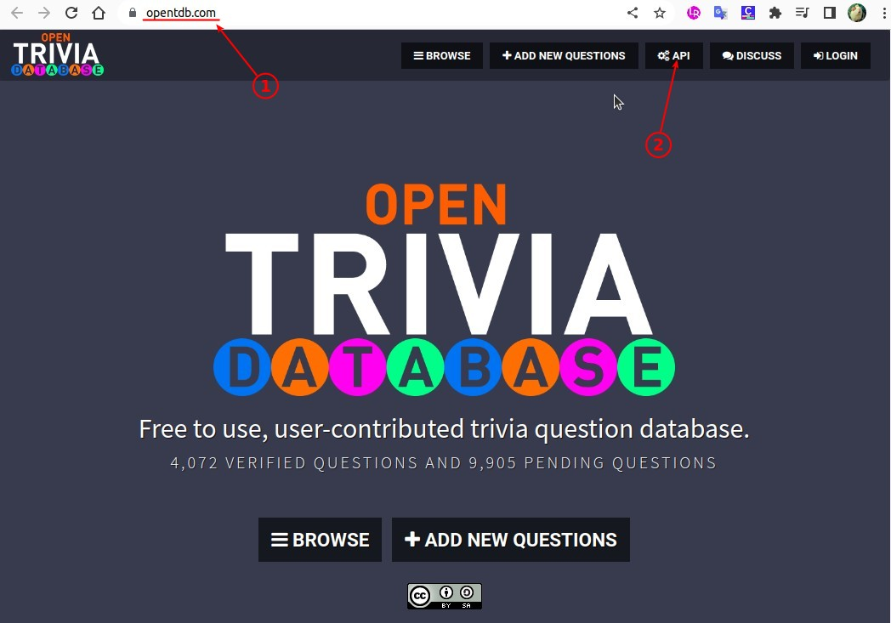
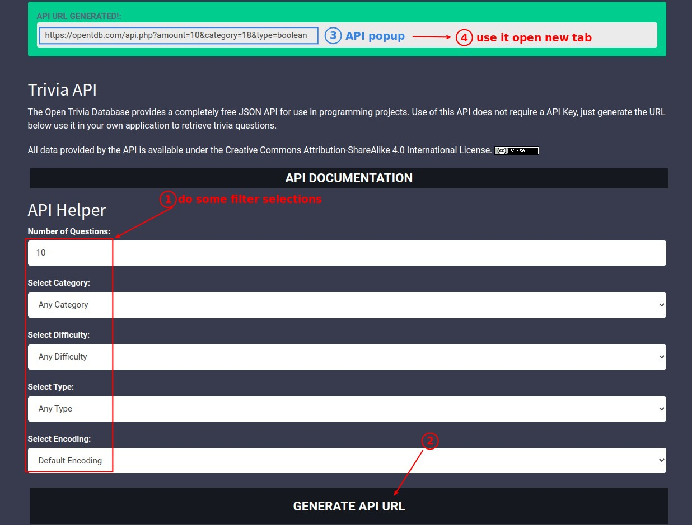
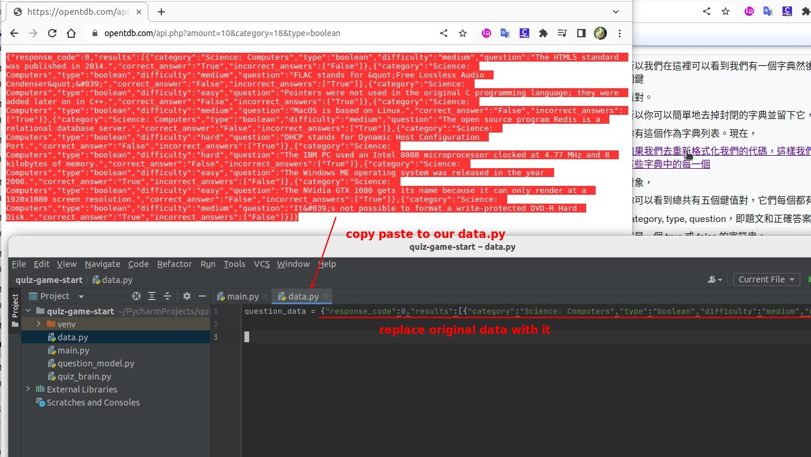
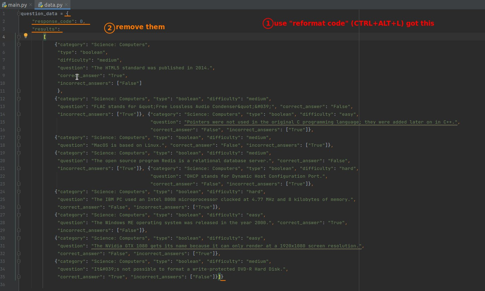
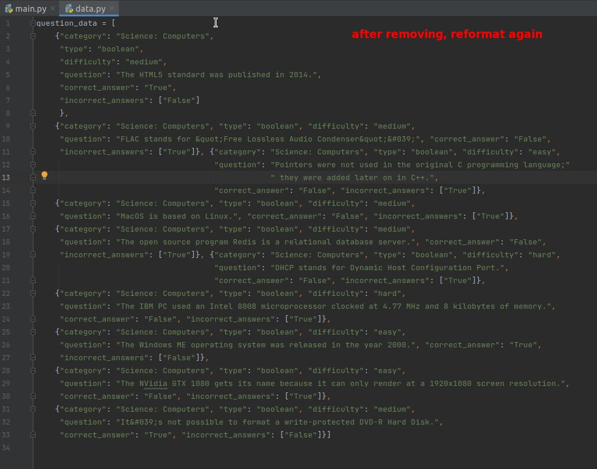
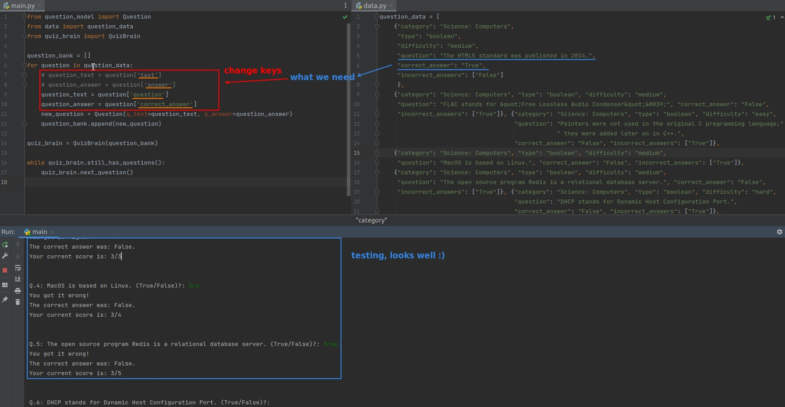

## **Outside quiz source: Open Trivia DB**

## **Replace data from it**

## **Edit code to works with new data**

- You can see that we only need to modify the main.py part, but not the other parts, which is the advantage of OOP.
  - For example, QuizBrain only needs to focus on his own business and does not care how the data changes, so it can run even if you change the quiz language, which is the ideal situation.
