## **Why lector know everything? ... is she god?**

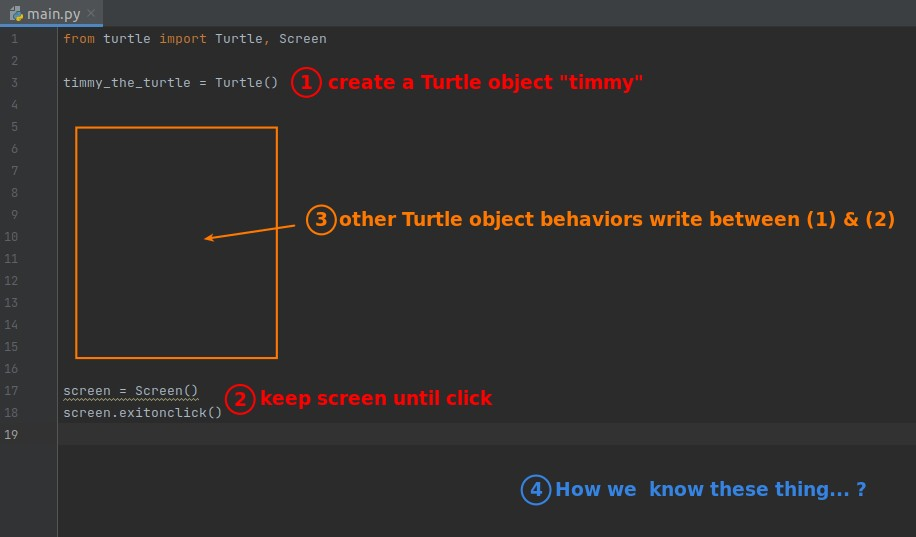

## **Turtle graphics documents**

> In fact, Lector learned how to use turtle by checking Turtle Graphics' documents as follow.

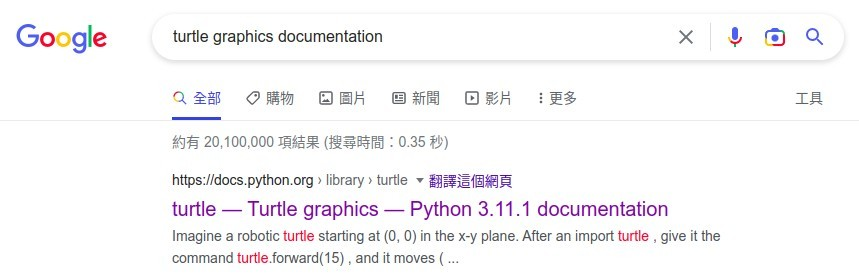

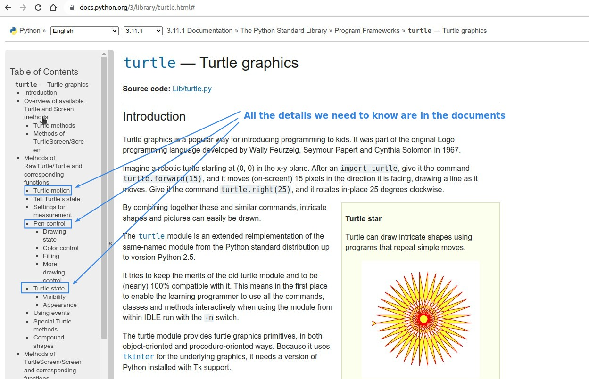

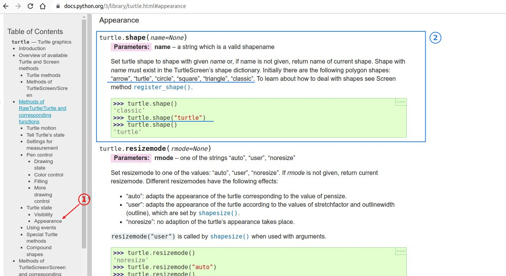

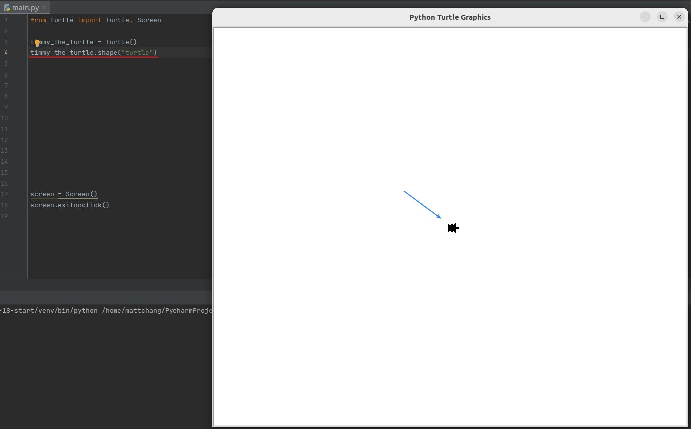

## **Query on the internet**

> Usually the documents are very large, so we can't find what we want quickly, so we have to query on the web.

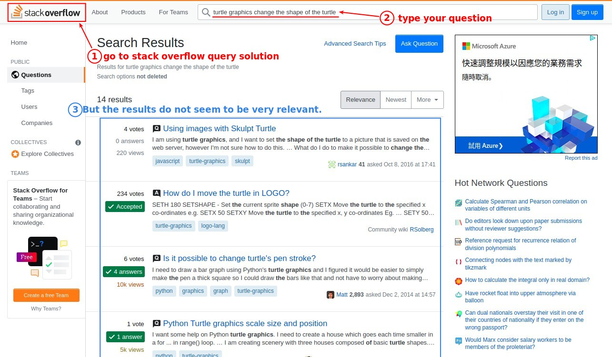

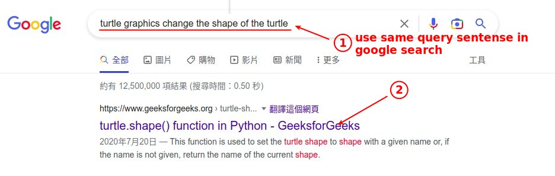

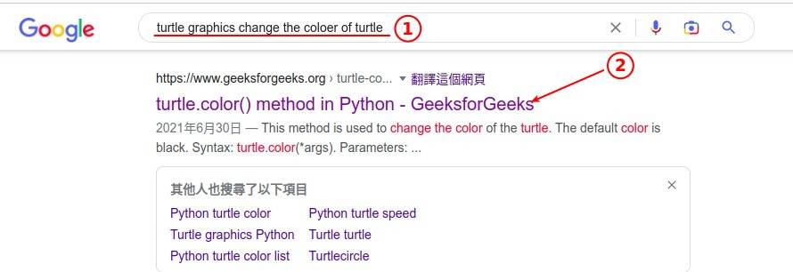

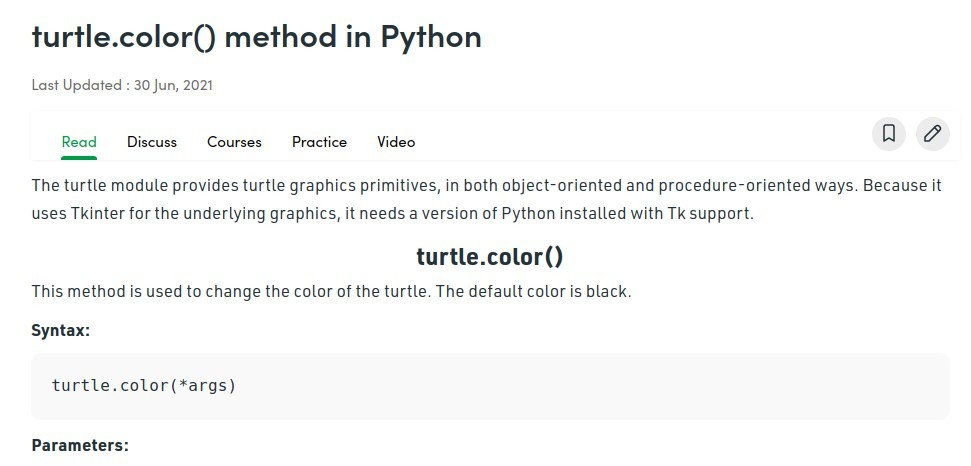

- Usually using google search query directly will give you more accurate results than querying on a specific website.

## **Go back to Turtle documents for detail**

> After we get the answer we want on the web, if we want to know more about how to use function/method, we have to go back to documents.

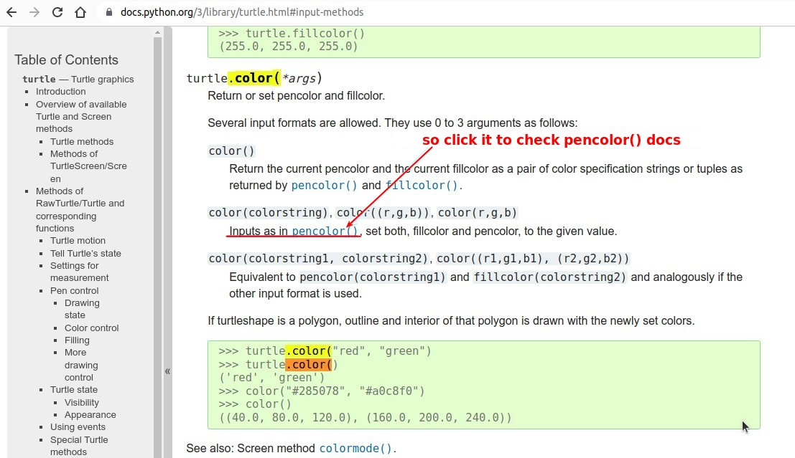

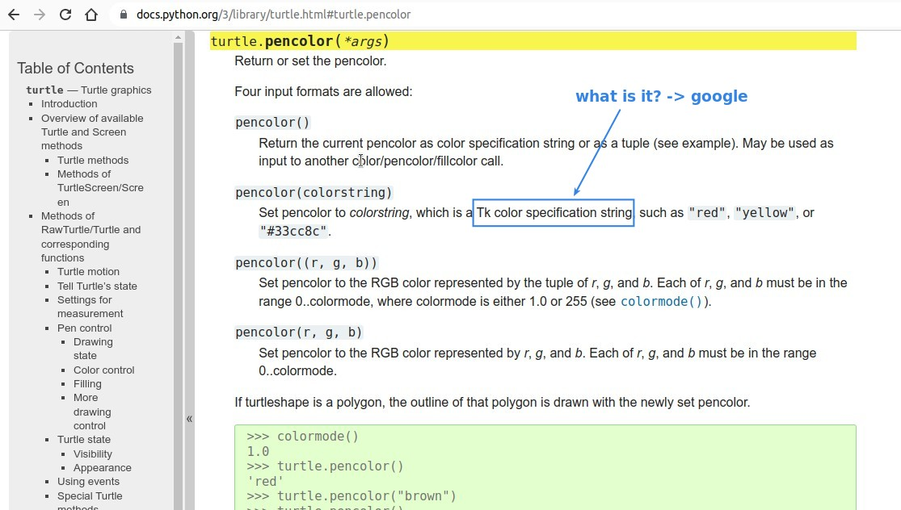

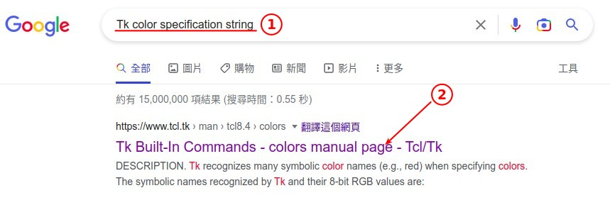

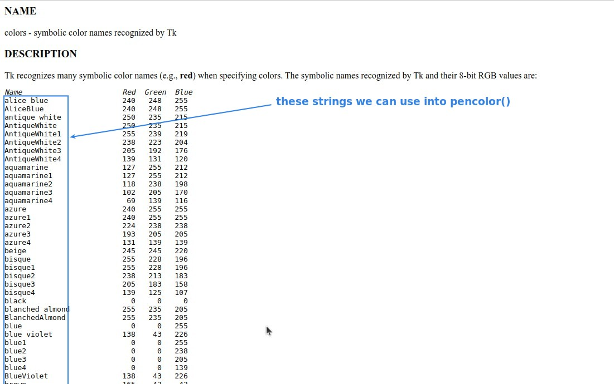

- The previous table is text only, lecture provides some links to websites with color examples to obtain TK color string data.

## **GUI**

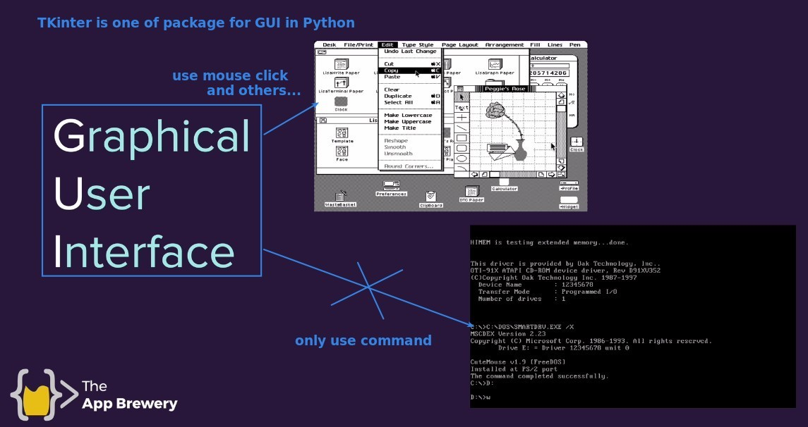

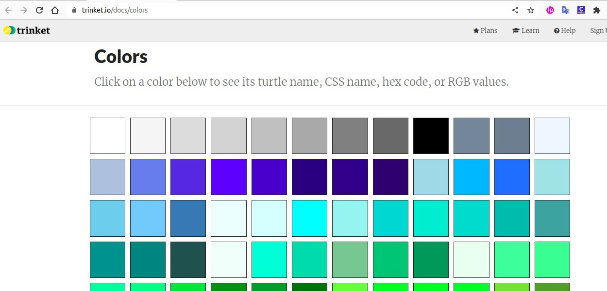

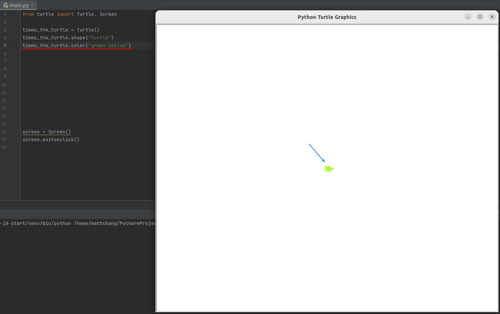

## **Let Turtle go forward 100 then turn right 90 degree**

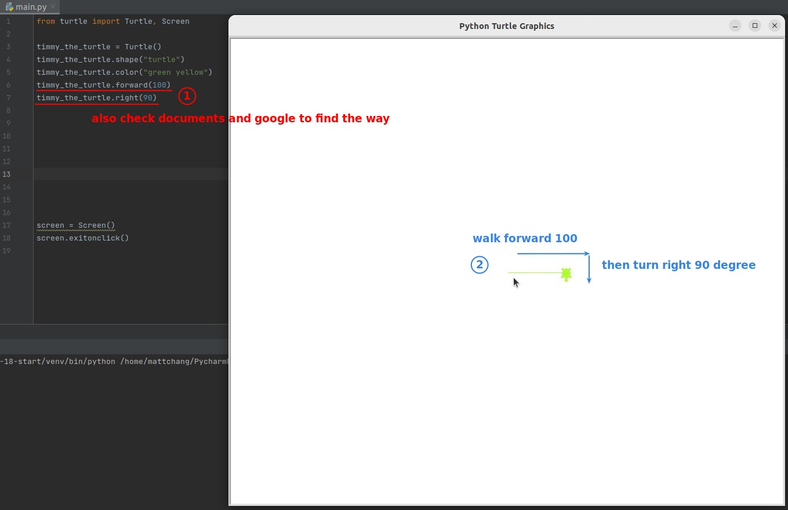

- We can make turtle "Timmy" do more things, but still need to learn to use the documents and query on the web by ourself.
