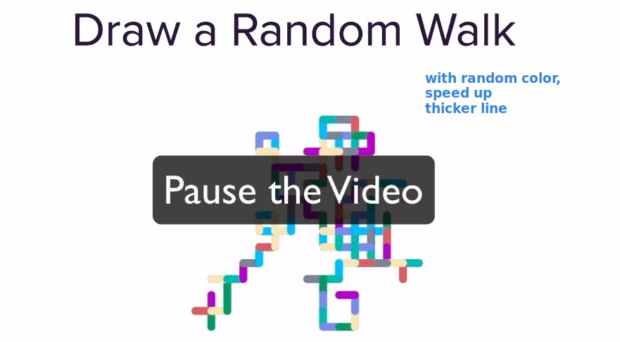
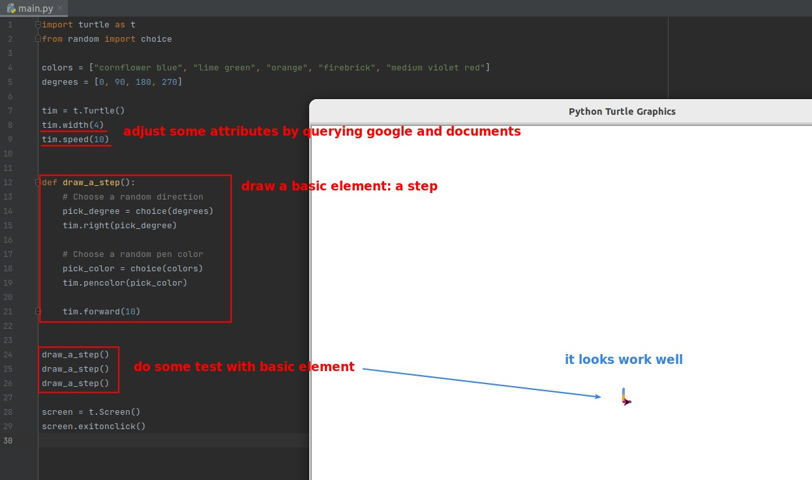
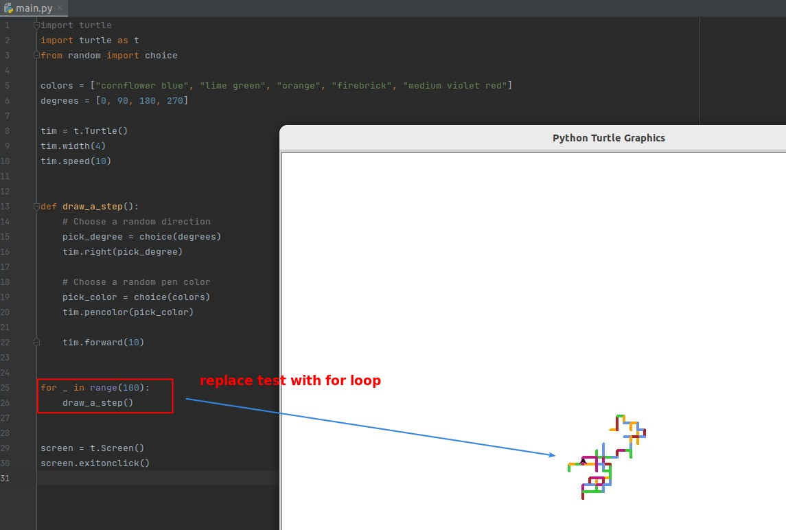

## **Challenge: Draw a random walk**

- The creation of such random events is useful in analyzing real-world situations, and similar operations are often used in mathematics and finance.

## **My solution**

### _Start from basic element: A step_

> I'm trying to get used to starting with the most basic elements...

### _Add more logic on basic: for loop_

### _want to do more feature_

- I actually tried to use click to stop the turtle moving instead of for loop, but the google result still didn't solve it, saying that I need to dig up more documents to have enough knowledge to solve this problem.
