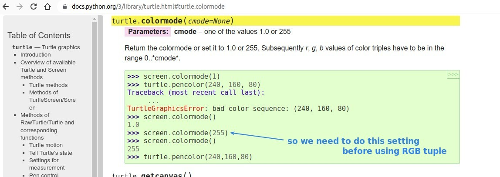
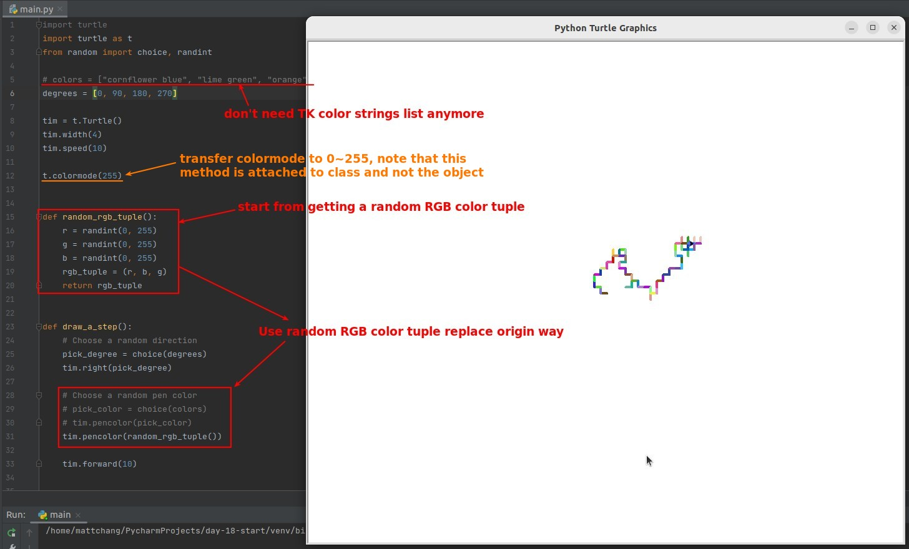

## **RGB color**

## **Tuple**

## **Challenge: Replace random TK string colors with random RGB color**

### _instruction_

### _My solution_

- Some methods are more suitable for attaching to a class, such as the colormode() above.
