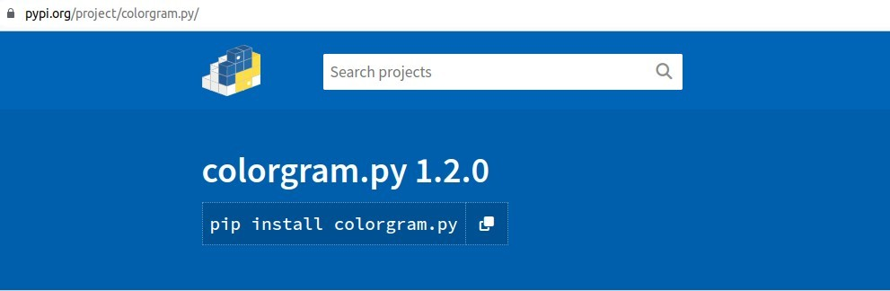
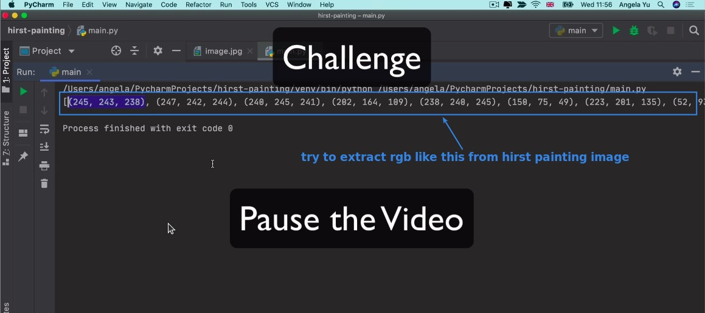
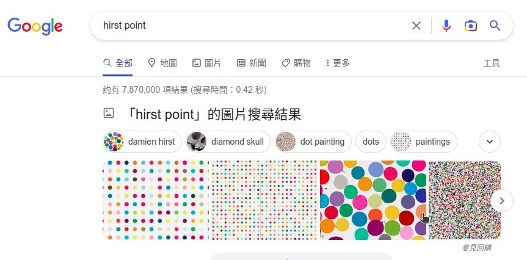
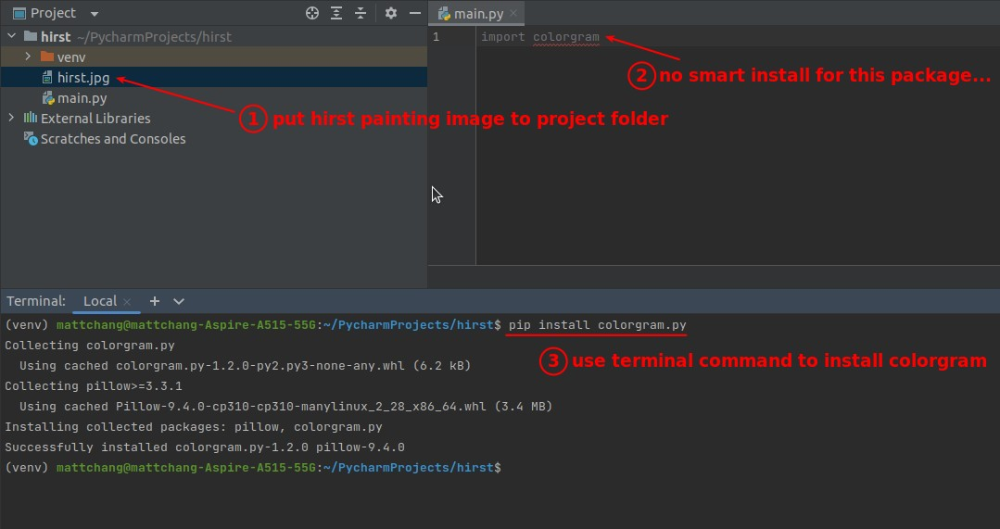
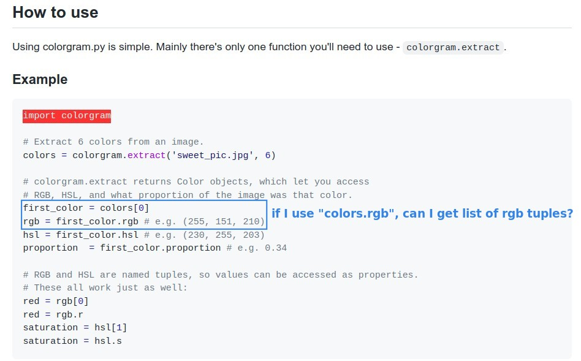
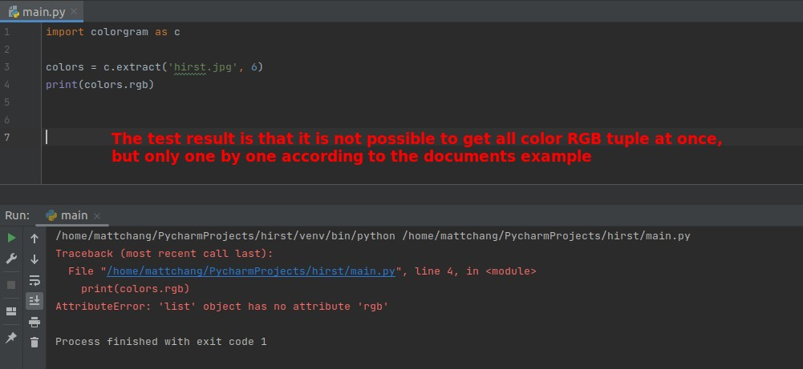
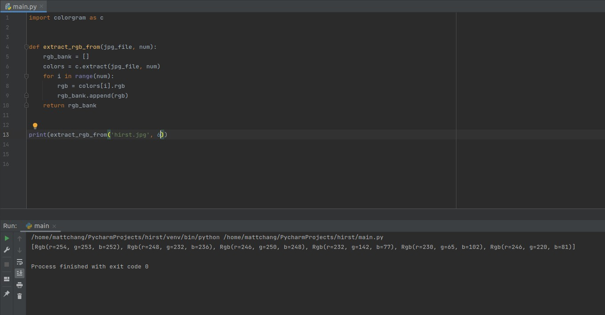
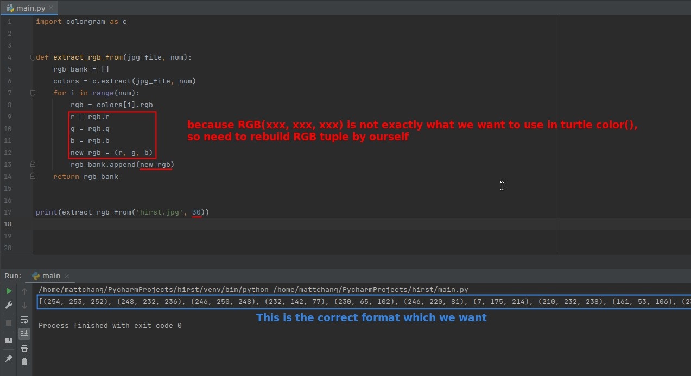
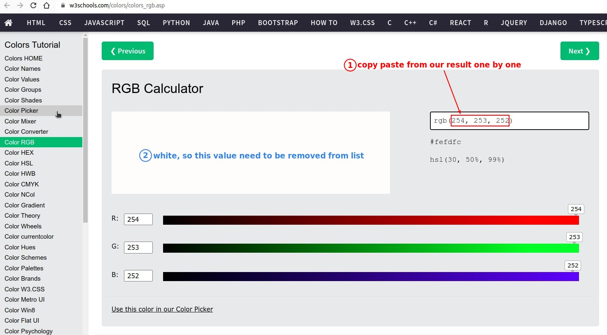
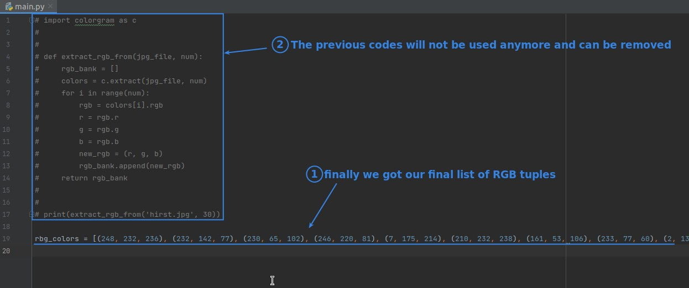

## **PyPi: cologram**

## **Challenge: Extract RGB tuples from hirst painting image**

## **Get JPG file & Prepare project env**

## **My solution**

### _Check officail documents_

### _Coding_

## **Lector's way**

### _further transfer to exact RGB tuples_

### _Test with w3cschool RGB calculator_

### _Get final list of RGB tuples_

