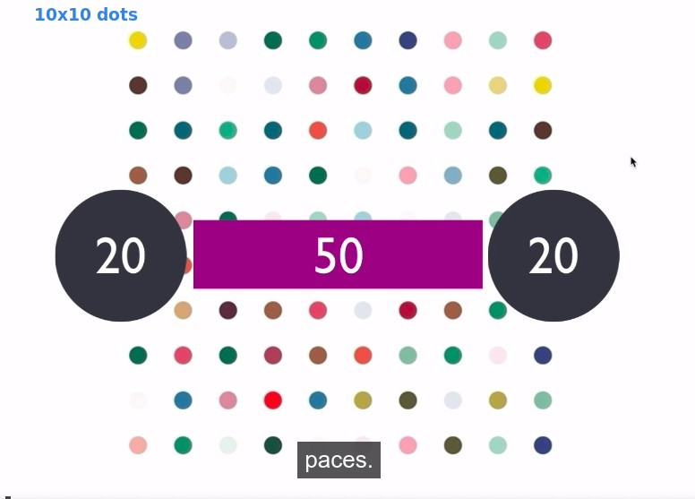
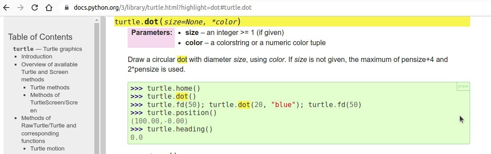
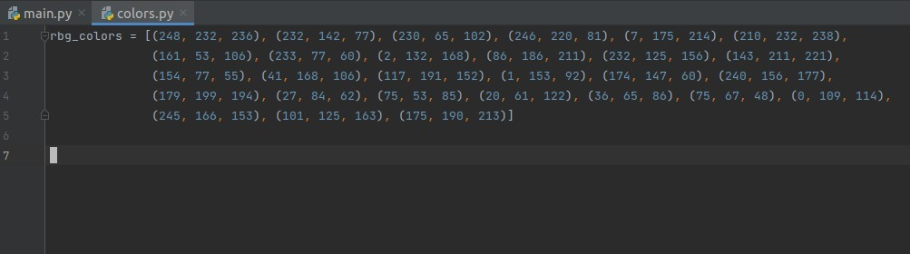
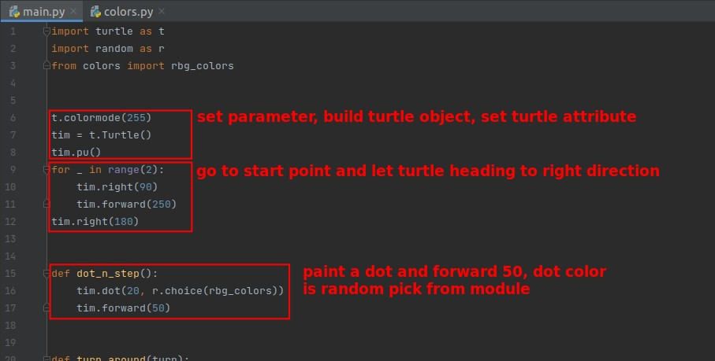
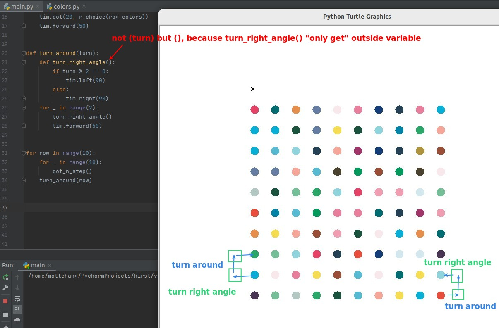
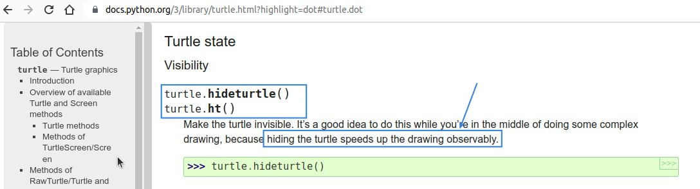
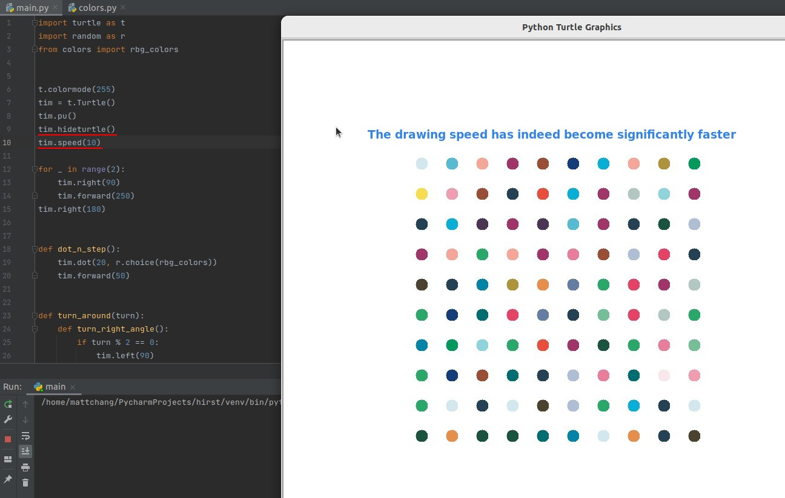

## **Challenge: Dots 10x10 with random colors**

## **My solve process**

### _check documents about drawing dots_

### _create new file for list of RGB tuples_

### _codes_

## **Lector's way**

> To be honest, lector's logic for running turtle is rather poor, but adding the following parts makes turtle's drawing speed significantly faster.

### _document about hiding turtle_

### _more codes to speed up turtle_

