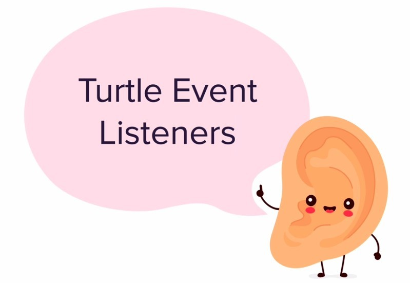
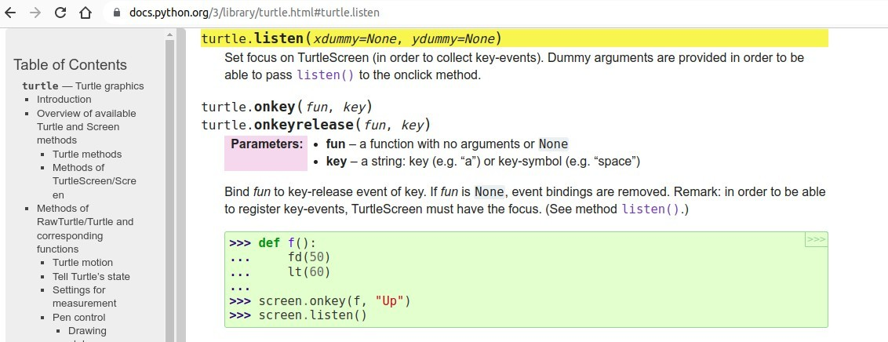
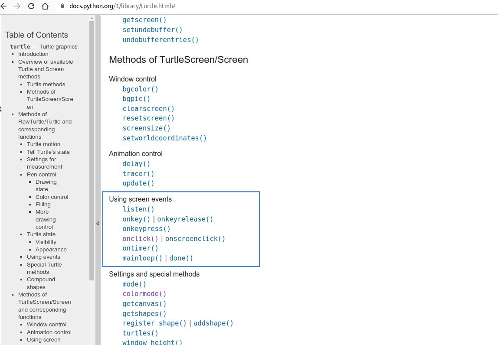
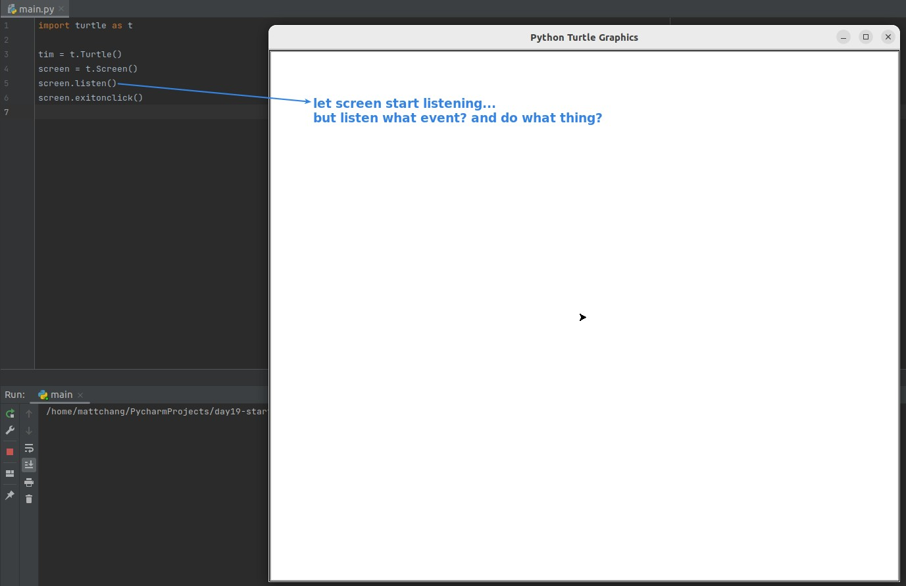
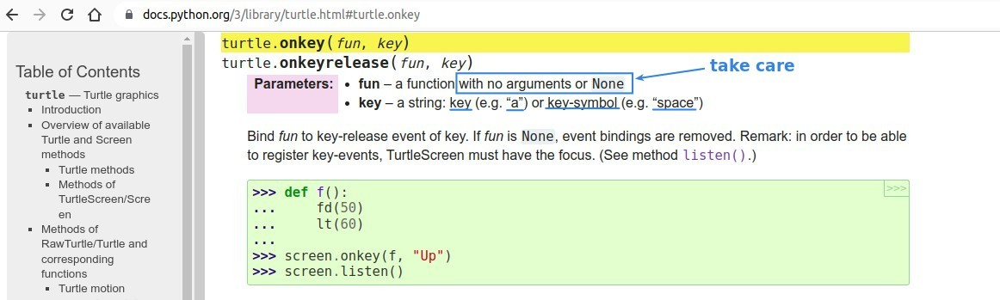
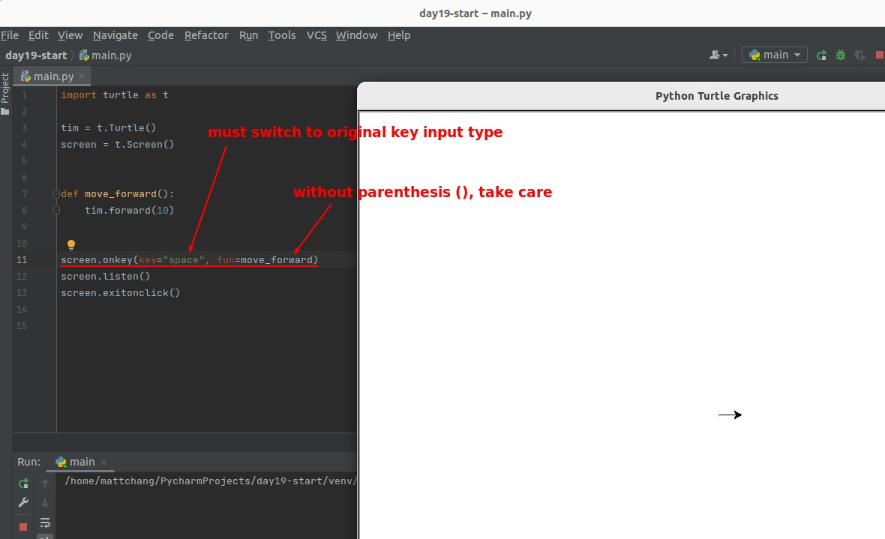
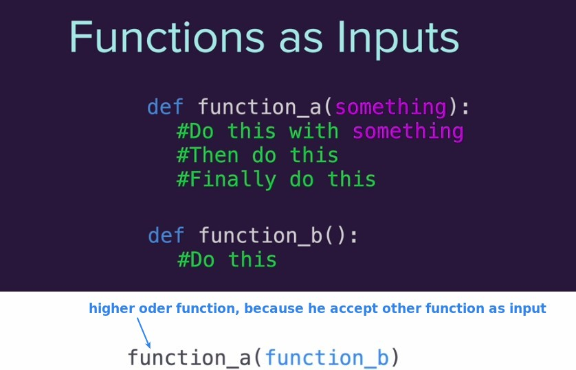
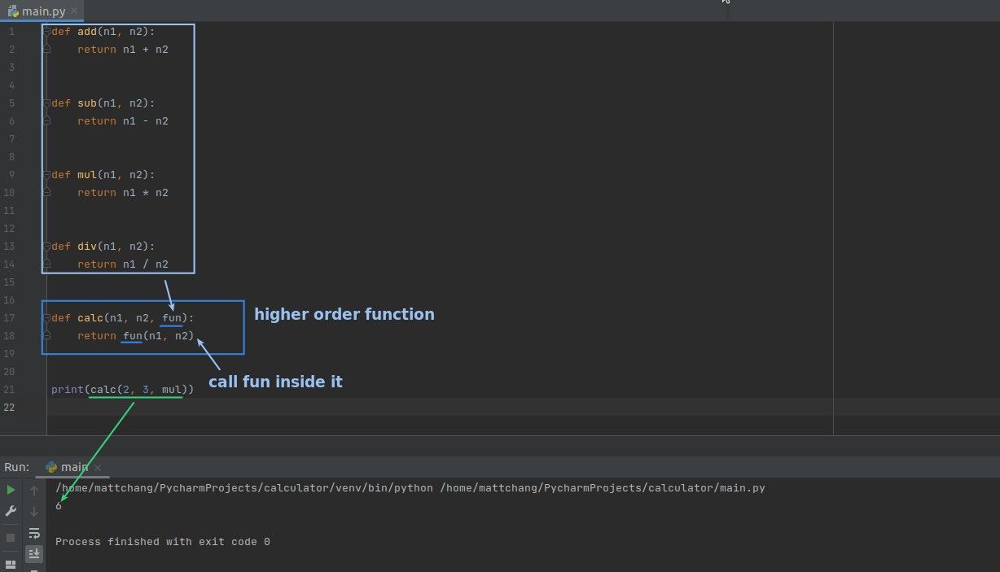

## **Turtle Event Listeners**

### _Image_

### _let screen start listen..._

- There are some event listener-related methods in this section of the document.

### _add event listener_

- The argument of a function in Python can be a function, which is common in Python.
  - Note that when a function is assigned to a parameter, it must have only the name and no parentheses.
- Note that when the method is not written by yourself, try to use the keyword argument instead of the position argument.

## **Higher order function**

> Higher Order is the concept of comparison, higher order function itself may become the input of other function, then the other side is higher order function relative to each other.

### _simple example: caculator_

