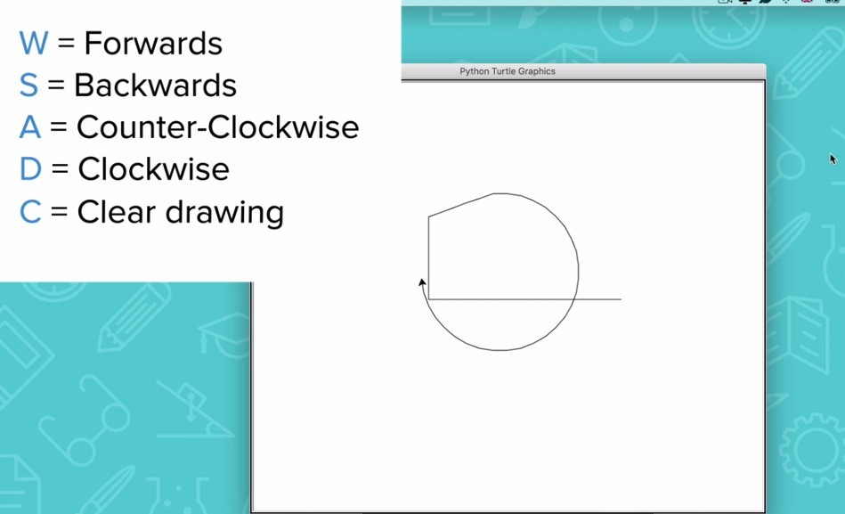
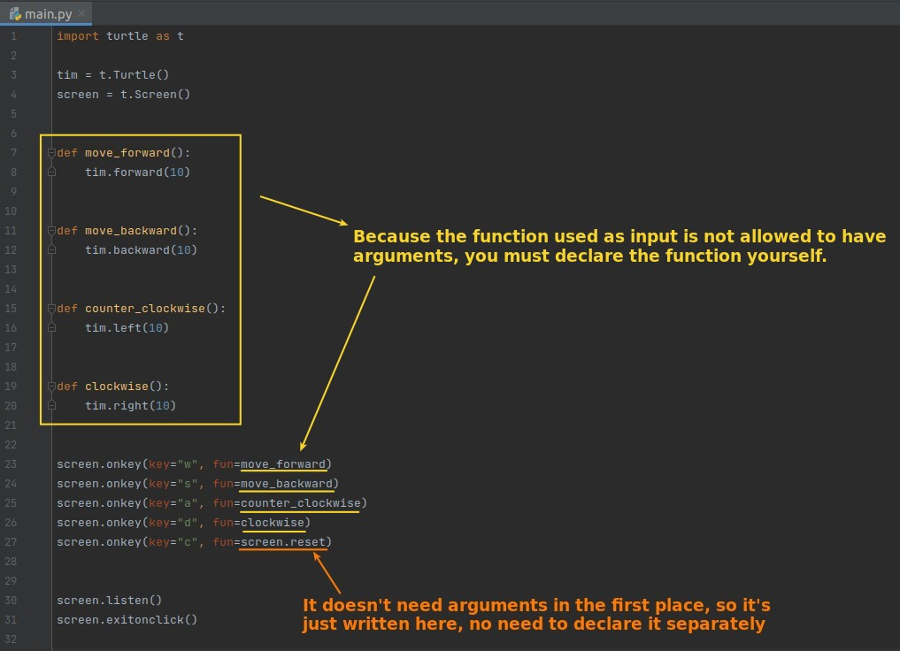
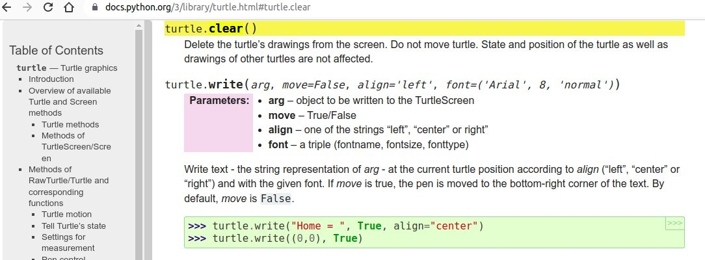
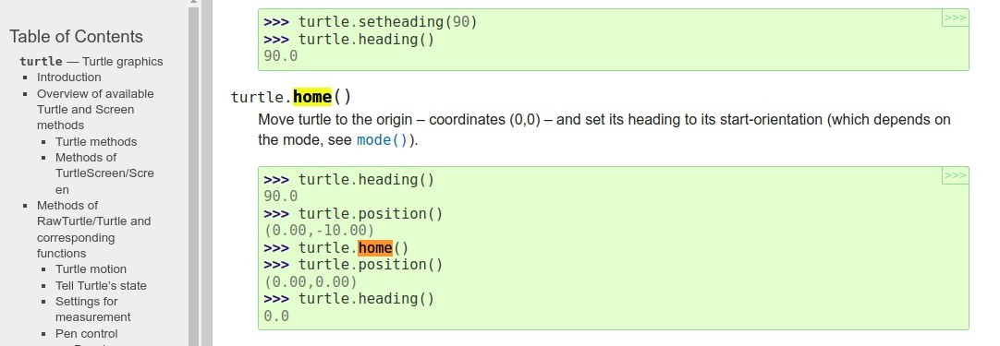
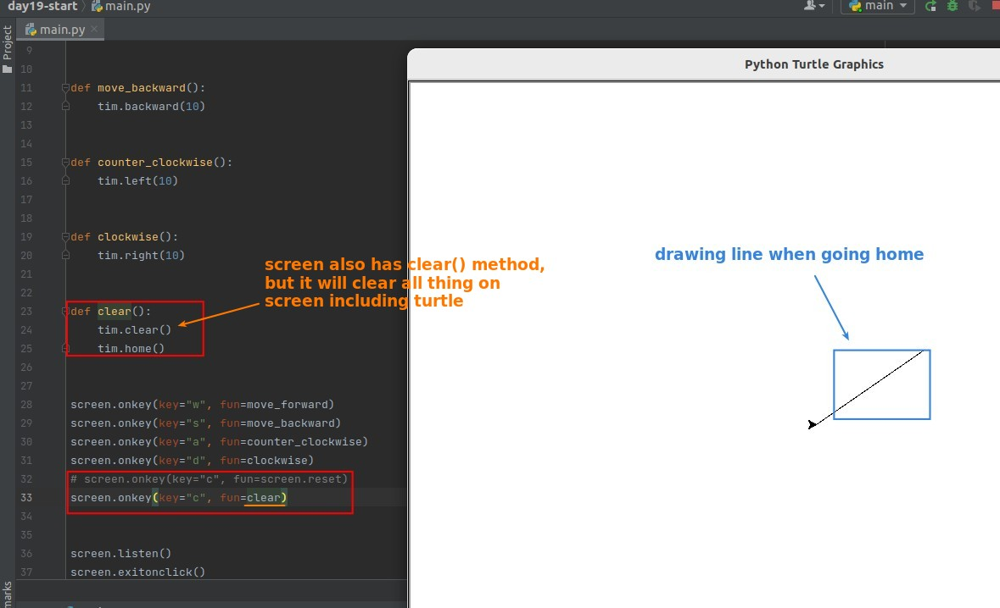
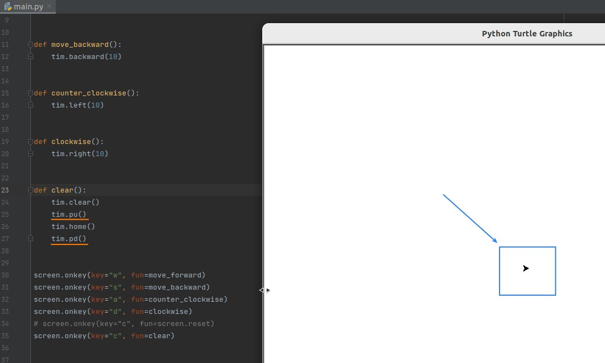
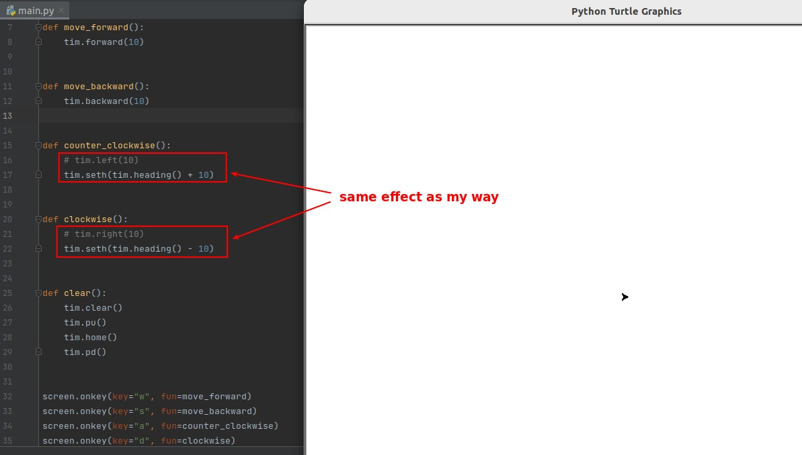

## **Challenge: Etch-A-Sketch app**

## **My solution**

- The method I found at first was screen.clear(), but after searching for documents I came across turtle.reset() and tried it out and found it was exactly what I wanted.
- I found it impossible to rotate and move turtle at the same time.

## **Lector's way**

### _checking documents_

### _declare clear() function_

### _turn turtle with heading way_

- Still can't turn and move at the same time :(
