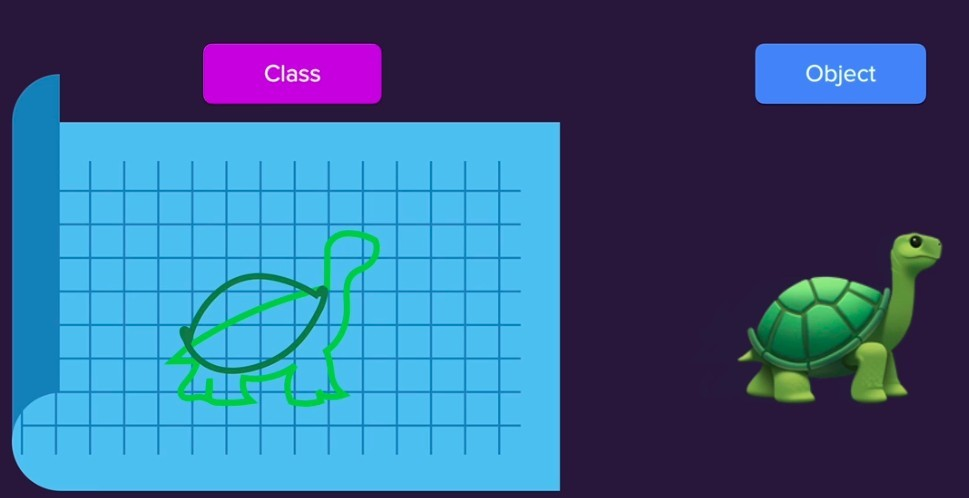
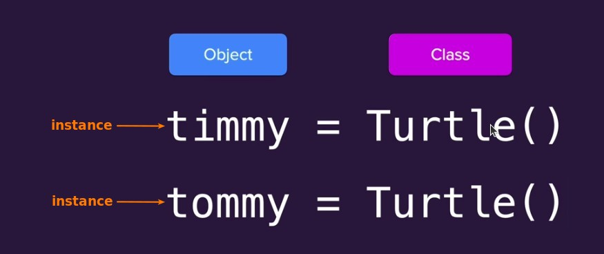
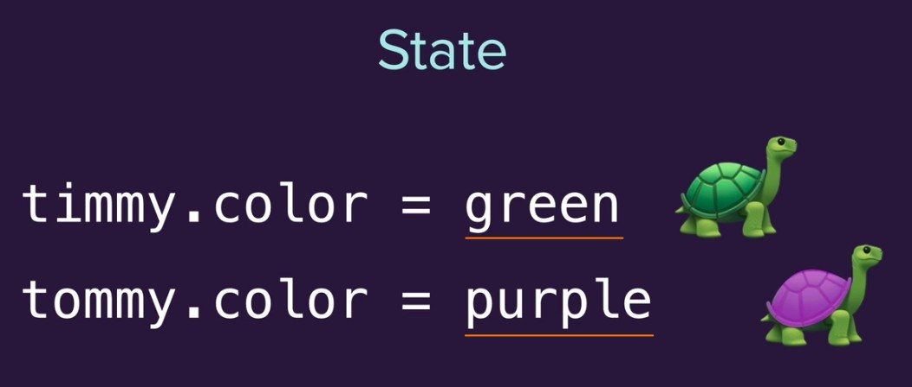
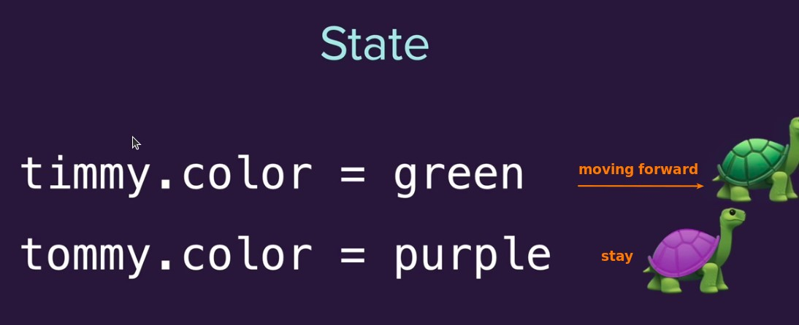

## **Blueprint and Instance**

## **class, object, instances**

- We will say that timmy and tommy are both Turtle objects, but they are different instances.

## **state**

### _different value of attributes_

### _different using of methods_

> The state is not just about attributes, there are also methods that use state as part of the state.

