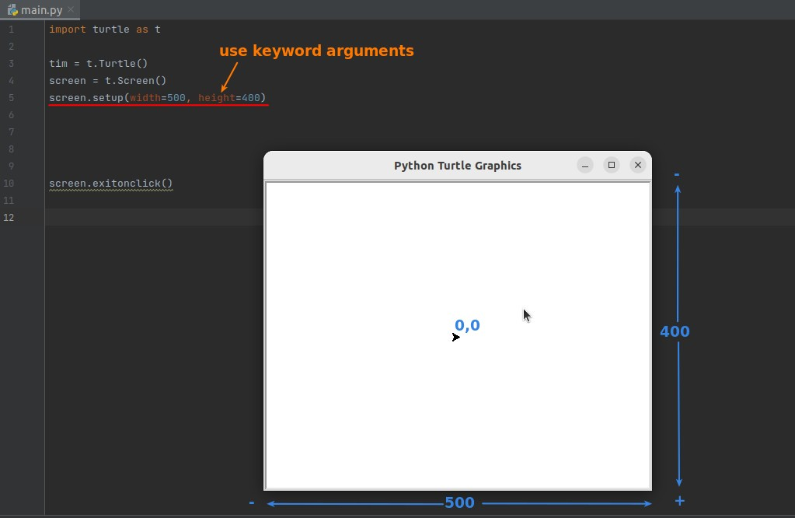
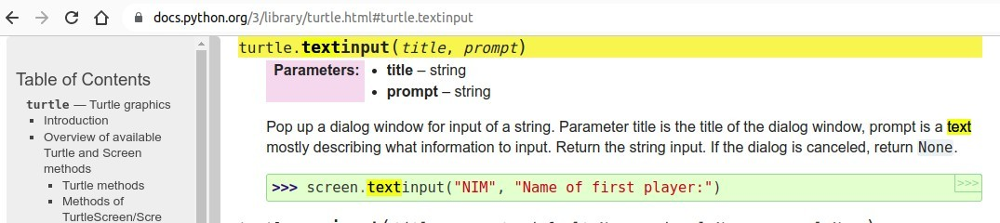
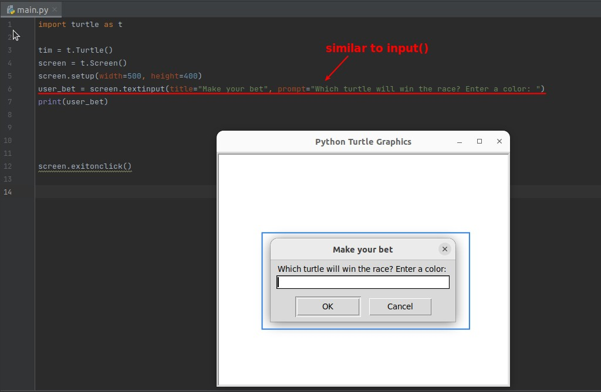
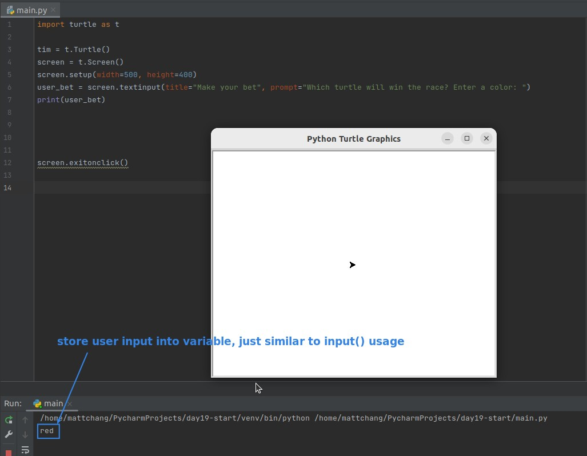
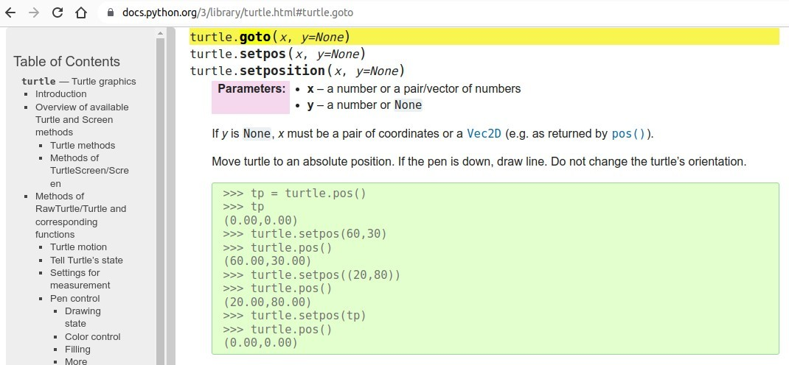
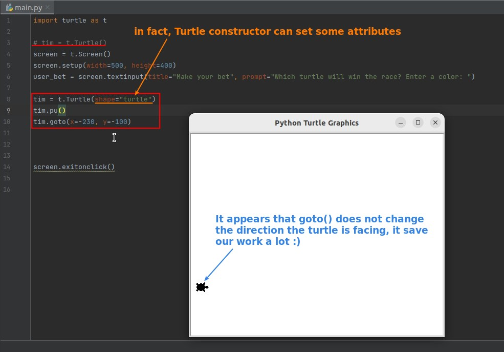
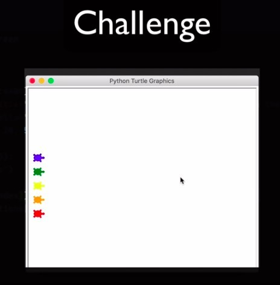
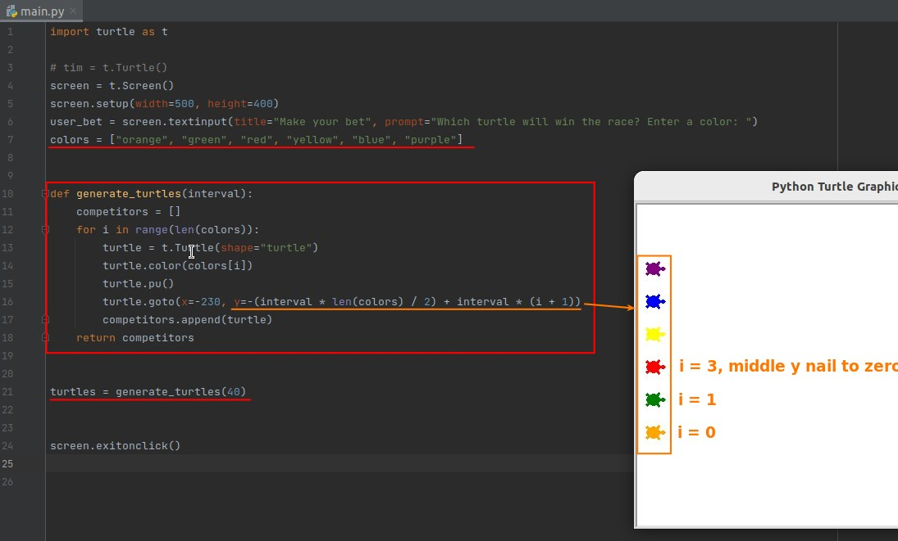
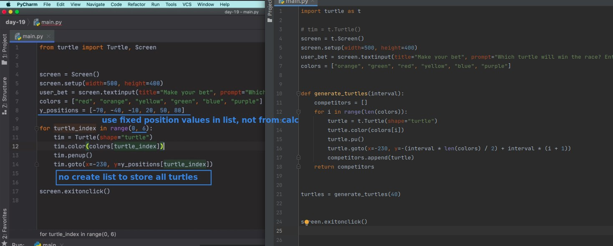

## **Screen setup & coordinate system**

## **Screen input**

> as same as normal input, but belong to screen object.

## **Turtle goto**

## **Challenge: create 6 turtles and place them at right positions**

### _instruction_

### _my solution_

### _compare to lector's_

- The lector approach is much simpler, but uses less flexibility.
