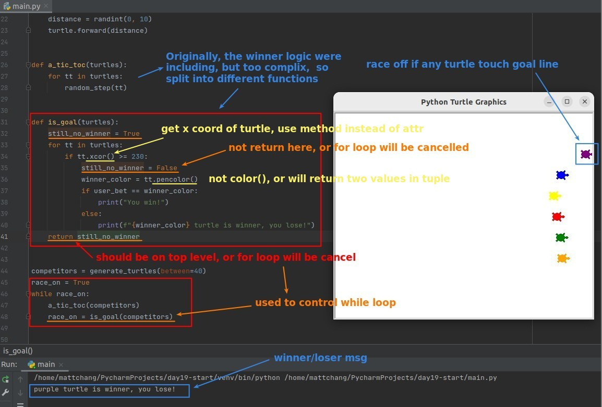

## **Challenge**

> Complete the turtle race game and stop the game the moment there is a winner, with a user win/lose indication on the console.

## **Start from a random step**

## **A tic toc**

## **Winner logic and finish codes with while loop**

## **Final if-statement**

