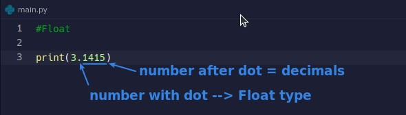

## **String**

## **Integer**

- Integer does not distinguish between positive and negative numbers, as long as the value without decimals is Integer type.

## **Float**

- You can imagine that there is a dot floating in the characters, so it is a Float type.

## **Underscore symbol \_ in number**

- Underscore "\_" will be ignored by python if it is in Integer or Float.
  - So it exists purely to increase the readability of the code.

## **Boolean**

- The beginning must be capitalized, which is different from the JS Boolean.
- Do not use quote wrapping, otherwise it will become String type.
