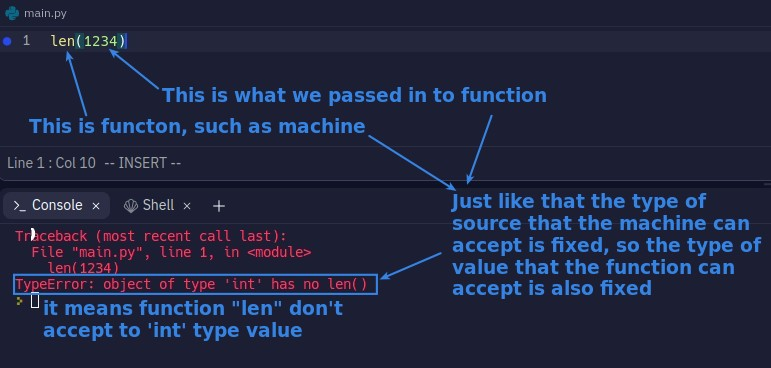
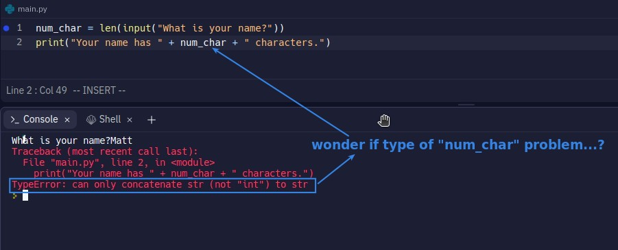
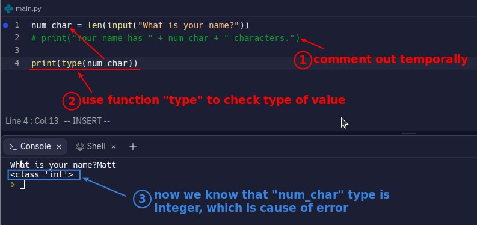
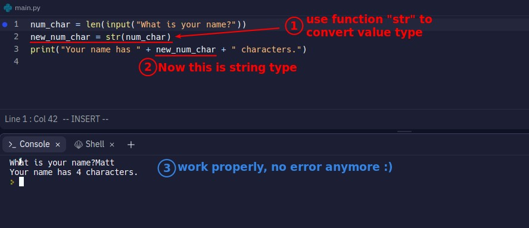
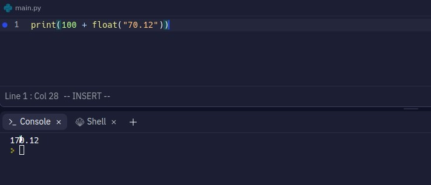

## **What is function, and function error**

- We usually don't care about the principle and process inside the machine, we only want to know what raw materials the machine needs and what it can help us to produce, and so does function.

## **How to Solve TypeError**

### _Check Type_

### _Convert Type_

- In addition to the function "str", there are of course other functions used to convert type, and it should be easy to guess their names(int, float...).
