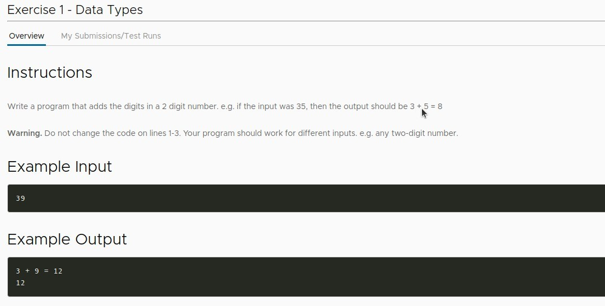
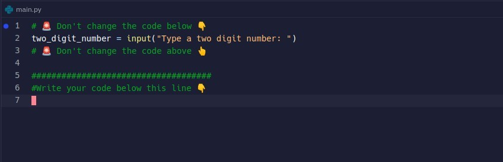
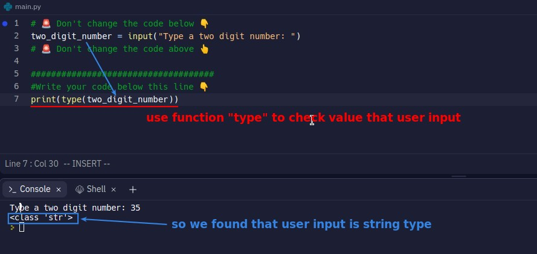
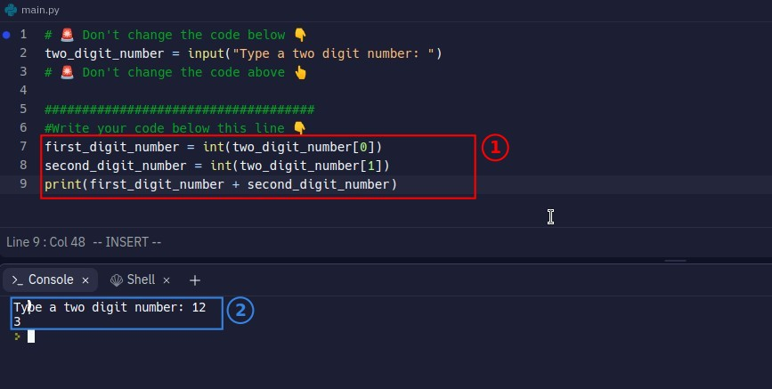

## **Question**

- Above is the part of the .replit file that has already been written.

## **Solution**

- Although the value entered by the user is of the string type and cannot be calculated mathematically, the subscripting feature of the string can be used to separate the two digits.

- "first_digit_number + second_digit_number" is integer type actually, so the function "print" can accept String type but also number(Integer/Float).
