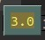

## **Division Math Operator always get Float value**

## **PEMDAS(LR) order**

## **EXAMPLE**

### _Parentheses have highest prority_

- The above is the sequence of mathematical operations that will be taught in basic education. We use the first word of each operation to group a word "PAMDAS" for remember.

- The order of operations in Python is slightly different.
  - multiplication and Division are equal important.
  - Addition and Subtraction are equal important.
  - When multiple operators of the same priority exist, the higher the priority is to the left.

### _When there are same priority operators_

## _Rest operations..._

